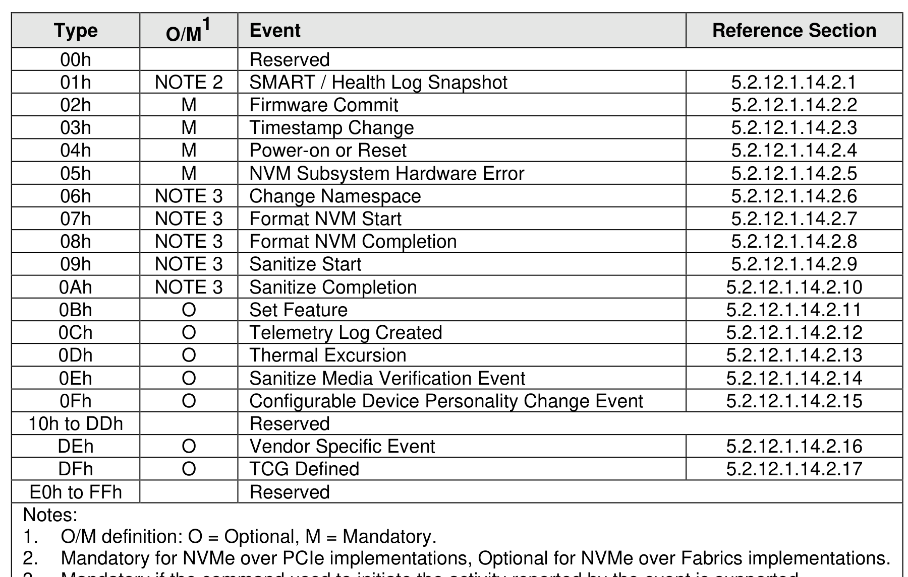

###### 5.2.12.1.14.2 Persistent Event Log Events

> **Section ID**: 5.2.12.1.14.2 | **Page**: 268-268

The values that may be reported in the Event Type field (refer to section 5.2.12.1.14) of the event header
for events in the Persistent Event log are defined in Figure 233.

---
### 📊 Tables (1)

#### Table 1: Untitled Table

| NOTE 3 | Change Namespace | 5.2.12.1.14.2.6 |
|---|---|---|
| NOTE 3 | Format NVM Start | 5.2.12.1.14.2.7 |
| NOTE 3 | Format NVM Completion | 5.2.12.1.14.2.8 |
| NOTE 3 | Sanitize Start | 5.2.12.1.14.2.9 |
| NOTE 3 | Sanitize Completion | 5.2.12.1.14.2.10 |
| O | Set Feature | 5.2.12.1.14.2.11 |
| O | Telemetry Log Created | 5.2.12.1.14.2.12 |
| O | Thermal Excursion | 5.2.12.1.14.2.13 |
| O | Sanitize Media Verification Event | 5.2.12.1.14.2.14 |
| O | Configurable Device Personality Change Event | 5.2.12.1.14.2.15 |
| | Reserved | |
| O | Vendor Specific Event | 5.2.12.1.14.2.16 |
| O | TCG Defined | 5.2.12.1.14.2.17 |
| | Reserved | |
| Definition: O = Optional, M = Mandatory.   Mandatory for NVMe over PCIe implementations, Optional for NVMe over Fabrics implementations.   Mandatory if the command used to initiate the activity reported by the event is supported. | | |
| **SMART / Health Log Snapshot Event (Event Type 01h)** | | |
| Devices that support the Persistent Event Log shall create a SMART / Health Log Snapshot Event:   If initialization management is not implemented, then for every controller in the NVM subsystem;   If initialization management is implemented, then for every primary controller, | | |

