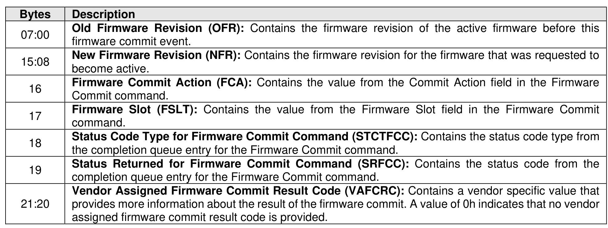

###### 5.2.12.1.14.2.2 Firmware Commit Event (Event Type 02h)

> **Section ID**: 5.2.12.1.14.2.2 | **Page**: 269-269

A firmware commit event shall be recorded in the Persistent Event Log when a Firmware Commit command
is completed. The Firmware Commit Event shall set the Persistent Event Log Event Header:
•
Event Type field to 02h; and
•
Event Type Revision field to 01h.
The Firmware Commit Event data is specified in Figure 235.

---
### 📊 Tables (1)

#### Table 1: Untitled Table

| Firmware Slot (FSLOT): Contains the value from the Firmware Slot field in the Firmware Commit command. |  |
|---|---|
| Status Code Type for Firmware Commit Command (STCTFCC): Contains the status code type from the completion queue entry for the Firmware Commit command. |  |
| Status Returned for Firmware Commit Command (SRFCC): Contains the status code from the completion queue entry for the Firmware Commit command. |  |
| Vendor Assigned Firmware Commit Result Code (VAFCRC): Contains a vendor specific value that provides more information about the result of the firmware commit. A value of 0h indicates that no vendor assigned firmware commit result code is provided. |  |

