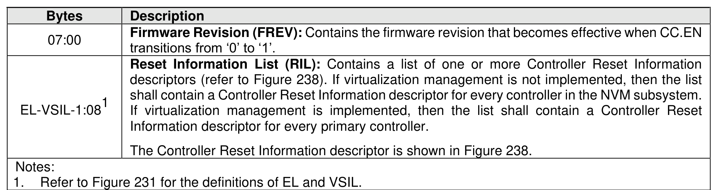
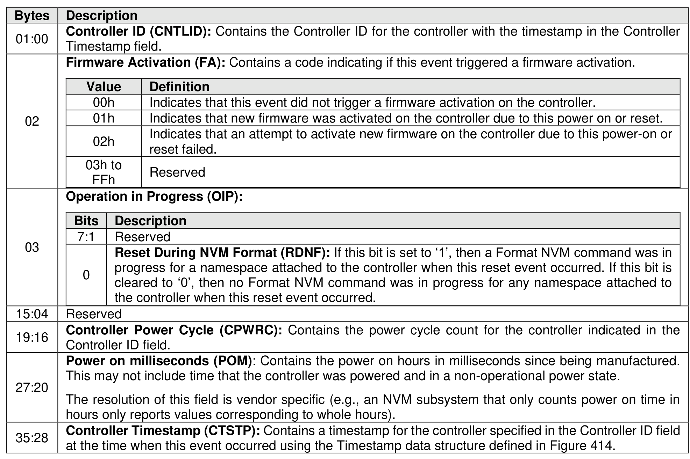

###### 5.2.12.1.14.2.4 Power-on or Reset Event (Event Type 04h)

> **Section ID**: 5.2.12.1.14.2.4 | **Page**: 270-270

A Power-on or Reset event shall be recorded in the Persistent Event Log when an NVM Subsystem Reset
(e.g., due to a power-on) or a Controller Level Reset is completed. The Power-on or Reset Event reports
information about resets due to power-on or other events that cause resets (refer to section 3.7) followed
by descriptors reporting information about the controller at the time the reset occurred, including timestamp
values for all controllers for use in synchronization of timestamp values across controllers.
The controller shall set the Persistent Event Log Event Header:
•
Event Type field to 04h; and
•
Event Type Revision field to 01h.
The Power-on or Reset Event data is specified in Figure 237.

---
### 📊 Tables (2)

#### Table 1: Untitled Table

| Description |  |
| :--- | :--- |
| **Controller ID (CNTLID)**: Contains the Controller ID for the controller with the timestamp in the Controller Timestamp field. |  |
| **Firmware Activation (FA)**: Contains a code indicating if this event triggered a firmware activation. |  |
| **Value** | **Definition** |
| | reset failed. |
| 03h to FFh | Reserved |
| **Operation in Progress (OIP)**: |  |
| **Bits** | **Description** |
| 7:1 | Reserved |
| 0 | **Reset During NVM Format (RDNF)**: If this bit is set to '1', then a Format NVM command was in progress for a namespace attached to the controller when this reset event occurred. If this bit is cleared to '0', then no Format NVM command was in progress for any namespace attached to the controller when this reset event occurred. |
| Reserved |  |
| **Controller Power Cycle (CPWRC)**: Contains the power cycle count for the controller indicated in the Controller ID field. |  |
| **Power on milliseconds (POM)**: Contains the power on hours in milliseconds since being manufactured. This may not include time that the controller was powered and in a non-operational power state. |  |
| The resolution of this field is vendor specific (e.g., an NVM subsystem that only counts power on time in hours only reports values corresponding to whole hours). |  |
| **Controller Timestamp (CTSTP)**: Contains a timestamp for the controller specified in the Controller ID field at the time when this event occurred using the Timestamp data structure defined in Figure 414. |  |

#### Table 2: Untitled Table

(Continuation of Untitled Table - see first part)

