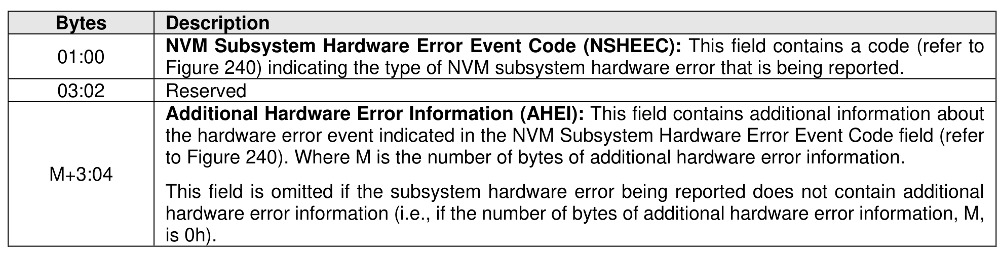
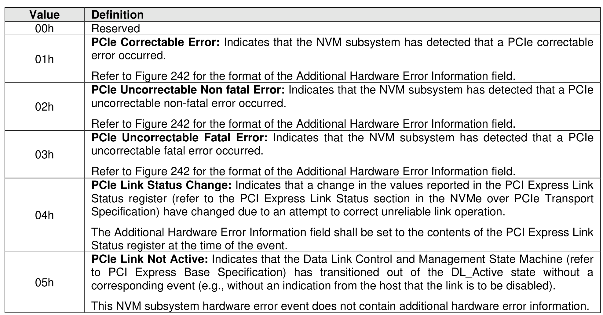
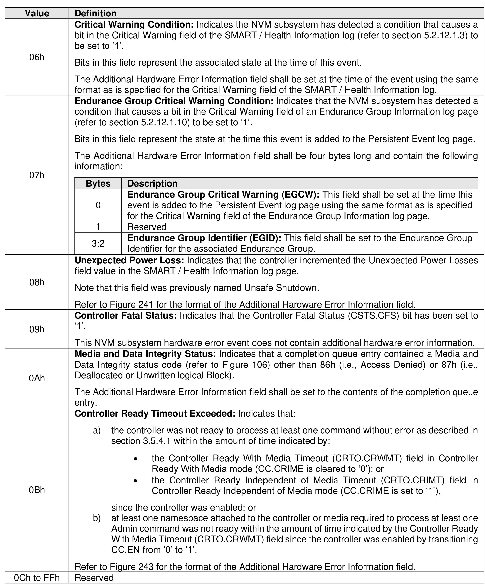
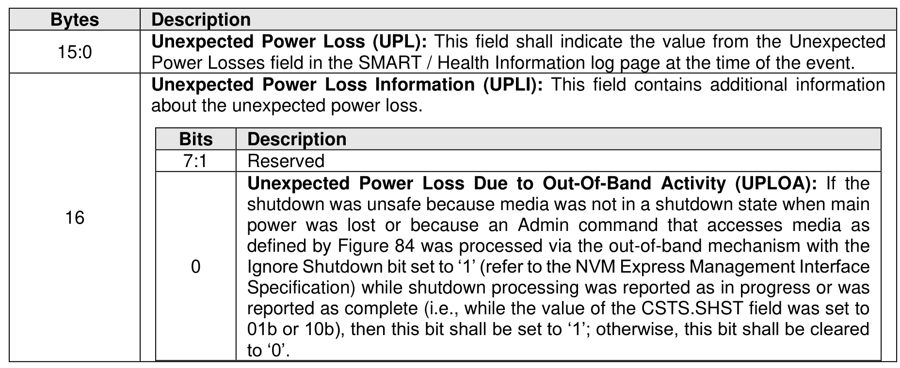
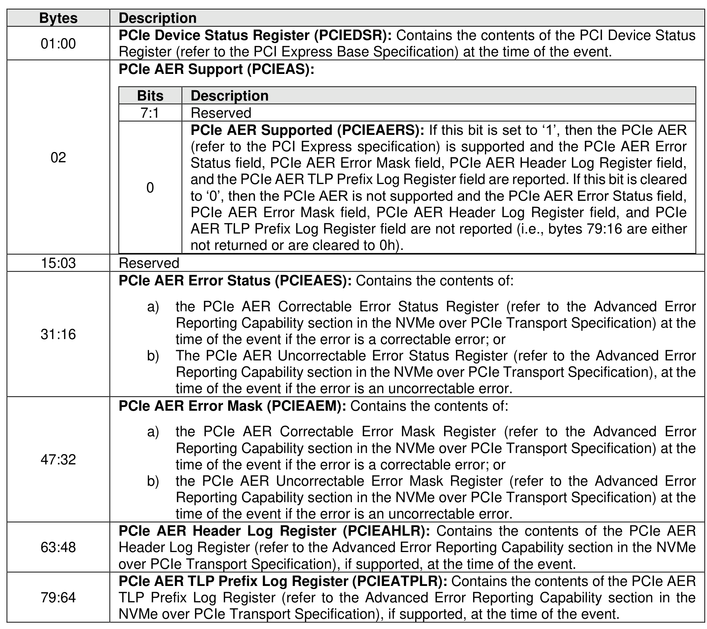
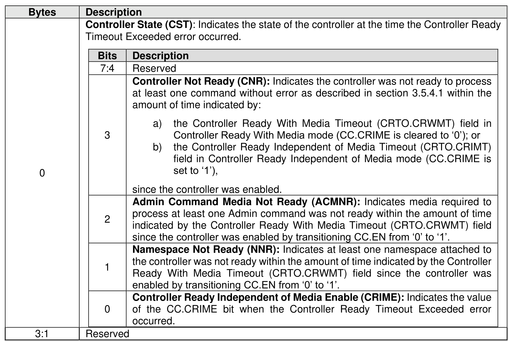

###### 5.2.12.1.14.2.5 NVM Subsystem Hardware Error Event (Event Type 05h)

> **Section ID**: 5.2.12.1.14.2.5 | **Page**: 271-274

An NVM Subsystem Hardware Error event shall be recorded in the Persistent Event Log when a supported
NVM subsystem hardware error event is detected. Which of the NVM subsystem hardware error events
are supported is vendor specific. The NVM subsystem hardware error event shall set the Persistent Event
Log Event Header:
•
Event Type field to 05h; and
•
Event Type Revision Field to 02h.
All detected NVM Subsystem Hardware Error events supported by the NVM subsystem shall be logged
unless otherwise specified (e.g., suppressed due to reoccurrence frequency (refer to section 5.2.12.1.14)).
NVM Subsystem Hardware Error event fields reporting information that is not available (e.g., due to a PCIe
optional feature that is not implemented) shall be cleared to 0h unless otherwise specified in the NVM
Subsystem Hardware Error Event code description.
The NVM Subsystem Hardware Error Event data is specified in Figure 239.

---
### 📊 Tables (6)

#### Table 1: Untitled Table

| e | Definition |
| :--- | :--- |
| | Reserved |
| | **PCIe Correctable Error:** Indicates that the NVM subsystem has detected that a PCIe correctable error occurred.   Refer to Figure 242 for the format of the Additional Hardware Error Information field. |
| | **PCIe Uncorrectable Non fatal Error:** Indicates that the NVM subsystem has detected that a PCIe uncorrectable fatal error occurred.   Refer to Figure 242 for the format of the Additional Hardware Error Information field. |
| | **PCIe Link Status Change:** Indicates that a change in the values reported in the PCI Express Link Status register (refer to the PCI Express Link Status section in the NVMe over PCIe Transport Specification) have changed due to an attempt to correct unreliable link operation.   The Additional Hardware Error Information field shall be set to the contents of the PCI Express Link Status register at the time of the event. |
| | **PCIe Link Not Active:** Indicates that the Data Link Control and Management State Machine (refer to PCI Express Base Specification) has transitioned out of the DL_Active state without a corresponding event (e.g., without an indication from the host that the link is to be disabled).   This NVM subsystem hardware error event does not contain additional hardware error information. |
| Bytes | Description |
| :--- | :--- |
| 0 | **Endurance Group Critical Warning (EGCW):** This field shall be set at the time this event is added to the Persistent Event log page using the same format as is specified for the Critical Warning field of the Endurance Group Information log page. |
| 1 | Reserved |
| 3:2 | **Endurance Group Identifier (EGID):** This field shall be set to the Endurance Group Identifier for the associated Endurance Group. |
| | **Unexpected Power Loss:** Indicates that the controller incremented the Unexpected Power Losses field value in the SMART / Health Information log page. |
| | Note that this field was previously named Unsafe Shutdown. |
| | Refer to Figure 241 for the format of the Additional Hardware Error Information field. |
| | **Controller Fatal Status:** Indicates that the Controller Fatal Status (CSTS.CFS) bit has been set to '1'. |
| | This NVM subsystem hardware error event does not contain additional hardware error information. |
| | **Media and Data Integrity Status:** Indicates that a completion queue entry contained a Media and Data Integrity status code (refer to Figure 106) other than 86h (i.e., Access Denied) or 87h (i.e., Deallocated or Unwritten logical Block). |
| | The Additional Hardware Error Information field shall be set to the contents of the completion queue entry. |
| | **Controller Ready Timeout Exceeded:** Indicates that: |
| | a) the controller was not ready to process at least one command without error as described in section 3.5.4.1 within the amount of time indicated by: |
| | • the Controller Ready With Media Timeout (CRTO.CRWMT) field in Controller Ready With Media mode (CC.CRIME is cleared to '0'); or |
| | • the Controller Ready Independent of Media Timeout (CRTO.CRIMT) field in Controller Ready Independent of Media mode (CC.CRIME is set to '1'), |
| | since the controller was enabled; or |
| | b) at least one namespace attached to the controller or media required to process at least one Admin command was not ready within the amount of time indicated by the Controller Ready With Media Timeout (CRTO.CRWMT) field since the controller was enabled by transitioning CC.EN from '0' to '1'. |
| | Refer to Figure 243 for the format of the Additional Hardware Error Information field. |
| FFh | Reserved |
| | Power Losses field in the SMART / Health Information log page at the time of the event. |
| | **Unexpected Power Loss Information (UPLI):** This field contains additional information about the unexpected power loss. |
| Bits | Description |
| :--- | :--- |
| 7:1 | Reserved |
| 0 | **Unexpected Power Loss Due to Out-Of-Band Activity (UPLOA):** If the shutdown was unsafe because media was not in a shutdown state when main power was lost or because an Admin command that accesses media as defined by Figure 84 was processed via the out-of-band mechanism with the Ignore Shutdown bit set to '1' (refer to the NVM Express Management Interface Specification) while shutdown processing was reported as in progress or was reported as complete (i.e., while the value of the CSTS.SHST field was set to 01b or 10b), then this bit shall be set to '1'; otherwise, this bit shall be cleared to '0'. |
| | **42: Additional Hardware Error Information for correctable and uncorrectable PCIe errors** |
| Description | |
| PCle Device Status Register (PCIEDSR): Contains the contents of the PCI Device Status Register (refer to the PCI Express Base Specification) at the time of the event. | |
| Bits | Description |
|:---|:---|
| 7:4 | Reserved |
| 3 | **Controller Not Ready (CNR)**: Indicates the controller was not ready to process at least one command without error as described in section 3.5.4.1 within the amount of time indicated by: a) the Controller Ready With Media Timeout (CRTO.CRWMT) field in Controller Ready With Media mode (CC.CRIME is cleared to '0'); or b) the Controller Ready Independent of Media Timeout (CRTO.CRIMT) field in Controller Ready Independent of Media mode (CC.CRIME is set to '1'), since the controller was enabled. |
| 2 | **Admin Command Media Not Ready (ACMNR)**: Indicates media required to process at least one Admin command was not ready within the amount of time indicated by the Controller Ready With Media Timeout (CRTO.CRWMT) field since the controller was enabled by transitioning CC.EN from '0' to '1'. |
| 1 | **Namespace Not Ready (NNR)**: Indicates at least one namespace attached to the controller was not ready within the amount of time indicated by the Controller Ready With Media Timeout (CRTO.CRWMT) field since the controller was enabled by transitioning CC.EN from '0' to '1'. |
| 0 | **Controller Ready Independent of Media Enable (CRIME)**: Indicates the value of the CC.CRIME bit when the Controller Ready Timeout Exceeded error occurred. |
| | Reserved |

#### Table 2: Untitled Table

(Continuation of Untitled Table - see first part)

#### Table 3: Untitled Table

(Continuation of Untitled Table - see first part)

#### Table 4: Untitled Table

(Continuation of Untitled Table - see first part)

#### Table 5: Untitled Table

(Continuation of Untitled Table - see first part)

#### Table 6: Untitled Table

(Continuation of Untitled Table - see first part)

