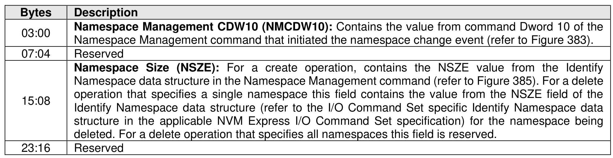
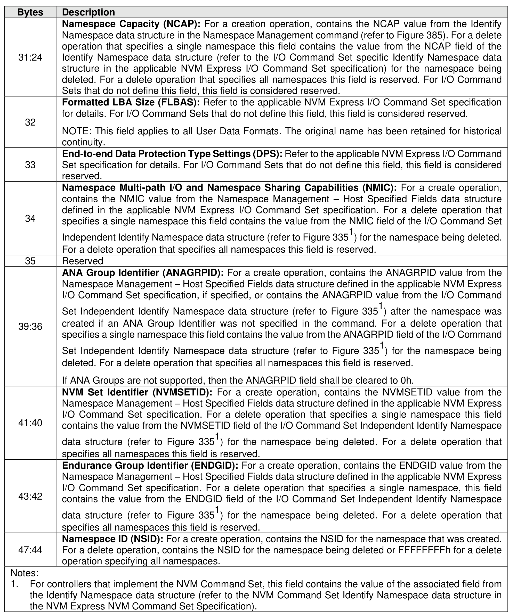

###### 5.2.12.1.14.2.6 Change Namespace Event (Event Type 06h)

> **Section ID**: 5.2.12.1.14.2.6 | **Page**: 274-275

The Changed Namespace Event (refer to Figure 244) persists the host parameters used for successful
Namespace Management commands. This event type is specific to namespaces that are associated with
I/O Command Sets that specify logical blocks (e.g., the NVM Command Set and the Zoned Namespace
Command Set). The event contains a Persistent Event Log Event header and the Change Namespace
Event data.
The Changed Namespace Event shall set the Persistent Event Log Event Header:
•
Event Type field to 06h; and
•
Event Type Revision Field to 02h.

---
### 📊 Tables (2)

#### Table 1: Untitled Table

| Namespace Capacity (NOCAP): For a create operation, contains the NOCAP value from the Identify Namespace data structure in the Namespace Management command (refer to Figure 385). For a delete operation that specifies a single namespace this field contains the value from the NCAP field of the Identify Namespace data structure (refer to the I/O Command Set specific Identify Namespace data structure in the applicable NVM Express I/O Command Set specification) for the namespace being deleted. For a delete operation that specifies all namespaces this field is reserved. For I/O Command Sets that do not define this field, this field is considered reserved. |  |
|---|---|
| Formatted LBA Size (FLBAS): Refer to the applicable NVM Express I/O Command Set specification for details. For I/O Command Sets that do not define this field, this field is considered reserved. |  |
| NOTE: This field applies to all User Data Formats. The original name has been retained for historical continuity. |  |
| End-to-end Data Protection Type Settings (DPS): Refer to the applicable NVM Express I/O Command Set specification for details. For I/O Command Sets that do not define this field, this field is considered reserved. |  |
| Namespace Multi-path I/O and Namespace Sharing Capabilities (NMIC): For a create operation, contains the NMIC value from the Namespace Management – Host Specified Fields data structure defined in the applicable NVM Express I/O Command Set specification. For a delete operation that specifies a single namespace this field contains the value from the NMIC field of the I/O Command Set Independent Identify Namespace data structure (refer to Figure 3351) for the namespace being deleted. For a delete operation that specifies all namespaces this field is reserved. |  |
| Reserved |  |
| ANA Group Identifier (ANAGRPID): For a create operation, contains the ANAGRPID value from the Namespace Management – Host Specified Fields data structure defined in the applicable NVM Express I/O Command Set specification, if specified, or contains the ANAGRPID value from the I/O Command Set Independent Identify Namespace data structure (refer to Figure 3351) after the namespace was created if an ANA Group Identifier was not specified in the command. For a delete operation that specifies a single namespace this field contains the value from the ANAGRPID field of the I/O Command Set Independent Identify Namespace data structure (refer to Figure 3351) for the namespace being deleted. For a delete operation that specifies all namespaces this field is reserved. |  |
| If ANA Groups are not supported, then the ANAGRPID field shall be cleared to 0h. |  |
| NVM Set Identifier (NVMSETID): For a create operation, contains the NVMSETID value from the Namespace Management – Host Specified Fields data structure defined in the applicable NVM Express I/O Command Set specification. For a delete operation that specifies a single namespace this field contains the value from the NVMSETID field of the I/O Command Set Independent Identify Namespace data structure (refer to Figure 3351) for the namespace being deleted. For a delete operation that specifies all namespaces this field is reserved. |  |
| Endurance Group Identifier (ENDGID): For a create operation, contains the ENDGID value from the Namespace Management – Host Specified Fields data structure defined in the applicable NVM Express I/O Command Set specification. For a delete operation that specifies a single namespace, this field contains the value from the ENDGID field of the I/O Command Set Independent Identify Namespace data structure (refer to Figure 3351) for the namespace being deleted. For a delete operation that specifies all namespaces this field is reserved. |  |
| Namespace ID (NSID): For a create operation, contains the NSID for the namespace that was created. For a delete operation, contains the NSID for the namespace being deleted or FFFFFFFFh for a delete operation specifying all namespaces. |  |
| controllers that implement the NVM Command Set, this field contains the value of the associated field from Identify Namespace data structure (refer to the NVM Command Set Identify Namespace data structure in NVM Express NVM Command Set Specification). |  |

#### Table 2: Untitled Table

(Continuation of Untitled Table - see first part)

