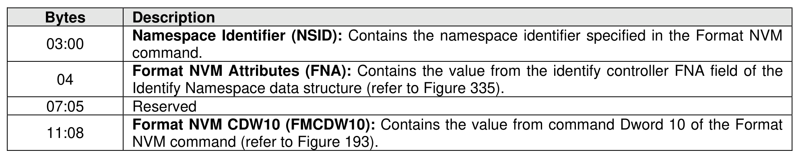

###### 5.2.12.1.14.2.7 Format NVM Start Event (Event Type 07h)

> **Section ID**: 5.2.12.1.14.2.7 | **Page**: 276-276

A Format NVM Start event shall be recorded in the Persistent Event Log after successfully validating the
command parameters of a Format NVM command (refer to section 5.2.10) and before modifying any of the
contents of the NVM.
The Format NVM Start event shall set the Persistent Event Log Event Header:
•
Event Type field to 07h; and
•
Event Type Revision field to 01h.

---
### 📊 Tables (1)

#### Table 1: Untitled Table

| 05 | Reserved |
|---|---|
| 08 | **Format NVM CDW10 (FMCDW10):** Contains the value from command Dword 10 of the Format NVM command (refer to Figure 193). |

