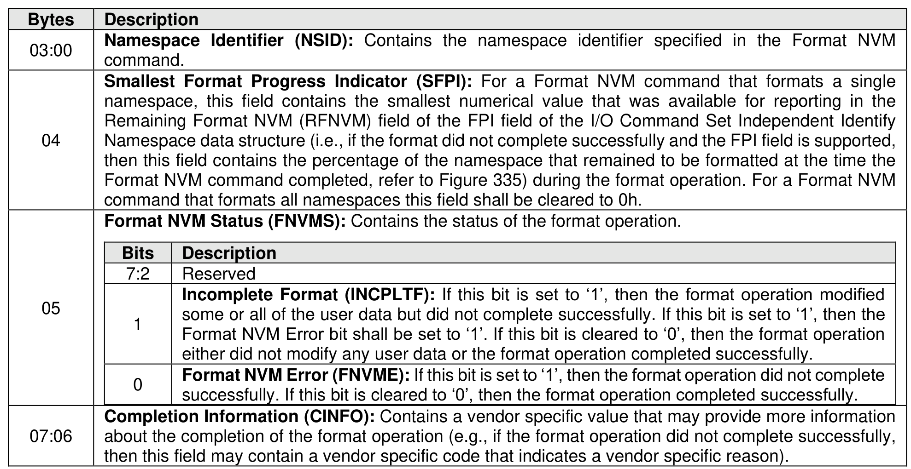
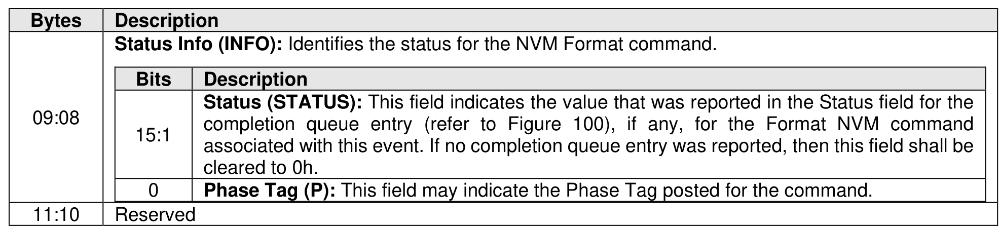

###### 5.2.12.1.14.2.8 Format NVM Completion Event (Event Type 08h)

> **Section ID**: 5.2.12.1.14.2.8 | **Page**: 276-277

A Format NVM Completion event shall be recorded in the Persistent Event Log at the completion of a
Format NVM command that resulted in modification of the contents of the NVM.
The Format NVM Completion event shall set the Persistent Event Log Event Header:
•
Event Type field to 08h; and
•
Event Type Revision field to 02h.

---
### 📊 Tables (2)

#### Table 1: Untitled Table

| Bits | Description |
|---|---|
| 7:2 | Reserved |
| 1 | **Incomplete Format (INCPLTF):** If this bit is set to '1', then the format operation modified some or all of the user data but did not complete successfully. If this bit is set to '1', then the Format NVM Error bit shall be set to '1'. If this bit is cleared to '0', then the format operation either did not modify any user data or the format operation completed successfully. |
| 0 | **Format NVM Error (FNVME):** If this bit is set to '1', then the format operation did not complete successfully. If this bit is cleared to '0', then the format operation completed successfully. |
| | **Completion Information (CINFO):** Contains a vendor specific value that may provide more information about the completion of the format operation (e.g., if the format operation did not complete successfully, then this field may contain a vendor specific code that indicates a vendor specific reason). |
| | |
| | |
| | |
| | |
| | |
| | |
| | |
| | |
| | |
| | |

#### Table 2: Untitled Table

(Continuation of Untitled Table - see first part)

