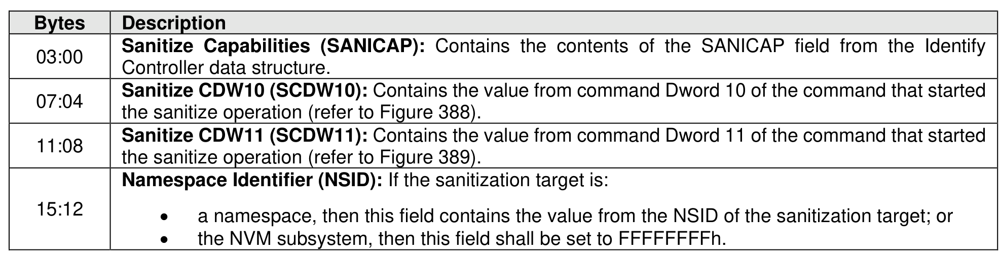

###### 5.2.12.1.14.2.9 Sanitize Start Event (Event Type 09h)

> **Section ID**: 5.2.12.1.14.2.9 | **Page**: 277-277

A Sanitize Start event shall be recorded in the Persistent Event Log at the start of a sanitize operation (i.e.,
the sanitization target transitions to the Restricted Processing state or the Unrestricted Processing state,
as described in section 8.1.26.4).
The Sanitize Start event shall set the Persistent Event Log Event Header:
•
Event Type field to 09h; and
•
Event Type Revision field to 02h.

---
### 📊 Tables (1)

#### Table 1: Untitled Table

| | |
|---|---|
| | a namespace, then this field contains the value from the NSID of the sanitization target; or |
| | the NVM subsystem, then this field shall be set to FFFFFFFFh. |
| **8.14.2.10** | **Sanitize Completion Event (Event Type 0Ah)** |
| | Sanitize Completion event shall be recorded in the Persistent Event Log at the completion of a sanitize operation (i.e., the sanitization target transitions to the Idle state, the Restricted Failure state, or the Selected Failure state, as described in section 8.1.26.4). |
| | Sanitize Completion event shall set the Persistent Event Log Event Header: |
| | Event Type field to 0Ah; and |
| | Event Type Revision field to 02h. |
| | Figure 248: Sanitize Completion Event Data Format (Event Type 0Ah) |

