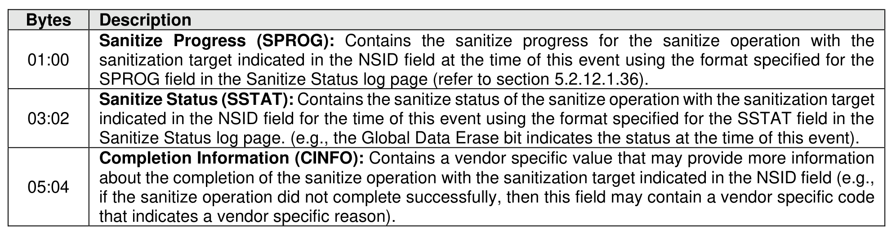
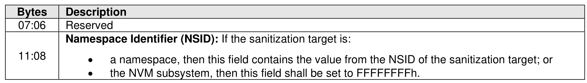

###### 5.2.12.1.14.2.10 Sanitize Completion Event (Event Type 0Ah)

> **Section ID**: 5.2.12.1.14.2.10 | **Page**: 277-278

A Sanitize Completion event shall be recorded in the Persistent Event Log at the completion of a sanitize
operation (i.e., the sanitization target transitions to the Idle state, the Restricted Failure state, or the
Unrestricted Failure state, as described in section 8.1.26.4).
The Sanitize Completion event shall set the Persistent Event Log Event Header:
•
Event Type field to 0Ah; and
•
Event Type Revision field to 02h.

---
### 📊 Tables (2)

#### Table 1: Untitled Table

| Namespace Identifier (NSID): If the sanitization target is: |  |
|---|---|
| • a namespace, then this field contains the value from the NSID of the sanitization target; or |  |
| • the NVM subsystem, then this field shall be set to FFFFFFFFh. |  |

#### Table 2: Untitled Table

(Continuation of Untitled Table - see first part)

