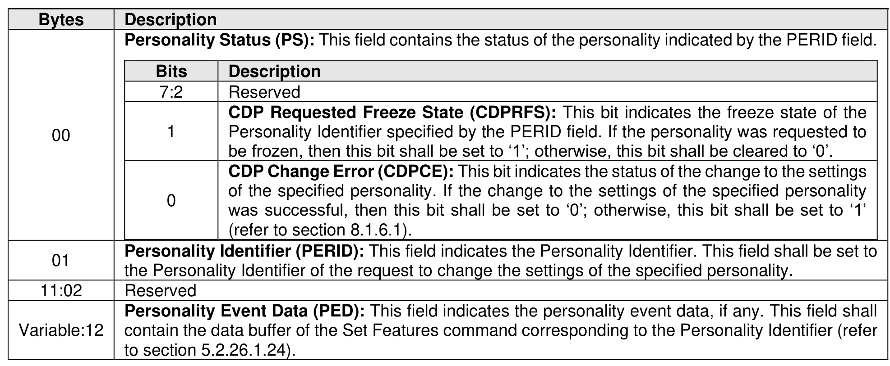

###### 5.2.12.1.14.2.15 Configurable Device Personality Change Event (Event Type 0Fh)

> **Section ID**: 5.2.12.1.14.2.15 | **Page**: 282-283

A Configurable Device Personality (CDP) Change Event shall be recorded in the Persistent Event log page
by the controller that successfully processes a Set Features command specifying the CDP feature (refer to
section 5.2.26.1.24) and:
1. a personality that is not the Manufacturing Default Personality that:
a) changes or fails to change the settings of the specified personality; or
NVM Express® Base Specification, Revision 2.3
b) freezes or unfreezes the specified personality;
or
2. the Security Personality (i.e., to change the settings of a supported security protocol) if that security
protocol transitions out of its manufacturing default state (refer to section 5.2.26.1.24.3).
If a Set features command specifying the CDP feature and the Manufacturing Default Personality is
processed, then only a single CDP Change Event is logged for the Manufacturing Default Personality (i.e.,
a CDP Change Event for each personality other than the Manufacturing Default Personality whose settings
are changed to the manufacturing default values is not logged).
The CDP Change Event shall set the Persistent Event Log Event Format Header:
•
Event Type field to 0Fh; and
•
Event Type Revision field to 01h.
The CDP Change Event data is specified in Figure 253.

---
### 📊 Tables (1)

#### Table 1: Untitled Table

| | | |
| :--- | :--- | :--- |
| | | Personality identifier specified by the PERID field. If the personality was requested to be frozen, then this bit shall be set to '1'; otherwise, this bit shall be cleared to '0'. |
| 0 | CDP Change Error (CDPCE): This bit indicates the status of the change to the settings of the specified personality. If the change to the settings of the specified personality was successful, then this bit shall be set to '0'; otherwise, this bit shall be set to '1' (refer to section 8.1.6.1). | |
| | Personality Identifier (PERID): This field indicates the Personality Identifier. This field shall be set to the Personality Identifier of the request to change the settings of the specified personality. | |
| | Reserved | |
| | Personality Event Data (PED): This field indicates the personality event data, if any. This field shall contain the data buffer of the Set Features command corresponding to the Personality Identifier (refer to section 5.2.26.1.24). | |
| | | |
| | | |
| | | |
| | | |
| | | |
| | | |
| | | |
|

