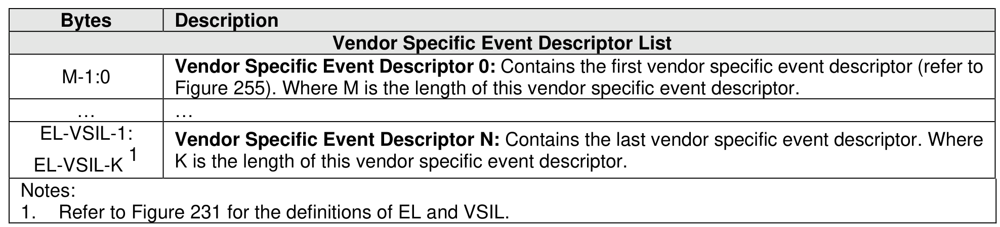
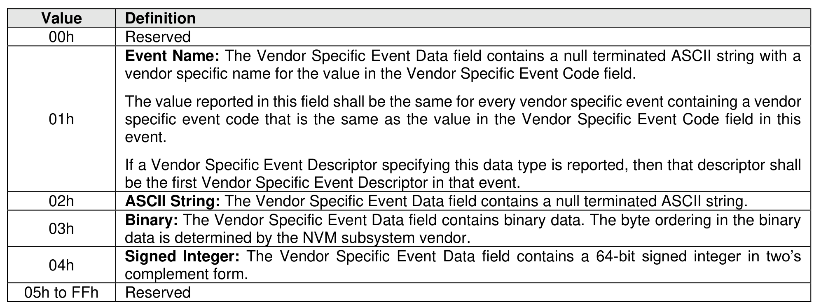

###### 5.2.12.1.14.2.16 Vendor Specific Event (Event Type DEh)

> **Section ID**: 5.2.12.1.14.2.16 | **Page**: 283-284

The Vendor Specific event (refer to Figure 254) contains a set of Vendor Specific Event Descriptors that
describe an event that the vendor has determined is a significant event which should be reported to a host
in the persistent event log and that is not described by any of the other persistent event log events.
The Vendor Specific Event Descriptors follow the format shown in Figure 255 and contain vendor specific
data of the type indicated in the Vendor Specific Event Data Type field of the Vendor Specific Event
Descriptor.
If a UUID Index is specified in the Get Log Page command (refer to section 5.2.12), then the controller shall
return:
a) Vendor specific events based on that UUID index; and
b) Vendor specific events defined by the NVM subsystem manufacturer.
The Vendor Specific event shall set the Persistent Event Log Event Header:
•
Event Type field to DEh; and
•
Event Type Revision field to 01h.
The Vendor Specific Event data is specified in Figure 254.
The format of the Vendor Specific Event Descriptor is shown in Figure 255.
The Vendor Specific Event Data Types that are able to be reported in a Vendor Specific Event Descriptor
are shown in Figure 256.

---
### 📊 Tables (3)

#### Table 1: Untitled Table

| | | |
| :--- | :--- | :--- |
| | | |
| | | |
| | | |
| | | |
| | | |
| | | |
| | | |
| |

#### Table 2: Untitled Table

(Continuation of Untitled Table - see first part)

#### Table 3: Untitled Table

(Continuation of Untitled Table - see first part)

