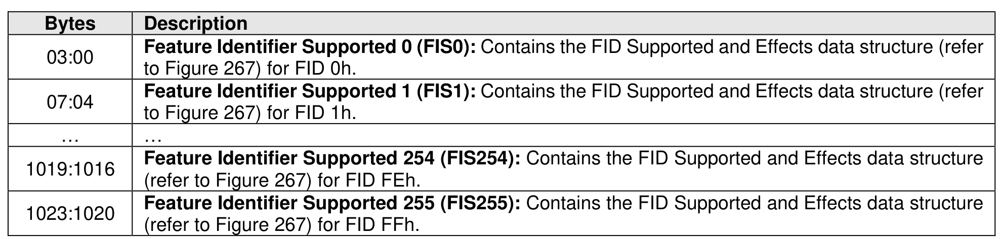
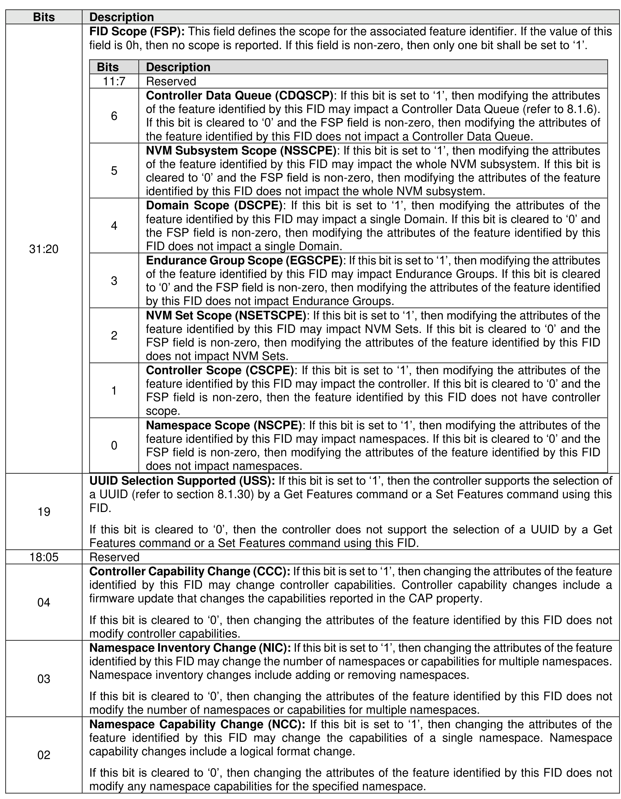
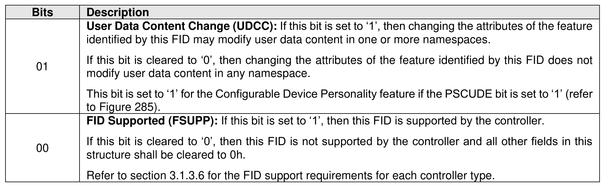

###### 5.2.12.1.18 Feature Identifiers Supported and Effects (Log Page Identifier 12h)

> **Section ID**: 5.2.12.1.18 | **Page**: 291-293

An NVM subsystem may support several interfaces for submitting a Get Log Page command such as an
Admin Submission Queue, PCIe VDM Management Endpoint, or 2-Wire Management Endpoint (refer the
NVM Express Management Interface Specification for details on Management Endpoints) and may have
zero or more instances of each of those interfaces. The feature identifiers (FIDs) supported on each
instance of each interface may be different. This log page describes the FIDs that are supported on the
interface to which the Get Log Page command was submitted and the effects of those features on the state
of the NVM subsystem. The log page is defined in Figure 266. Each Feature Identifier’s effects are
described in a FID Supported and Effects data structure defined in Figure 267.
If the UUID Selection Supported bit is set to ‘1’ for the Get Log Page command in the Commands Supported
and Effects log page (refer to section 5.2.12.1.6), then the log page data reflects the FIDs that are supported
based on the value of the UUID Index field (refer to section 8.1.30).
If the Feature Identifiers Supported and Effects log page is supported and the Feature is supported, then
the scope, as defined in Figure 403, shall be indicated in the FID Scope field (FSP) for that Feature (refer
to Figure 267).
For controllers that implement I/O Queues, the features that the controller supports are dependent on the
I/O Command Set that is based on:
•
the I/O Command Set selected in CC.CSS, if CC.CSS is not set to 110b; and
•
the Command Set Identifier (CSI) field in CDW 14, if CC.CSS is set to 110b.
If CC.CSS is set to 110b, I/O Command Sets that have not been enabled by the I/O Command Set Profile
(FID 19h) (refer to section 5.2.26.1.17) are treated as unsupported.
The FID Supported and Effects data structure describes the effect of a Set Features command for the FID,
including any optional features of the FID.

---
### 📊 Tables (3)

#### Table 1: Untitled Table

| Bits | Description |
|:---|:---|
| 11:7 | Reserved |
| 6 | **Controller Data Queue (CDQSCP):** If this bit is set to '1', then modifying the attributes of the feature identified by this FID may impact a Controller Data Queue (refer to 8.1.6). If this bit is cleared to '0' and the FSP field is non-zero, then modifying the attributes of the feature identified by this FID does not impact a Controller Data Queue. |
| 5 | **NVM Subsystem Scope (NSSCPE):** If this bit is set to '1', then modifying the attributes of the feature identified by this FID may impact the whole NVM subsystem. If this bit is cleared to '0' and the FSP field is non-zero, then modifying the attributes of the feature identified by this FID does not impact the whole NVM subsystem. |
| 4 | **Domain Scope (DSCPE):** If this bit is set to '1', then modifying the attributes of the feature identified by this FID may impact a single Domain. If this bit is cleared to '0' and the FSP field is non-zero, then modifying the attributes of the feature identified by this FID does not impact a single Domain. |
| 3 | **Endurance Group Scope (EGSCPE):** If this bit is set to '1', then modifying the attributes of the feature identified by this FID may impact Endurance Groups. If this bit is cleared to '0' and the FSP field is non-zero, then modifying the attributes of the feature identified by this FID does not impact Endurance Groups. |
| 2 | **NVM Set Scope (NSETSCPE):** If this bit is set to '1', then modifying the attributes of the feature identified by this FID may impact NVM Sets. If this bit is cleared to '0' and the FSP field is non-zero, then modifying the attributes of the feature identified by this FID does not impact NVM Sets. |
| 1 | **Controller Scope (CSCPE):** If this bit is set to '1', then modifying the attributes of the feature identified by this FID may impact the controller. If this bit is cleared to '0' and the FSP field is non-zero, then the feature identified by this FID does not have controller scope. |
| 0 | **Namespace Scope (NSCPE):** If this bit is set to '1', then modifying the attributes of the feature identified by this FID may impact namespaces. If this bit is cleared to '0' and the FSP field is non-zero, then modifying the attributes of the feature identified by this FID does not impact namespaces. |
| | **UUID Selection Supported (USS):** If this bit is set to '1', then the controller supports the selection of a UUID (refer to section 8.1.30) by a Get Features command or a Set Features command using this FID.   If this bit is cleared to '0', then the controller does not support the selection of a UUID by a Get Features command or a Set Features command using this FID. |
| 5 | Reserved |
| | **Controller Capability Change (CCC):** If this bit is set to '1', then changing the attributes of the feature identified by this FID may change controller capabilities. Controller capability changes include a firmware update that changes the capabilities reported in the CAP property.   If this bit is cleared to '0', then changing the attributes of the feature identified by this FID does not modify controller capabilities. |
| | **Namespace Inventory Change (NIC):** If this bit is set to '1', then changing the attributes of the feature identified by this FID may change the number of namespaces or capabilities for multiple namespaces. Namespace inventory changes include adding or removing namespaces.   If this bit is cleared to '0', then changing the attributes of the feature identified by this FID does not modify the number of namespaces or capabilities for multiple namespaces. |
| | **Namespace Capability Change (NCC):** If this bit is set to '1', then changing the attributes of the feature identified by this FID may change the capabilities of a single namespace. Namespace capability changes include a logical format change.   If this bit is cleared to '0', then changing the attributes of the feature identified by this FID does not modify any namespace capabilities for the specified namespace. |
| | identified by this FID may modify user data content in one or more namespaces.   If this bit is cleared to '0', then changing the attributes of the feature identified by this FID does not modify user data content in any namespace.   This bit is set to '1' for the Configurable Device Personality feature if the PSCUDE bit is set to '1' (refer to Figure 285). |
| | **FID Supported (FSUPP):** If this bit is set to '1', then this FID is supported by the controller.   If this bit is cleared to '0', then this FID is not supported by the controller and all other fields in this structure shall be cleared to 0h.   Refer to section 3.1.3.6 for the FID support requirements for each controller type. |

#### Table 2: Untitled Table

(Continuation of Untitled Table - see first part)

#### Table 3: Untitled Table

(Continuation of Untitled Table - see first part)

