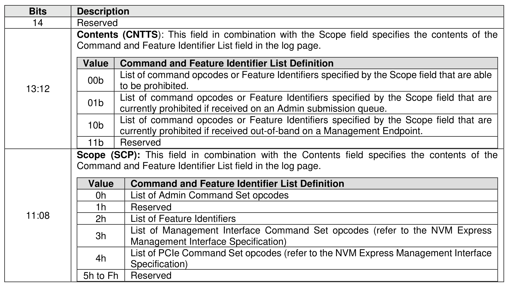
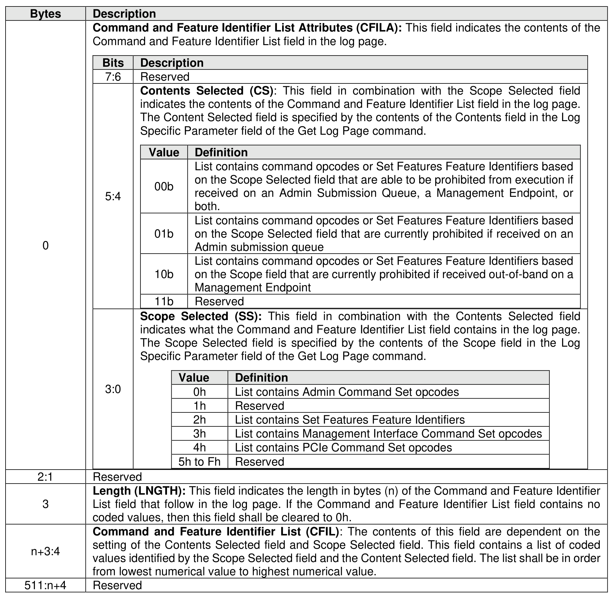

###### 5.2.12.1.20 Command and Feature Lockdown (Log Page Identifier 14h)

> **Section ID**: 5.2.12.1.20 | **Page**: 294-296

This log page is used to indicate which commands and Set Features Feature Identifiers are able to be
prohibited from execution using the Command and Feature Lockdown capability (refer to section 8.1.5) and
which commands are currently prohibited if received on an Admin Submission Queue or received out-of-
band on a Management Endpoint (refer to the NVM Express Management Interface Specification). This log
page uses the Log Specific Parameter field in Command Dword 10 (refer to Figure 201) as defined in Figure
270. This log page may use the UUID Index field in the Get Log Page command to specify the scope and
content of the list returned in the Command and Feature Identifier List field of this log page. The UUID Index
field may be used if the Scope field is set to 2h, allowing returning of vendor specific Set Features Feature
Identifier lockdown information.
If a UUID Index is specified in the Get Log Page command (refer to section 5.2.12) and the Scope field is
set to 2h, then the controller should return vendor specific Set Features lockdown information based on that
UUID index. If the Scope field is not set to 2h, then the controller ignores the UUID index field.
If a controller processes this command with the Contents field set to 10b and the NVM subsystem does not
contain a Management Endpoint, then the command shall be aborted with a status code of Invalid Field in
Command.
The log page returned is defined in Figure 271.

---
### 📊 Tables (2)

#### Table 1: Untitled Table

| Value | Command and Feature Identifier List Definition |
| :--- | :--- |
| 00b | List of command opcodes or Feature Identifiers specified by the Scope field that are able to be prohibited. |
| 01b | List of command opcodes or Feature Identifiers specified by the Scope field that are currently prohibited if received on an Admin submission queue. |
| 10b | List of command opcodes or Feature Identifiers specified by the Scope field that are currently prohibited if received out-of-band on a Management Endpoint. |
| 11b | Reserved |
| Value | Command and Feature Identifier List Definition |
| :--- | :--- |
| 0h | List of Admin Command Set opcodes |
| 1h | Reserved |
| 2h | List of Feature Identifiers |
| 3h | List of Management Interface Command Set opcodes (refer to the NVM Express Management Interface Specification) |
| 4h | List of PCIe Command Set opcodes (refer to the NVM Express Management Interface Specification) |
| 5h to Fh | Reserved |
| Bits | Description |
| :--- | :--- |
| 7:6 | Reserved |
| | **Contents Selected (CS):** This field in combination with the Scope Selected field indicates the contents of the Command and Feature Identifier List field in the log page. The Content Selected field is specified by the contents of the Contents field in the Log Specific Parameter field of the Get Log Page command. |
| | |
| | |
| | |
| | |
| | |
| | |
| | |
| | |
| | |
| | |

#### Table 2: Untitled Table

(Continuation of Untitled Table - see first part)

