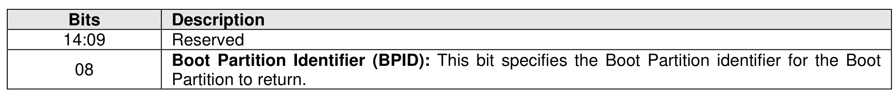
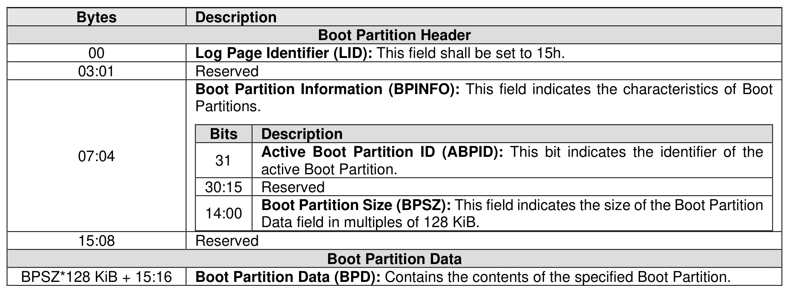

###### 5.2.12.1.21 Boot Partition (Log Page Identifier 15h)

> **Section ID**: 5.2.12.1.21 | **Page**: 296-297

The Boot Partition log page provides read only access to the Boot Partition (refer to section 8.1.3)
accessible by this controller through the BPRSEL property (refer to section 3.1.4.14).
This log page consists of a header describing the Boot Partition and Boot Partition data as defined by Figure
273. The Boot Partition Identifier bit in the Log Specific Parameter field determines the Boot Partition.
A host reading this log page has no effects on the BPINFO property (refer to section 3.1.4.13), the BPRSEL
property, and the BPMBL property (refer to section 3.1.4.15).
The Log Specific Parameter field in Command Dword 10 (refer to Figure 201) for this log page is defined
in Figure 272.

---
### 📊 Tables (2)

#### Table 1: Untitled Table

| Offset | Description |
|---|---|
| | **Boot Partition Information (BPINFO):** This field indicates the characteristics of Boot Partitions. |
| | |
| | <table><tbody><tr><th>Bits</th><th>Description</th></tr><tr><td>31</td><td><b>Active Boot Partition ID (ABPID):</b> This bit indicates the identifier of the active Boot Partition.</td></tr><tr><td>30:15</td><td>Reserved</td></tr><tr><td>14:00</td><td><b>Boot Partition Size (BPSZ):</b> This field indicates the size of the Boot Partition Data field in multiples of 128 KiB.</td></tr></tbody></table> |
| 15:08 | Reserved |
| | |
| | **Boot Partition Data** |
| 128 KiB + 15:16 | **Boot Partition Data (BPD):** Contains the contents of the specified Boot Partition. |

#### Table 2: Untitled Table

(Continuation of Untitled Table - see first part)

