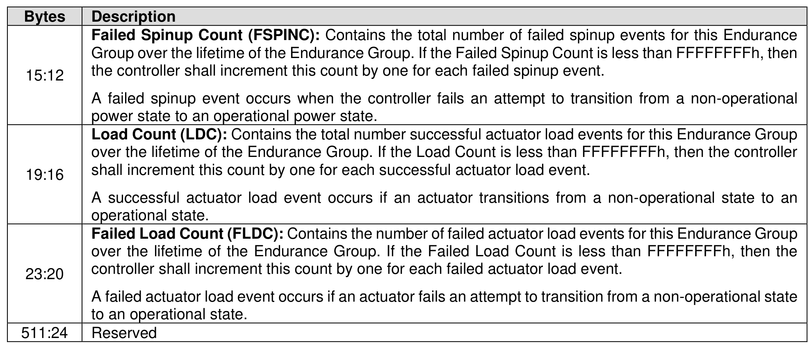

###### 5.2.12.1.22 Rotational Media Information Log (Log Page Identifier 16h)

> **Section ID**: 5.2.12.1.22 | **Page**: 297-298

This log page provides rotational media information (refer to section 8.1.25) for Endurance Groups that
store data on rotational media. The information provided is retained across power cycles and resets.
The Endurance Group Identifier is specified in the Log Specific Identifier field in Command Dword 11 of the
Get Log Page command as defined in Figure 221.
If the NVM subsystem does not contain any Endurance Groups that store data on rotational media, then
the Rotational Media Information Log should not be supported.

---
### 📊 Tables (2)

#### Table 1: Untitled Table

| | |
| :--- | :--- |
| All other values | 0 (refer to section 5.2.26.1.2). |
| Reserved | |
| **Spinup Count (SPINC):** Contains the total number of successful spinup events for this Endurance Group over the lifetime of the Endurance Group. If the Spinup Count is less than FFFFFFFFh, then the controller shall increment this count by one for each successful spinup event.   A successful spinup event occurs when the controller power state transitions from a non-operational power state to an operational power state. | |
| | |
| | |
| | |
| | |
| | |
| | |
| | |
| | |
| | |
| |

#### Table 2: Untitled Table

(Continuation of Untitled Table - see first part)

