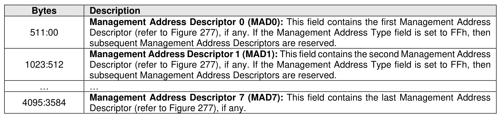
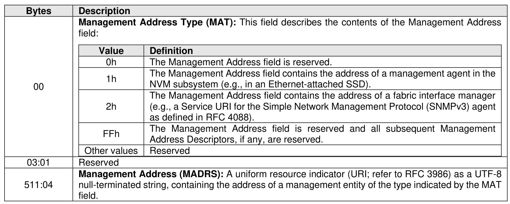

###### 5.2.12.1.24 Management Address List (Log Page Identifier 18h)

> **Section ID**: 5.2.12.1.24 | **Page**: 299-299

This log consists of a Management Address List (refer to Figure 276) of up to eight Management Address
Descriptors (refer to Figure 277). Management addresses are described in section 8.1.15.
Figure 277 describes the Management Address Descriptor.
Because the list is able to contain from zero to eight Management Address Descriptors with a MAT field
less than FFh, a host scans the list starting with Management Address Descriptor 0, and ending with either
Management Address Descriptor 7 or a Management Address Descriptor having a MAT field set to FFh.

---
### 📊 Tables (2)

#### Table 1: Untitled Table

| | Description |
|---|---|
| | **Management Address Type (MAT):** This field describes the contents of the Management Address field: |
| | <table><tbody><tr><th>Value</th><th>Definition</th></tr><tr><td>0h</td><td>The Management Address field is reserved.</td></tr><tr><td>FFh</td><td>The Management Address field contains the address of a management agent in the Management Address field is reserved and all subsequent Management Address Descriptors, if any, are reserved.</td></tr><tr><td>Other values</td><td>Reserved</td></tr></tbody></table> |
| | Reserved |
| | **Management Address (MADRS):** A uniform resource indicator (URI; refer to RFC 3986) as a UTF-8 null-terminated string, containing the address of a management entity of the type indicated by the MAT field. |

#### Table 2: Untitled Table

(Continuation of Untitled Table - see first part)

