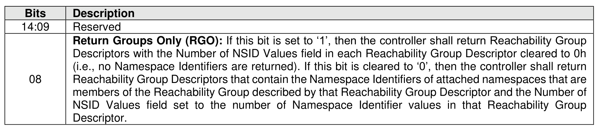
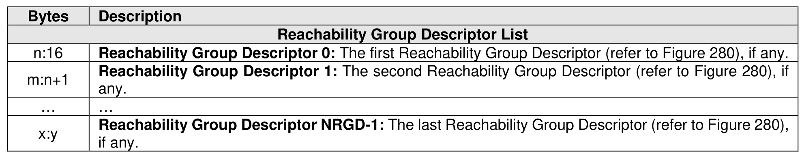
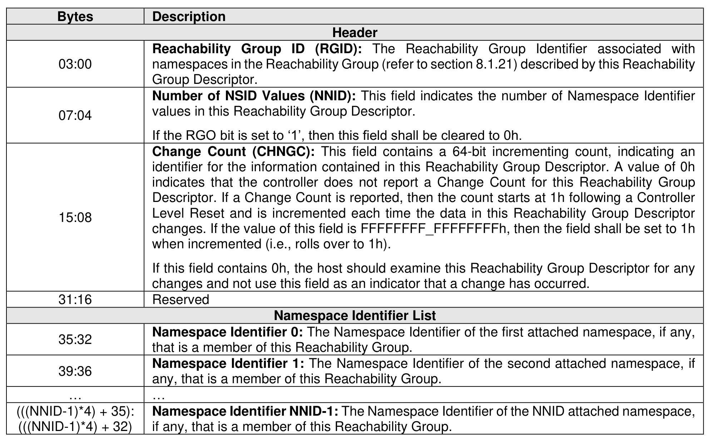

###### 5.2.12.1.25 Reachability Groups (Log Identifier 1Ah)

> **Section ID**: 5.2.12.1.25 | **Page**: 300-301

This log page consists of a header describing the log page and a list of descriptors containing the
Reachability Groups (refer to section 8.1.21) that contain namespaces attached to the controller processing
this command that all have the same reachability attributes.
If the Index Offset Supported bit is cleared to ‘0’ in the LID Support and Effects data structure for this log
page (refer to Figure 208), then:
•
if the RGO bit is cleared to ‘0’ in Command Dword 10, then the LPOL field in Command Dword 12
and the LPOU field in Command Dword 13 of the Get Log Page command should be cleared to
0h.
If the Index Offset Supported bit is set to ‘1’ in the LID Supported and Effects data structure for this log page
(refer to Figure 208), then:
•
for indexes greater than 0, the entry data structure that is indexed is a Reachability Group descriptor
(e.g., specifying an index offset of 2 returns this log page starting at the second descriptor (i.e.,
Reachability Group Descriptor 1)); and
•
for index 0, the data structure starting from the beginning of the log page is returned.
If the host performs multiple Get Log Page commands to read this log page (e.g., using the LPOL field or
the LPOU field), then the host should re-read the header of the log page and ensure that the Change Count
field in the log page matches the original value read. If it does not match, then the data captured is not
consistent and this log page should be re-read.
The Log Specific Parameter field in Command Dword 10 (refer to Figure 201) for this log page is defined
in Figure 278.
The format of the Reachability Group Descriptor is defined in Figure 280. Namespace Identifiers shall be
listed in ascending NSID order.

---
### 📊 Tables (4)

#### Table 1: Untitled Table

| Description | Header |
| :--- | :--- |
| **Change Count (CHNGC)**: This field contains a 64-bit incrementing Reachability Groups log page change count, indicating an identifier for this set of reachability groups information. The count starts at 0h following a Controller Level Reset and is incremented each time the contents of the log page change. If the value of this field is FFFFFFFF_FFFFFFFFh, then the field shall be set to 0h when incremented (i.e., rolls over to 0h). | |
| **Number of Reachability Group Descriptors (NRGD)**: This field indicates the number of Reachability Group Descriptors available in the log page. The log page shall contain one Reachability Group Descriptor if the Reachability Group contains namespaces that are attached to the controller processing the command). If no namespaces are attached to the controller, then the log page does not contain any Reachability Group Descriptors and this field shall be cleared to 0h. | |
| | |
| | |
| | |
| | |
| | |
| | |
| | |
| | |
| | |
| |

#### Table 2: Untitled Table

(Continuation of Untitled Table - see first part)

#### Table 3: Untitled Table

(Continuation of Untitled Table - see first part)

#### Table 4: Untitled Table

(Continuation of Untitled Table - see first part)

