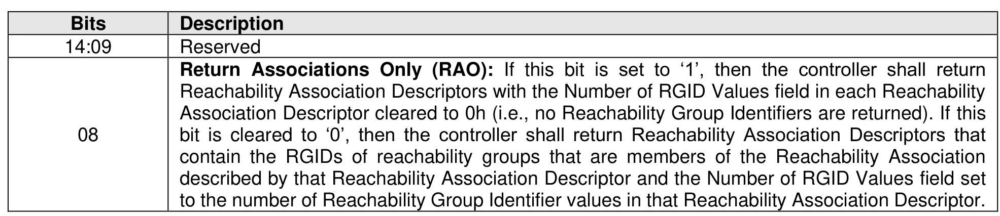
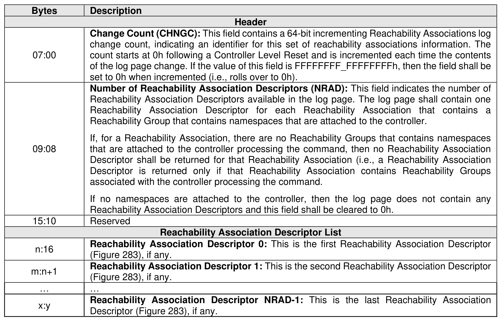
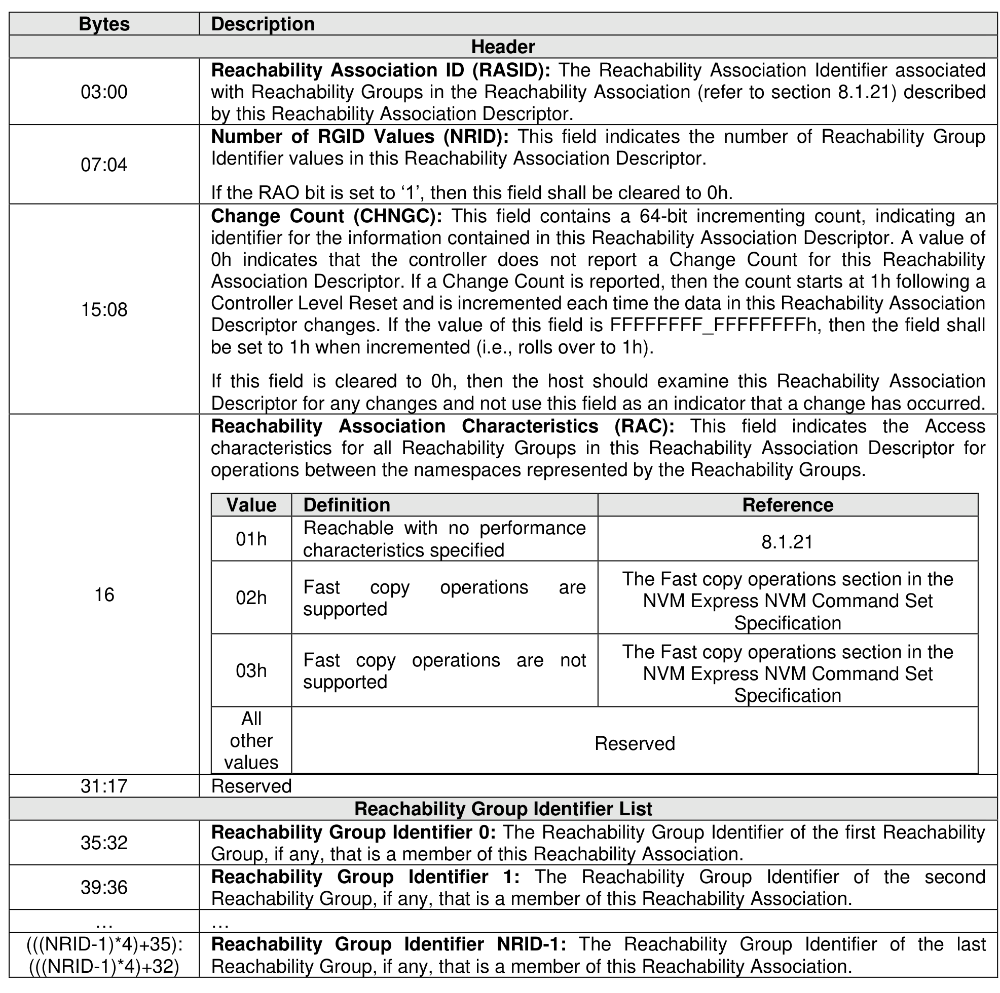

###### 5.2.12.1.26 Reachability Associations (Log Identifier 1Bh)

> **Section ID**: 5.2.12.1.26 | **Page**: 301-303

This log page consists of a header describing the log page and a list of descriptors containing the
Reachability Associations (refer to section 8.1.21), for the controller processing the Get Log Page command
requesting the Reachability Associations log page, that contain Reachability Groups (refer 5.2.12.1.25) that
all have the same reachability attributes.
If the Index Offset Supported bit is cleared to ‘0’ in the LID Support and Effects data structure for this log
page (refer to Figure 208), then:
•
if the RAO bit is cleared to ‘0’ in Command Dword 10, then the LPOL field in Command Dword 12
and the LPOU field in Command Dword 13 of the Get Log Page command should be cleared to
0h.
If the Index Offset Supported bit is set to ‘1’ in the LID Supported and Effects data structure for this log page
(refer to Figure 208), then:
•
for indexes greater than 0, the entry data structure that is indexed is a Reachability Association
descriptor (e.g., specifying an index offset of 2 returns this log page starting at the second descriptor
(i.e., Reachability Association Descriptor 1)).
If the host performs multiple Get Log Page commands to read this log page (e.g., using the LPOL field or
the LPOU field), then the host should re-read the header of the log page and ensure that the Change Count
field in this log page matches the original value read. If it does not match, then the data captured is not
consistent and this log page should be re-read.
The Log Specific Parameter field in Command Dword 10 (refer to Figure 201) for this log page is defined
in Figure 281.

---
### 📊 Tables (3)

#### Table 1: Untitled Table

| | Description | Header |
|---|---|---|
| | Change Count (CHNGC): This field contains a 64-bit incrementing Reachability Associations log change count, indicating an identifier for this set of reachability associations information. The count starts at 0h following a Controller Level Reset and is incremented each time the contents of the Reachability Association Descriptors available in the log page. The log page shall contain one Reachability Association Descriptor for each Reachability Association that contains a Reachability Group that contains namespaces that are attached to the controller. | |
| | If, for a Reachability Association, there are no Reachability Groups that contains namespaces that are attached to the controller processing the command, then no Reachability Association Descriptor shall be returned for that Reachability Association (i.e., a Reachability Association Descriptor is returned only if that Reachability Association contains Reachability Groups associated with the controller processing the command. | |
| | If no namespaces are attached to the controller, then the log page does not contain any Reachability Association Descriptors and this field shall be cleared to 0h. | |
| | | |
| | | |
| | | |
| | | |
| | | |
| | | |
| | | |
|

#### Table 2: Untitled Table

(Continuation of Untitled Table - see first part)

#### Table 3: Untitled Table

(Continuation of Untitled Table - see first part)

