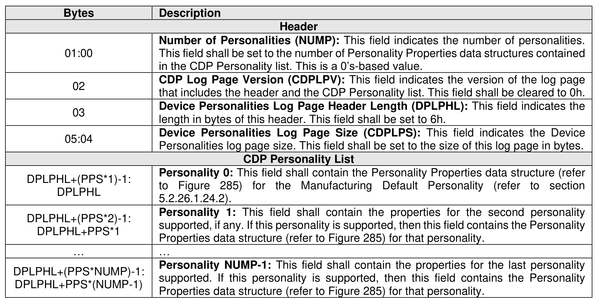
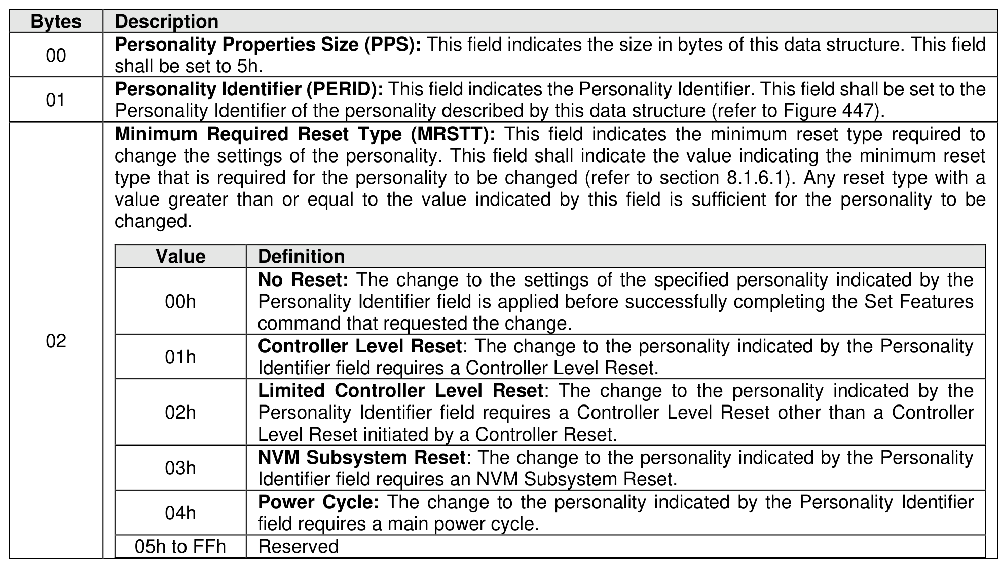
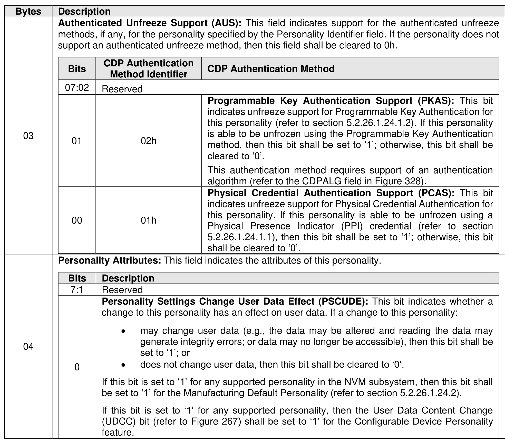

###### 5.2.12.1.28 Device Personalities (Log Page Identifier 1Dh)

> **Section ID**: 5.2.12.1.28 | **Page**: 304-305

Figure 284 defines the list of all personalities that are supported by all controllers in the NVM subsystem.
The properties for each personality are defined in Figure 285.
The personalities in the CDP Personality list shall be listed in ascending order of Personality Identifier.
Refer to section 8.1.6 for the usage of this log page by the host.

---
### 📊 Tables (3)

#### Table 1: Untitled Table

| Description | |
| :--- | :--- |
| Personality Properties Size (PPS): | This field indicates the size in bytes of this data structure. This field shall be set to 5h. |
| Personality Identifier (PERID): | This field indicates the Personality Identifier. This field shall be set to the Personality Identifier of the personality described by this data structure (refer to Figure 447). |
| Minimum Required Reset Type (MRSTT): | This field indicates the minimum reset required to change the settings of the personality. This field shall indicate the value indicating the minimum reset required to change the settings of the personality. |
| Value | Definition |
| 00h | No Reset: The change to the settings of the specified personality indicated by the Personality Identifier field is applied before successfully completing the Set Features command that requested the change. |
| 01h | Controller Level Reset: The change to the personality indicated by the Personality Identifier field requires a Controller Level Reset. |
| 02h | Limited Controller Level Reset: The change to the personality indicated by the Personality Identifier field requires a Controller Level Reset other than a Controller Level Reset initiated by a Controller Reset. |
| 03h | NVM Subsystem Reset: The change to the personality indicated by the Personality Identifier field requires an NVM Subsystem Reset. |
| 04h | Power Cycle: The change to the personality indicated by the Personality Identifier field requires a main power cycle. |
| 05h to FFh | Reserved |
| Bits | CDP Authentication Method Identifier | CDP Authentication Method |
| :--- | :--- | :--- |
| 07:02 | Reserved | |
| 01 | 02h | Programmable Key Authentication Support (PKAS): This bit indicates unfreeze support for Programmable Key Authentication for this personality (refer to section 5.2.26.1.24.1.2). If this personality is able to be unfrozen using the Programmable Key Authentication method, then this bit shall be set to '1'; otherwise, this bit shall be cleared to '0'.   This authentication method requires support of an authentication algorithm (refer to the CDPALG field in Figure 328). |
| 00 | 01h | Physical Credential Authentication Support (PCAS): This bit indicates unfreeze support for Physical Credential Authentication for this personality. If this personality is able to be unfrozen using a Physical Presence Indicator (PPI) credential (refer to section 5.2.26.1.24.1.1), then this bit shall be set to '1'; otherwise, this bit shall be cleared to '0'. |
| Bits | Description |
| :--- | :--- |
| 7:1 | Reserved |
| 0 | Personality Settings Change User Data Effect (PSCUDE): This bit indicates whether a change to this personality has an effect on user data. If a change to this personality:   • may change user data (e.g., the data may be altered and reading the data may generate integrity errors; or data may no longer be accessible), then this bit shall be set to '1'; or   • does not change user data, then this bit shall be cleared to '0'.   If this bit is set to '1' for any supported personality in the NVM subsystem, then this bit shall be set to '1' for the Manufacturing Default Personality (refer to section 5.2.26.1.24.2).   If this bit is set to '1' for any supported personality, then the User Data Content Change (UDCC) bit (refer to Figure 267) shall be set to '1' for the Configurable Device Personality feature. |

#### Table 2: Untitled Table

(Continuation of Untitled Table - see first part)

#### Table 3: Untitled Table

(Continuation of Untitled Table - see first part)

