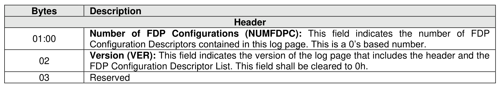
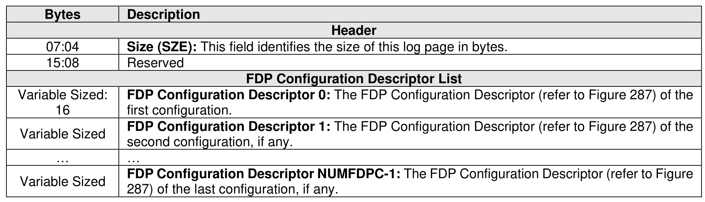
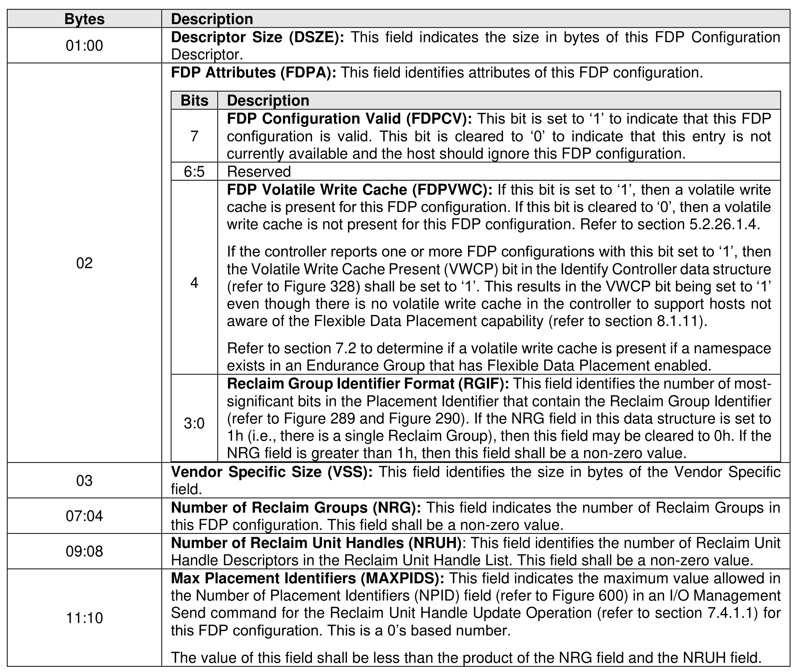
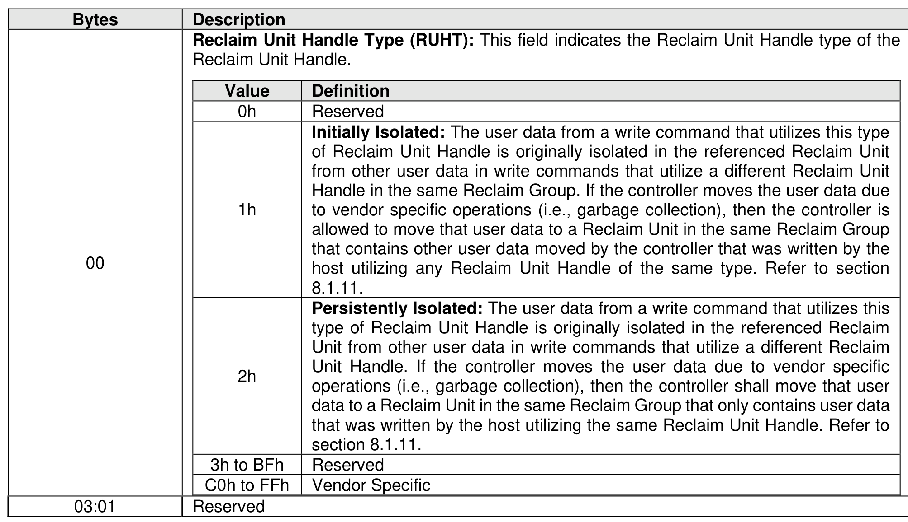
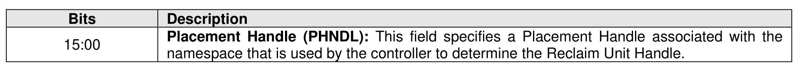
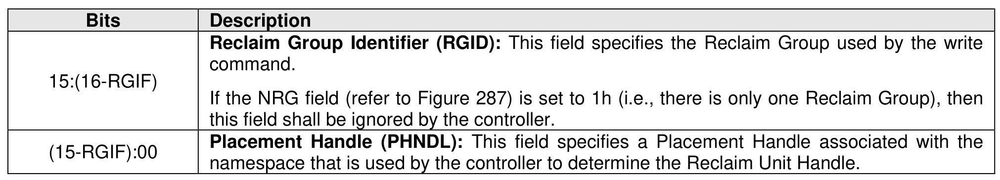

###### 5.2.12.1.29 Flexible Data Placement (FDP) Configurations (Log Page Identifier 20h)

> **Section ID**: 5.2.12.1.29 | **Page**: 305-308

The FDP Configurations log page (refer to Figure 286) identifies a list of static FDP configurations that are
allowed to be applied to the specified Endurance Group. The Endurance Group Identifier in the Log Specific
Identifier field as defined in Figure 221 specifies the Endurance Group. The creation of an Endurance Group
or the enablement of an FDP configuration in an Endurance Group within the NVM subsystem may affect
which FDP configurations are currently allowed (refer to the FDP Configuration Valid bit in Figure 287).
Refer to section 8.1.11 for the usage of this log page by the host.
Figure 287 defines the format of an FDP Configuration Descriptor. The Reclaim Unit Handles in the Reclaim
Unit Handle list shall be listed in ascending order of Reclaim Unit Handle Identifier.
The format of the Placement Identifier used in the Data Placement Directive (refer to section 8.1.9.4) for a
specific FDP configuration is dependent on the number of Reclaim Groups supported by the FDP
configuration in use and the number of bits allocated for the Reclaim Group Identifier field. If the NRG field
(refer to Figure 287) is set to 1h indicating that there is only one Reclaim Group and zero bits are allocated
to the Reclaim Group Identifier (i.e., the RGIF field (refer to Figure 287) is cleared to 0h), then the format
of the Placement Identifier is defined in Figure 289. If one or more bits are allocated to the Reclaim Group
Identifier (i.e., the RGIF field is non-zero), then the format of the Placement Identifier is defined in Figure
290.

---
### 📊 Tables (7)

#### Table 1: Untitled Table

| Bytes | Description |
| :--- | :--- |
| 00 | Reclaim Unit Handle Type (RUHT): This field indicates the Reclaim Unit Handle type of the Reclaim Unit Handle. |
| | | Value | Definition |
| | | 0h | Reserved |
| | | | Initially Isolated: The user data from a write command that utilizes this type of Reclaim Unit Handle is originally isolated in the referenced Reclaim Unit Handle. If the controller is allowed to move that user data to a Reclaim Unit in the same Reclaim Group that contains other user data moved by the controller that was written by the host utilizing any Reclaim Unit Handle of the same type. Refer to section 8.1.11. |
| | | | Persistently Isolated: The user data from a write command that utilizes this type of Reclaim Unit Handle is originally isolated in the referenced Reclaim Unit from other user data in write commands that utilize a different Reclaim Unit Handle. If the controller moves the user data due to vendor specific operations (i.e., garbage collection), then the controller shall move that user data to a Reclaim Unit in the same Reclaim Group that only contains user data that was written by the host utilizing the same Reclaim Unit Handle. Refer to section 8.1.11. |
| | | 2h | |
| | | 3h to BFh | Reserved |
| | | C0h to FFh | Vendor Specific |
| 03:01 | Reserved |

#### Table 2: Untitled Table

(Continuation of Untitled Table - see first part)

#### Table 3: Untitled Table

(Continuation of Untitled Table - see first part)

#### Table 4: Untitled Table

(Continuation of Untitled Table - see first part)

#### Table 5: Untitled Table

(Continuation of Untitled Table - see first part)

#### Table 6: Untitled Table

(Continuation of Untitled Table - see first part)

#### Table 7: Untitled Table

(Continuation of Untitled Table - see first part)

