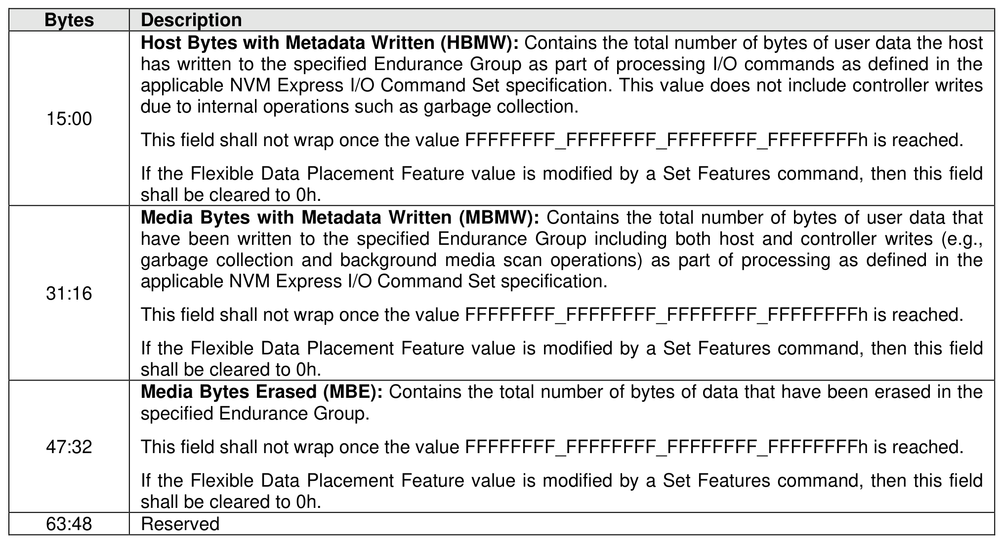

###### 5.2.12.1.31 Flexible Data Placement (FDP) Statistics (Log Page Identifier 22h)

> **Section ID**: 5.2.12.1.31 | **Page**: 309-310

The FDP Statistics log page (refer to Figure 293) is used to provide information about the FDP configuration
over the life of the FDP configuration in an Endurance Group. The Endurance Group is specified by the
Endurance Group Identifier field in the Log Specific Identifier field as defined in Figure 221).
If Flexible Data Placement is enabled in the specified Endurance Group and the Get Log Page command
specifies this log page, then the NSID field in that command is reserved.
If Flexible Data Placement is disabled in the specified Endurance Group and the Get Log Page command
specifies this log page, then the controller shall abort the command with a status code of FDP Disabled.
The values reported in this log page are not cleared to 0h by a firmware update.
The values reported in this log page include operations on all namespaces that existed in the specified
Endurance Group since the Flexible Data Placement was last enabled in that Endurance Group (refer to
section 5.2.26.1.20).

---
### 📊 Tables (1)

#### Table 1: Untitled Table

| 6 | have been written to the specified Endurance Group including both host and controller Writes (e.g., garbage collection and background media scan operations) as part of processing as defined in the applicable NVM Express I/O Command Set specification.   This field shall not wrap once the value FFFFFFFF_FFFFFFFF_FFFFFFFF_FFFFFFFFh is reached.   If the Flexible Data Placement Feature value is modified by a Set Features command, then this field shall be cleared to 0h. |
|---|---|
| 2 | **Media Bytes Erased (MBE):** Contains the total number of bytes of data that have been erased in the specified Endurance Group.   This field shall not wrap once the value FFFFFFFF_FFFFFFFF_FFFFFFFF_FFFFFFFFh is reached.   If the Flexible Data Placement Feature value is modified by a Set Features command, then this field shall be cleared to 0h. |
| 3 | Reserved |
| | 285 |

