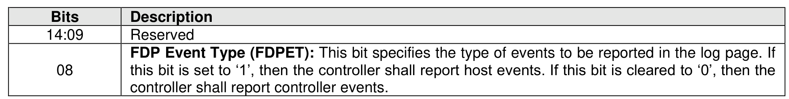
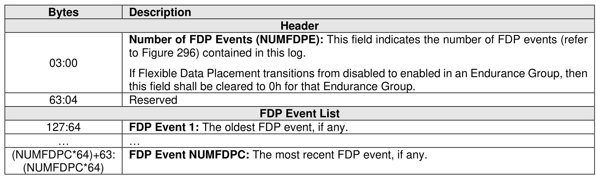
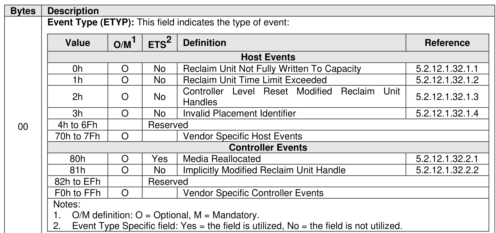
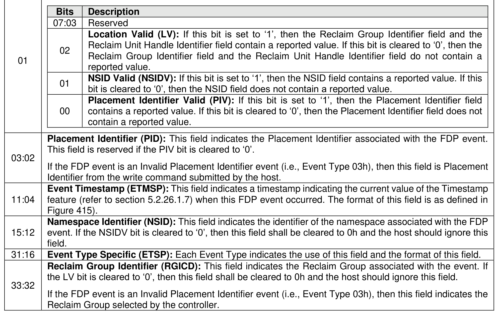
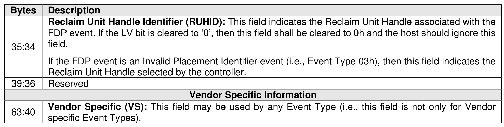

###### 5.2.12.1.32 Flexible Data Placement (FDP) Events (Log Page Identifier 23h)

> **Section ID**: 5.2.12.1.32 | **Page**: 310-312

The FDP Events log page is used to provide information about events affecting Reclaim Units and media
usage in an Endurance Group that has Flexible Data Placement enabled. The log page is 4 KiB bytes in
size. The Endurance Group is specified by the Endurance Group Identifier in the Log Specific Identifier field
as defined in Figure 221.
FDP events are associated with Reclaim Unit Handles. An FDP event shall only be reported if the FDP
event occurs and that FDP event is enabled for that Reclaim Unit Handle (refer to section 5.2.26.1.21).
If:
•
an FDP event occurs;
•
that event is enabled; and
•
the number of events recorded is the maximum supported,
then the oldest event shall be discarded.
The FDP Event Type bit (refer to Figure 294) specifies whether the controller reports host events or
controller events in the log page. The controller shall not report both host events and controller events in
the log page.
If Flexible Data Placement is enabled in the specified Endurance Group and a Get Log Page command
specifies this log page, then the NSID field in that command is reserved.
If Flexible Data Placement is disabled in the specified Endurance Group, then a Get Log Page command
that specifies this log page shall be aborted with a status code of FDP Disabled.
The FDP events shall be listed in ascending order of occurrence. Because the Timestamp feature may or
may not have been set by the host after each Controller Level Reset and because the Event Timestamp
field is the time at which the event was created, the FDP events may or may not be in order of ascending
value of the Event Timestamp field.
The number of FDP events reported in the log page is equal to the value of the Number of FDP Events
field. The values of the bytes in this log page which follow the FDP Event List is implementation specific.
The format of the FDP event is described in Figure 296.
If the controller is not able to report the namespace identifier associated with the event, then the NSIDV bit
shall be cleared to ‘0’.
If the controller is not able to report the specific Reclaim Unit Handle, then:
•
the PIV bit shall be cleared to ‘0’; and
•
the LV bit shall be cleared to ‘0’.

---
### 📊 Tables (5)

#### Table 1: Untitled Table

| Value | O/M | ETS | Definition | Reference |
| :--- | :--- | :--- | :--- | :--- |
| 0h | O | No | Reclaim Unit Not Fully Written To Capacity | 5.2.12.1.32.1.1 |
| 1h | O | No | Reclaim Unit Time Limit Exceeded | 5.2.12.1.32.1.2 |
| 2h | O | No | Controller Level Reset Modified Reclaim Unit Handles | 5.2.12.1.32.1.3 |
| 3h | O | No | Invalid Placement Identifier | 5.2.12.1.32.1.4 |
| 4h to 6Fh | | | Reserved | |
| 70h to 7Fh | O | | Vendor Specific Host Events | |
| | | | **Controller Events** | |
| 80h | O | Yes | Media Reallocated | 5.2.12.1.32.2.1 |
| 81h | O | No | Implicitly Modified Reclaim Unit Handle | 5.2.12.1.32.2.2 |
| 82h to EFh | | | Reserved | |
| F0h to FFh | O | | Vendor Specific Controller Events | |
| | | | Notes: | |
| | | | 1. O/M definition: O = Optional, M = Mandatory. | |
| | | | 2. Event Type Specific field: Yes = the field is utilized, No = the field is not utilized. | |
| | | | **FDP Event Flags (FDPEF):** | |
| Bits | | | Description | |
| 07:03 | | | Reserved | |
| | | | **Location Valid (LV):** If this bit is set to '1', then the Reclaim Group Identifier field and the Reclaim Unit Handle Identifier field contain a reported value. If this bit is cleared to '0', then the Reclaim Group Identifier field and the Reclaim Unit Handle Identifier field do not contain a reported value. | |
| 02 | | | **NSID Valid (NSIDV):** If this bit is set to '1', then the NSID field contains a reported value. If this bit is cleared to '0', then the NSID field does not contain a reported value. | |
| 01 | | | **Placement Identifier (PID):** This field indicates the Placement Identifier associated with the FDP event. This field is reserved if the PIV bit is cleared to '0'. | |
| 00 | | | If the FDP event is an Invalid Placement Identifier event (i.e., Event Type 03h), then this field is Placement Identifier from the write command submitted by the host. | |
| | | | **Event Timestamp (ETMSP):** This field indicates a timestamp indicating the current value of the Timestamp feature (refer to section 5.2.26.1.7) when this FDP event occurred. The format of this field is as defined in Figure 415). | |
| | | | **Namespace Identifier (NSID):** This field indicates the identifier of the namespace associated with the FDP event. If the NSIDV bit is cleared to '0', then this field shall be cleared to 0h and the host should ignore this field. | |
| | | | **Event Type Specific (ETSP):** Each Event Type indicates the use of this field and the format of this field. | |
| | | | **Reclaim Group Identifier (RGICD):** This field indicates the Reclaim Group associated with the event. If the LV bit is cleared to '0', then this field shall be cleared to 0h and the host should ignore this field. | |
| | | | If the FDP event is an Invalid Placement Identifier event (i.e., Event Type 03h), then this field indicates the Reclaim Group selected by the controller. | |
| | | | FDP event. If the LV bit is cleared to '0', then this field shall be cleared to 0h and the host should ignore this field. | |
| | | | If the FDP event is an Invalid Placement Identifier event (i.e., Event Type 03h), then this field indicates the Reclaim Unit Handle selected by the controller. | |
| | | | Reserved | |
| | | | **Vendor Specific Information** | |
| | | | **Vendor Specific (VS):** This field may be used by any Event Type (i.e., this field is not only for Vendor specific Event Types). | |
| | | | controller is not able to report the namespace identifier associated with the event, then the NSIDV bit cleared to '0'. | |
| | | | controller is not able to report the specific Reclaim Unit Handle, then: | |

#### Table 2: Untitled Table

(Continuation of Untitled Table - see first part)

#### Table 3: Untitled Table

(Continuation of Untitled Table - see first part)

#### Table 4: Untitled Table

(Continuation of Untitled Table - see first part)

#### Table 5: Untitled Table

(Continuation of Untitled Table - see first part)

