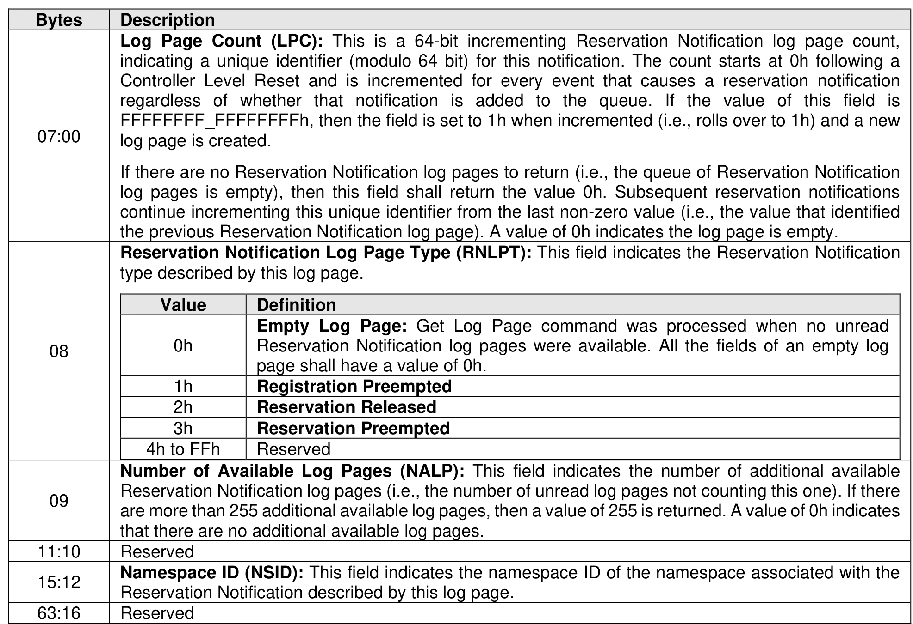

###### 5.2.12.1.35 Reservation Notification (Log Page Identifier 80h)

> **Section ID**: 5.2.12.1.35 | **Page**: 318-319

The Reservation Notification log page reports one log page from a time ordered queue of Reservation
Notification log pages, if available. A new Reservation Notification log page is created and added to the end
of the queue of reservation notifications whenever an unmasked reservation notification occurs on any
namespace that is attached to the controller. The Get Log Page command:
•
returns a data buffer containing a log page corresponding to the oldest log page in the reservation
notification queue (i.e., the log page containing the lowest Log Page Count field; accounting for
wrapping); and
•
removes that Reservation Notification log page from the queue.
If there are no available Reservation Notification log page entries when a Get Log Page command is issued
then an empty log page (i.e., all fields in the log page cleared to 0h) shall be returned.
If the controller is unable to store a reservation notification in the Reservation Notification log page due to
the size of the queue, that reservation notification is lost. If a reservation notification is lost, then the
controller shall increment the Log Page Count field of the last reservation notification in the queue (i.e., the
Log Page Count field in the last reservation notification in the queue shall contain the value associated with
the most recent reservation notification that has been lost).
The format of the log page is defined in Figure 301.

---
### 📊 Tables (1)

#### Table 1: Untitled Table

| Value | Definition |
| :--- | :--- |
| 0h | **Empty Log Page**: Get Log Page command was processed when no unread Reservation Notification log pages were available. All the fields of an empty log page shall have a value of 0h. |
| 1h | **Registration Preempted** |
| 2h | **Reservation Released** |
| 3h | **Reservation Preempted** |
| 4h to FFh | **Reserved** |
| | **Number of Available Log Pages (NALP)**: This field indicates the number of additional available Reservation Notification log pages (i.e., the number of unread log pages not counting this one). If there are more than 255 additional available log pages, then a value of 255 is returned. A value of 0h indicates that there are no additional available log pages. |
| | **Reserved** |
| | **Namespace ID (NSID)**: This field indicates the namespace ID of the namespace associated with the Reservation Notification described by this log page. |
| | **Reserved** |

