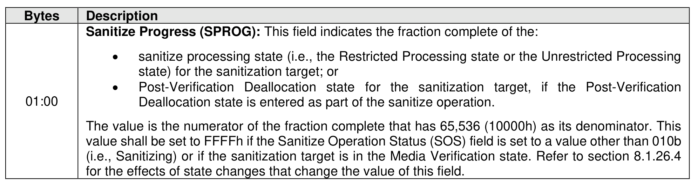
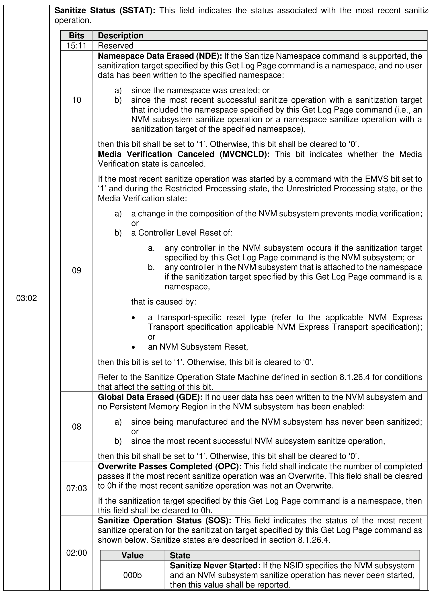
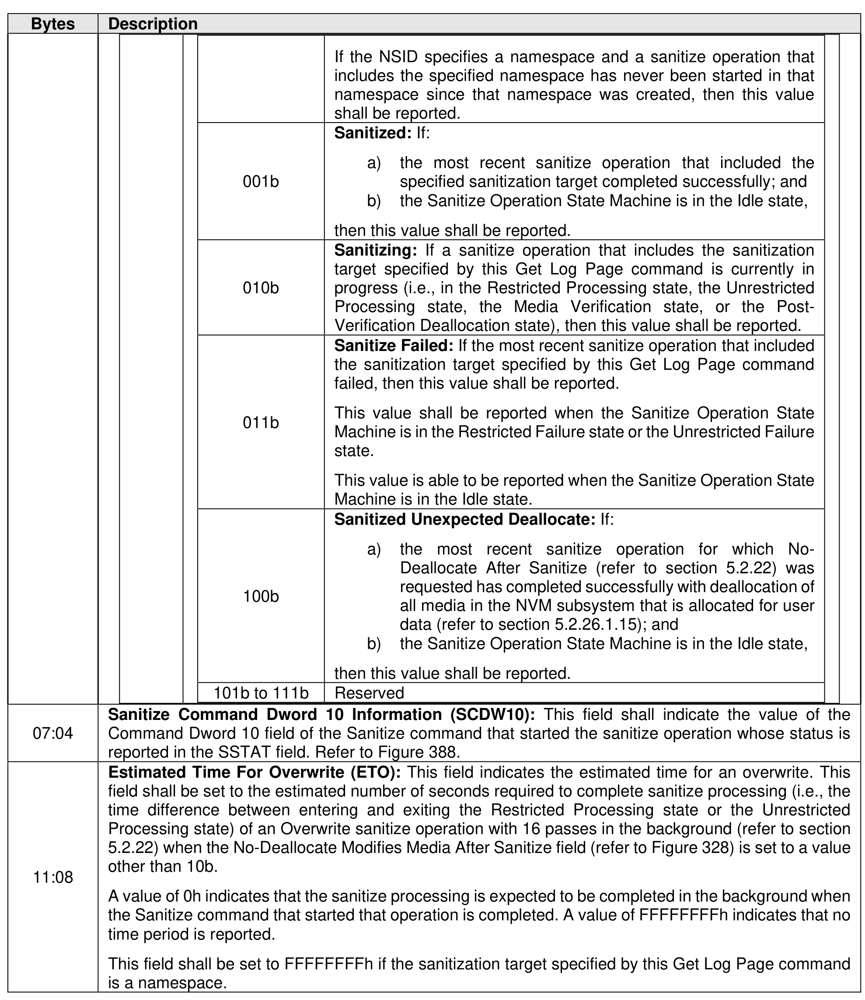
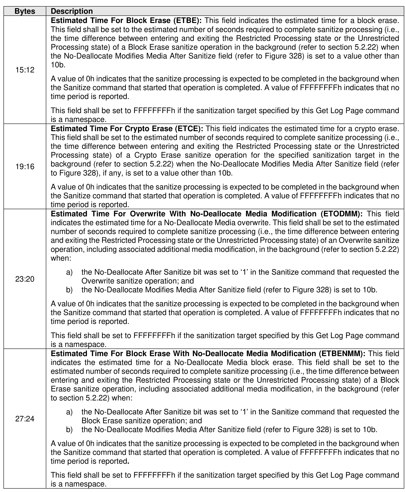
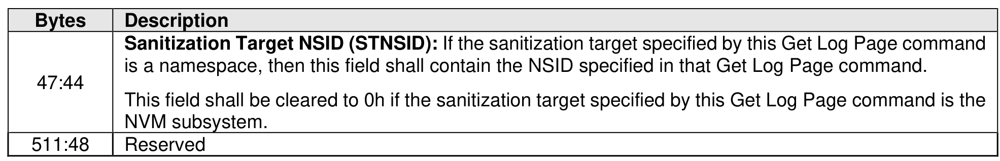

###### 5.2.12.1.36 Sanitize Status (Log Page Identifier 81h)

> **Section ID**: 5.2.12.1.36 | **Page**: 319-325

The Sanitize Status log page is used to report sanitize operation time estimates and information about the
most recent sanitize operation (refer to section 8.1.26) for the specified sanitization target.
The Get Log Page command returns a data buffer containing a log page formatted as defined in Figure
302. This log page shall be retained across power cycles and resets. If the controller is not able to report
valid data (e.g., due to a division event that prevents reporting sanitize status information), then the Get
Log Page command shall be aborted with a status code of Controller Pathing Error. If a Get Log Page
command is aborted with a status code of Controller Pathing Error, then submitting a subsequent Get Log
Page command to a controller with a different domain identifier and requesting the same Sanitize Status
log page may be successful. If the controller is able to report valid data, then this log page shall contain
valid data whenever CSTS.RDY is set to ‘1’.
If the Sanitize Capabilities (SANICAP) field in the Identify Controller data structure is not cleared to 0h (i.e.,
the Sanitize command is supported), then this log page shall be supported. If the Sanitize Capabilities field
in the Identify Controller data structure is cleared to 0h, then this log page is reserved.
If the Sanitize Namespace command is supported, then this log page shall support setting the NSID field
to the value of an allocated NSID.
The NSID field in the Get Log Page command specifies the sanitization target for the requested Sanitize
Status log page (i.e., whether the scope of the Sanitize Status log page is the NVM subsystem or a
namespace). If the NSID field is set to:
•
0h or is set to FFFFFFFFh, then the Sanitize Status log page for the NVM subsystem is requested;
or
•
an allocated NSID, then the Sanitize Status log page for the namespace indicated by the NSID is
requested.
If the NSID specified in the NSID field specifies an unallocated NSID, then the command shall be aborted
with a status code of Invalid Namespace or Format.
If the NSID field specifies a namespace as the sanitization target and an NVM subsystem sanitize operation
is in progress, then the command shall be aborted with a status code of Sanitize In Progress.
If the NSID field specifies a namespace as the sanitization target and the NVM subsystem is in the
Restricted Failure state or the Unrestricted Failure state, then the command shall be aborted with a status
code of Sanitize Failed.

---
### 📊 Tables (6)

#### Table 1: Untitled Table

| Bits | Description |
|---|---|
| 15:11 | Reserved |
| 10 | **Namespace Data Erased (NDE):** If the Sanitize Namespace command is supported, the sanitization target specified by this Get Log Page command is a namespace, and no user data has been written to the specified namespace:  a) since the namespace was created; or  b) since the most recent successful sanitize operation with a sanitization target that included the namespace specified by this Get Log Page command (i.e., an NVM subsystem sanitize operation or a namespace sanitize operation with a sanitization target of the specified namespace), then this bit shall be set to '1'. Otherwise, this bit shall be cleared to '0'. |
| 09 | **Media Verification Canceled (MVCNCLD):** This bit indicates whether the Media Verification state is canceled. If the most recent sanitize operation was started by a command with the EMVS bit set to '1' and during the Restricted Processing state, the Unrestricted Processing state, or the Media Verification state:  a) a change in the composition of the NVM subsystem prevents media verification; or  b) a Controller Level Reset of:  &nbsp;&nbsp;&nbsp;&nbsp; a. any controller in the NVM subsystem occurs if the sanitization target specified by this Get Log Page command is the NVM subsystem; or  &nbsp;&nbsp;&nbsp;&nbsp; b. any controller in the NVM subsystem that is attached to the namespace if the sanitization target specified by this Get Log Page command is a namespace, that is caused by:  &nbsp;&nbsp;&nbsp;&nbsp; • a transport-specific reset type (refer to the applicable NVM Express Transport specification applicable NVM Express Transport specification); or  &nbsp;&nbsp;&nbsp;&nbsp; • an NVM Subsystem Reset, then this bit is set to '1'. Otherwise, this bit is cleared to '0'. Refer to the Sanitize Operation State Machine defined in section 8.1.26.4 for conditions that affect the setting of this bit. |
| 08 | **Global Data Erased (GDE):** If no user data has been written to the NVM subsystem and no Persistent Memory Region in the NVM subsystem has been enabled:  a) since being manufactured and the NVM subsystem has never been sanitized; or  b) since the most recent successful NVM subsystem sanitize operation, then this bit shall be set to '1'. Otherwise, this bit shall be cleared to '0'. |
| 07:03 | **Overwrite Passes Completed (OPC):** This field shall indicate the number of completed passes if the most recent sanitize operation was an Overwrite. This field shall be cleared to 0h if the most recent sanitize operation was not an Overwrite. If the sanitization target specified by this Get Log Page command is a namespace, then this field shall be cleared to 0h. |
| 02:00 | **Sanitize Operation Status (SOS):** This field indicates the status of the most recent sanitize operation for the sanitization target specified by this Get Log Page command as shown below. Sanitize states are described in section 8.1.26.4.  | Value | State |
| | | 000b | **Sanitize Never Started:** If the NSID specifies the NVM subsystem and an NVM subsystem sanitize operation has never been started, then this value shall be reported. |
| | | | |
| :--- | :--- | :--- | :--- |
| | | If the NSID specifies a namespace and a sanitize operation that includes the specified namespace has never been started in that namespace since that namespace was created, then this value shall be reported. | |
| | | **Sanitized:** If: | |
| | 001b | a) the most recent sanitize operation that included the specified sanitization target completed successfully; and b) the Sanitize Operation State Machine is in the Idle state, | |
| | | then this value shall be reported. | |
| | 010b | **Sanitizing:** If a sanitize operation that includes the sanitization target specified by this Get Log Page command is currently in progress (i.e., in the Restricted Processing state, the Unrestricted Processing state, the Media Verification state, or the Post-Verification Deallocation state), then this value shall be reported. | |
| | 011b | **Sanitize Failed:** If the most recent sanitize operation that included the sanitization target specified by this Get Log Page command failed, then this value shall be reported.  This value shall be reported when the Sanitize Operation State Machine is in the Restricted Failure state or the Unrestricted Failure state.  This value is able to be reported when the Sanitize Operation State Machine is in the Idle state. | |
| | 100b | **Sanitized Unexpected Deallocate:** If: a) the most recent sanitize operation for which No-Deallocate After Sanitize (refer to section 5.2.22) was requested has completed successfully with deallocation of all media in the NVM subsystem that is allocated for user data (refer to section 5.2.26.1.15); and b) the Sanitize Operation State Machine is in the Idle state, | |
| | | then this value shall be reported. | |
| | 101b to 111b | Reserved | |
| | **Sanitize Command Dword 10 Information (SCDW10):** This field shall indicate the value of the Command Dword 10 field of the Sanitize command that started the sanitize operation whose status is reported in the SSTAT field. Refer to Figure 388. | | |
| | **Estimated Time For Overwrite (ETO):** This field indicates the estimated time for an overwrite. This field shall be set to the estimated number of seconds required to complete sanitize processing (i.e., the time difference between entering and exiting the Restricted Processing state or the Unrestricted Processing state) of an Overwrite sanitize operation with 16 passes in the background (refer to section 5.2.22) when the No-Deallocate Modifies Media After Sanitize field (refer to Figure 328) is set to a value other than 10b.  A value of 0h indicates that the sanitize processing is expected to be completed in the background when the Sanitize command that started that operation is completed. A value of FFFFFFFFh indicates that no time period is reported.  This field shall be set to FFFFFFFFh if the sanitization target specified by this Get Log Page command is a namespace. | | |
| Estimated Time For Block Erase (ETBE): This field indicates the estimated time for a block erase. This field shall be set to the estimated number of seconds required to complete sanitize processing (i.e., the time difference between entering and exiting the Restricted Processing state or the Unrestricted Processing state) of a Block Erase sanitize operation in the background (refer to section 5.2.22) when the No-Deallocate Modifies Media After Sanitize field (refer to Figure 328) is set to a value other than 10b. A value of 0h indicates that the sanitize processing is expected to be completed in the background when the Sanitize command that started that operation is completed. A value of FFFFFFFFh indicates that no time period is reported. This field shall be set to FFFFFFFFh if the sanitization target specified by this Get Log Page command is a namespace. |  |
| --- | --- |
| Estimated Time For Crypto Erase (ETCE): This field indicates the estimated time for a crypto erase. This field shall be set to the estimated number of seconds required to complete sanitize processing (i.e., the time difference between entering and exiting the Restricted Processing state or the Unrestricted Processing state) of a Crypto Erase sanitize operation for the specified sanitization target in the background (refer to section 5.2.22) when the No-Deallocate Modifies Media After Sanitize field (refer to Figure 328), if any, is set to a value other than 10b. A value of 0h indicates that the sanitize processing is expected to be completed in the background when the Sanitize command that started that operation is completed. A value of FFFFFFFFh indicates that no time period is reported. |  |
| Estimated Time For Overwrite With No-Deallocate Media Modification (ETODMM): This field indicates the estimated time for a No-Deallocate Media overwrite. This field shall be set to the estimated number of seconds required to complete sanitize processing (i.e., the time difference between entering and exiting the Restricted Processing state or the Unrestricted Processing state) of an Overwrite sanitize operation, including associated additional media modification, in the background (refer to section 5.2.22) when:   a) the No-Deallocate After Sanitize bit was set to '1' in the Sanitize command that requested the Overwrite sanitize operation; and   b) the No-Deallocate Modifies Media After Sanitize field (refer to Figure 328) is set to 10b.   A value of 0h indicates that the sanitize processing is expected to be completed in the background when the Sanitize command that started that operation is completed. A value of FFFFFFFFh indicates that no time period is reported. This field shall be set to FFFFFFFFh if the sanitization target specified by this Get Log Page command is a namespace. |  |
| Estimated Time For Block Erase With No-Deallocate Media Modification (ETBENMM): This field indicates the estimated time for a No-Deallocate Media block erase. This field shall be set to the estimated number of seconds required to complete sanitize processing (i.e., the time difference between entering and exiting the Restricted Processing state or the Unrestricted Processing state) of a Block Erase sanitize operation, including associated additional media modification, in the background (refer to section 5.2.22) when:   a) the No-Deallocate After Sanitize bit was set to '1' in the Sanitize command that requested the Block Erase sanitize operation; and   b) the No-Deallocate Modifies Media After Sanitize field (refer to Figure 328) is set to 10b.   A value of 0h indicates that the sanitize processing is expected to be completed in the background when the Sanitize command that started that operation is completed. A value of FFFFFFFFh indicates that no time period is reported. This field shall be set to FFFFFFFFh if the sanitization target specified by this Get Log Page command is a namespace. |  |
| Bits | Description |
|:---|:---|
| 7:4 | **Failure State (FAILS):** If the SOS field is set to 011b (i.e., Sanitize Failed), then this field shall indicate the state of the Sanitize Operation State Machine for the sanitization target (refer to Figure 706) in which the failure occurred.  The values of this field are sanitize states, defined in the description of the SANS field.  If the VERS bit is cleared to '0', then this field shall be cleared to 0h.  If the SOS field is set to a value other than 011b (i.e., Sanitize Failed), then this field shall be cleared to 0h. |
| 3:0 | **Sanitize State (SANS):** This field indicates the state of the sanitize operation. This field shall be set to the current state of the Sanitize Operation State Machine for the sanitization target (refer to Figure 706).  If the VERS bit is cleared to '0', then this field shall be cleared to 0h.   |
| | | **Value** | **State** | **Reference** |
| | | 0h | Idle | 8.1.26.4.1 |
| | | 1h | Restricted Processing | 8.1.26.4.2 |
| | | 2h | Restricted Failure | 8.1.26.4.3 |
| | | 3h | Unrestricted Processing | 8.1.26.4.4 |
| | | 4h | Unrestricted Failure | 8.1.26.4.5 |
| | | 5h | Media Verification | 8.1.26.4.6 |
| | | 6h | Post-Verification Deallocation | 8.1.26.4.7 |
| | | All other values | Reserved | |
| | Reserved | | | |
| | **Maximum Namespace Sanitize Operations In Progress (MNSOIP):** This field indicates the maximum number of namespace sanitize operations that are allowed to be in progress concurrently in the NVM subsystem. If this field is cleared to 0h, then the maximum number of namespace sanitize operations that are allowed to be in progress concurrently in the NVM subsystem is not reported.  This field shall be set to FFFFFFFFh if the sanitization target specified by this Get Log Page command is a namespace. | | | |
| | | | | |
| | | | | |
| | | | | |
| | | | | |
| | |

#### Table 2: Untitled Table

(Continuation of Untitled Table - see first part)

#### Table 3: Untitled Table

(Continuation of Untitled Table - see first part)

#### Table 4: Untitled Table

(Continuation of Untitled Table - see first part)

#### Table 5: Untitled Table

(Continuation of Untitled Table - see first part)

#### Table 6: Untitled Table

(Continuation of Untitled Table - see first part)

