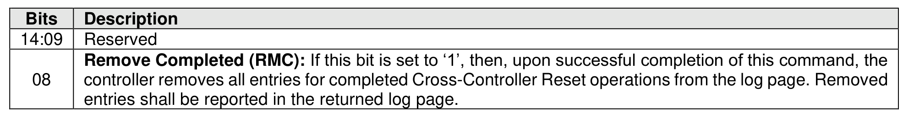
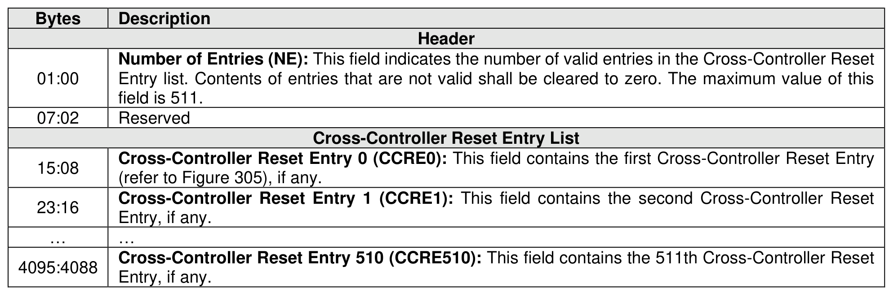
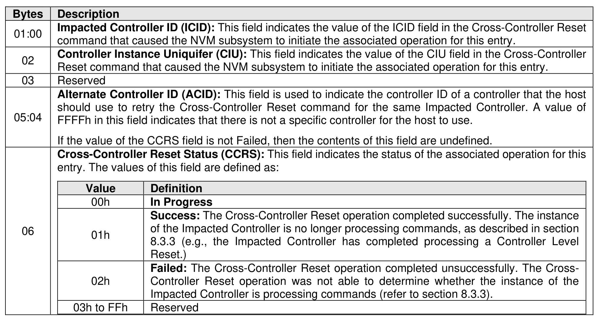
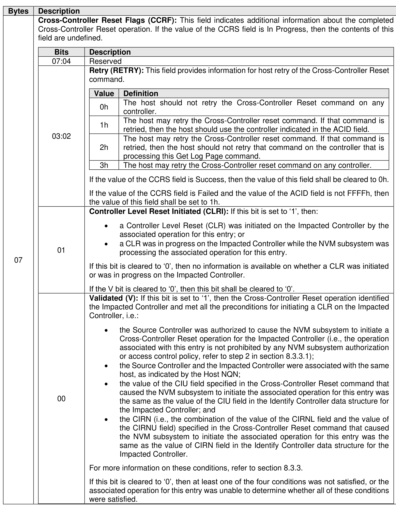

###### 5.2.12.3.1 Cross-Controller Reset (Log Identifier 1Eh)

> **Section ID**: 5.2.12.3.1 | **Page**: 325-327

The Cross-Controller Reset log page indicates the status of Cross-Controller Reset operations this
controller caused to be initiated by the NVM subsystem.
This log page contains entries for in-progress and completed Cross-Controller Reset operations (refer to
section 8.3.3) as described in this section. The Source Controller (i.e., the controller processing a Cross-
Controller Reset command) adds an entry for the Impacted Controller (i.e., the controller specified in the
Impacted Controller ID (ICID) field of that command) to this log page under the conditions described in
section 5.4.3. If Cross-Controller Reset Completed Notices are enabled and the result of a Cross-Controller
Reset operation is recorded in the associated entry in this log page (as described in section 8.3.3), then the
Source Controller reports a Cross-Controller Reset Completed Notice asynchronous event (refer to Figure
154).
For each entry in this log page, that entry shall remain in the log page while the associated operation is in
progress (i.e., the Cross-Controller Reset Status (CCRS) field in that entry is set to In Progress). The
controller shall remove the entry for a completed operation as a result of:
•
the Source Controller processing a Get Log Page command for this log page with the Remove
Completed bit set to ‘1’, as defined in Figure 303;
•
the Source Controller processing a subsequent Cross-Controller Reset command for the Impacted
Controller indicated by the ICID field of that entry; or
•
a Controller Level Reset (refer to section 3.7.2) occurring on the Source Controller.
As a result of an NVM Subsystem Reset (refer to section 3.7.1) on a domain:
•
the NVM subsystem shall terminate all in-progress Cross-Controller Reset operations a Source
Controller in the domain caused to be initiated; and
•
each Source Controller in the domain shall remove all entries from this log page.
Upon reading this log page, if an entry indicates the Cross-Controller Reset operation is completed and:
•
the value of the ICID field of that entry identifies a controller that the host is recovering from a loss
of communication; and
•
the value of the Controller Instance Uniquifier (CIU) field of that entry is the same as the value of
the CIU field of the Identify Controller data structure (refer to Figure 328) for that controller,
then the host processes that entry as described in section 9.6.2.2. The host should ignore other entries in
this log page.
If the host connected to a Discovery subsystem using the well-known Discovery Service NQN, then the
controller shall not report that this log page is supported in the Supported Log Pages log page (refer to
section 5.2.12.1.1).
The Log Specific Parameter field in Command Dword 10 (refer to Figure 201) for this log page is defined
in Figure 303.
This log page is defined in Figure 304.
The format of the Cross-Controller Reset Entry is defined in Figure 305.

---
### 📊 Tables (4)

#### Table 1: Untitled Table

| | Reserved |
|---|---|
| | Cross-Controller Reset Entry 0 (CCRE0): This field contains the first Cross-Controller Reset Entry (refer to Figure 305), if any. |
| | Cross-Controller Reset Entry 1 (CCRE1): This field contains the second Cross-Controller Reset Entry, if any. |
| | ... |
| 88 | Cross-Controller Reset Entry 510 (CCRE510): This field contains the 511th Cross-Controller Reset Entry, if any. |

Figure 305: Cross-Controller Reset Entry Data Structure

| Description | |
|---|---|
| **Impacted Controller ID (ICID):** This field indicates the value of the ICID field in the Cross-Controller Reset command that caused the NVM subsystem to initiate the associated operation for this entry. | |
| **Controller Instance Uniquifier (CIU):** This field indicates the value of the CIU field in the Cross-Controller Reset command that caused the NVM subsystem to initiate the associated operation for this entry.   If the value of the CCRS field is not Failed, then the contents of this field are undefined. | |
| **Cross-Controller Reset Status (CCRS):** This field indicates the status of the associated operation for this entry. The values of this field are defined as: | |
| **Value** | **Definition** |
| 00h | **In Progress** |
| | **01h**   **Success:** The Cross-Controller Reset operation completed successfully. The instance of the Impacted Controller is no longer processing commands, as described in section 8.3.3 (e.g., the Impacted Controller has completed processing a Controller Level Reset). |
| | **02h**   **Failed:** The Cross-Controller Reset operation completed unsuccessfully. The Cross-Controller Reset operation was not able to determine whether the instance of the Impacted Controller is processing commands (refer to section 8.3.3). |
| | 03h to FFh   Reserved |
| | |
| | |
| | |
| | |
| | |
| | |
| | |
| | |
| | |
| | |

#### Table 2: Untitled Table

(Continuation of Untitled Table - see first part)

#### Table 3: Untitled Table

(Continuation of Untitled Table - see first part)

#### Table 4: Untitled Table

(Continuation of Untitled Table - see first part)

