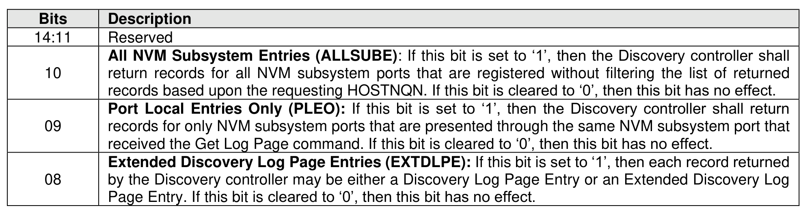
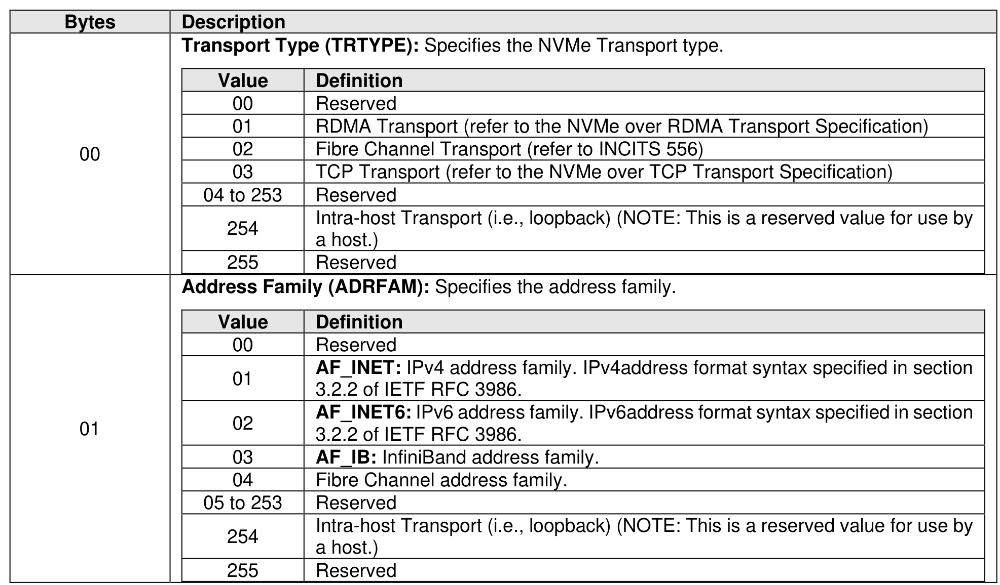
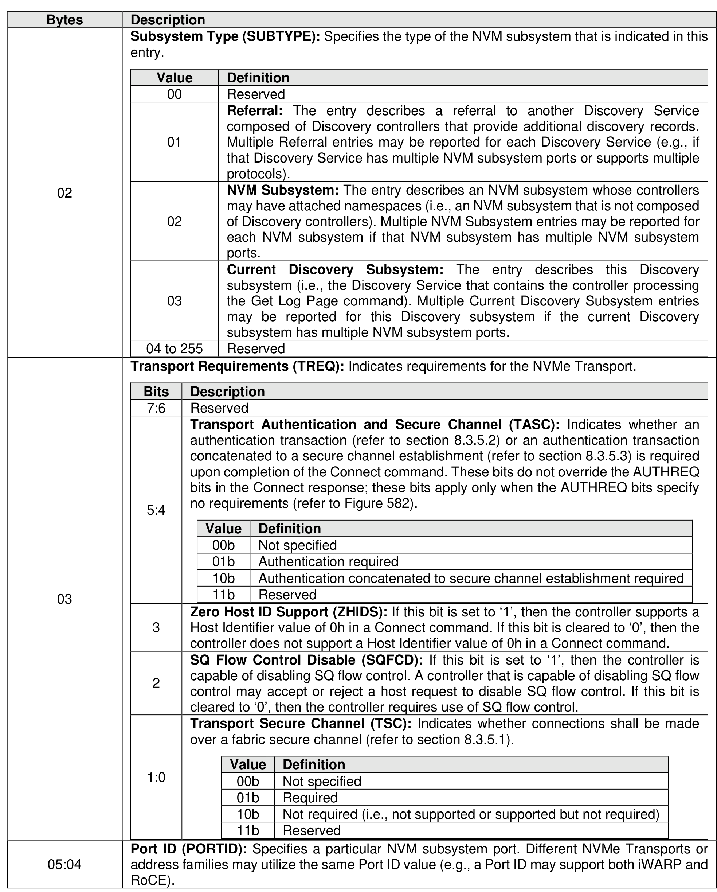
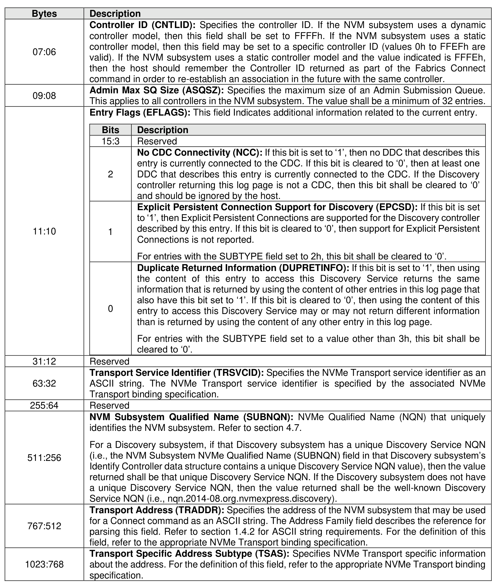
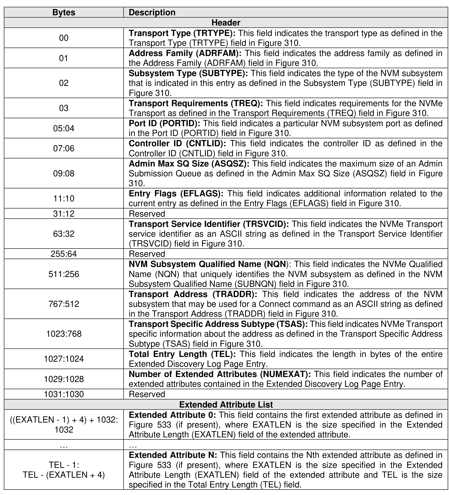
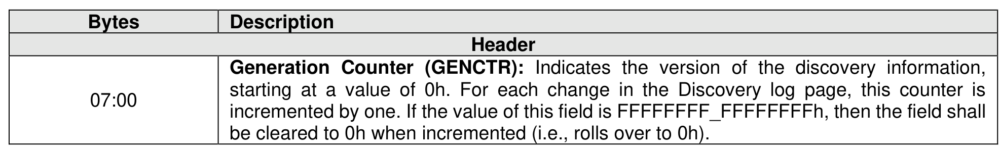
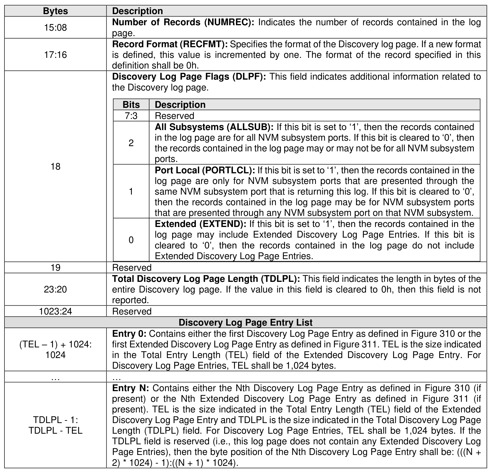

###### 5.2.12.3.3 Discovery (Log Page Identifier 70h)

> **Section ID**: 5.2.12.3.3 | **Page**: 330-336

The Discovery log page shall only be supported by Discovery controllers. The Discovery log page shall not
be supported by controllers that expose namespaces for NVMe over PCIe or NVMe over Fabrics. The
Discovery log page provides an inventory of NVM subsystems with which a host may attempt to form an
association. Depending on the parameters specified in a Get Log Page command, the Discovery log page
may contain entries for:
•
all known NVM subsystems; or
•
a subset of entries specific to the host or Discovery controller requesting the log page.
The Discovery log page is persistent across power cycles.
Figure 308 specifies the format for the LID Specific Parameter field in the Supported Log Pages log page
(refer to section 5.2.12.1.1) for the Discovery log page.
If a Discovery controller supports returning Extended Discovery Log Page Entries (i.e., the Extended
Discovery Log Page Entries Supported (EXTDLPES) bit is set to ‘1’ in the LID Specific Parameter field as
defined in Figure 308) and that Discovery controller processes a Get Log Page command for this log page
with the Extended Discovery Log Page Entries (EXTDLPE) bit set to ‘1’ in the Log Specific Parameter (LSP)
field (refer to Figure 309), then each entry returned by that Discovery controller may be either a Discovery
Log Page Entry or an Extended Discovery Log Page Entry. Extended Discovery Log Page Entries may
contain zero or more extended attributes. If a Discovery controller returns records that include Extended
Discovery Log Page Entries, then that Discovery controller shall set the Extended (EXTEND) bit to ‘1’ in
the Discovery Log Page Flags (DLPF) field. A Centralized Discovery controller (CDC) shall support
returning Extended Discovery Log Page Entries.
If a Discovery controller supports returning only port local Discovery Log Page Entries or port local Extended
Discovery Log Page Entries (i.e., the Port Local Entries Only Supported (PLEOS) bit is set to ‘1’ in the LID
Specific Parameter field as defined in Figure 308) and that Discovery controller processes a Get Log Page
command for this log page with the Port Local Entries Only (PLEO) bit set to ‘1’ in the LSP field (refer to
Figure 309), then that Discovery controller shall return records for only NVM subsystem ports that are
presented through the same NVM subsystem port that received the Get Log Page command. If a Discovery
controller returns records for only NVM subsystem ports that are presented through the same NVM
subsystem port that received the Get Log Page command, then that Discovery controller shall set the Port
Local (PORTLCL) bit to ‘1’ in the DLPF field. Only a Direct Discovery controller (DDC) may support returning
only port local Discovery Log Page Entries or port local Extended Discovery Log Page Entries.
If a Discovery controller supports returning records for all NVM subsystem ports that are registered (i.e.,
the All NVM Subsystems Entries Supported (ALLSUBES) bit is set to ‘1’ in the LID Specific Parameter field
as defined in Figure 308) and that Discovery controller processes a Get Log Page command for this log
page with the All NVM Subsystem Entries (ALLSUBE) bit set to ‘1’ in the LSP field (refer to Figure 309),
then that Discovery controller shall return records for all NVM subsystem ports that are registered. The list
of records returned by that Discovery controller shall not be filtered based upon the requesting HOSTNQN.
If a Discovery controller returns records for all NVM subsystem ports that are registered, then that Discovery
controller shall set the All Subsystems (ALLSUB) bit to ‘1’ in the DLPF field. A Discovery controller may
require authentication before reporting the ALLSUBES bit being set to ‘1’ or may require configuration
outside the scope of this specification.
The Log Page Offset may be used to retrieve specific records. If the Discovery controller supports an index
offset for this log page (i.e., the Index Offset Supported (IOS) bit is set to ‘1’ in the Supported Log Pages
log page (refer to section 5.2.12.1.1) for this log page) and the OT bit is set to ‘1’ in a Get Log Page
command, then the index values specified in the Log Page Offset Lower (LPOL) field (refer to Figure 203)
and Log Page Offset Upper (LPOU) field (refer to Figure 204) in that Get Log Page command shall be used
to index into the header and list of entries within this log page (e.g., specifying an index offset of 0 returns
this log page starting at the header, specifying an index offset of 1 returns this log page starting at the offset
of Entry 0, etc.).
The number of records (i.e., the number of Discovery Log Page Entries) is returned in the header of the log
page. The format for a Discovery Log Page Entry is defined in Figure 310. The format for an Extended
Discovery Log Page Entry is defined in Figure 311. The format for an extended attribute is defined in Figure
533. The format for the Discovery log page is defined in Figure 312.
A single Get Log Page command used to read the Discovery log page shall be atomic. If the Discovery log
page is read using multiple Get Log Page commands, then the reader should validate the Generation
Counter field to ensure that there has not been a change in the contents of the data. The Discovery log
page contents should be processed in the following sequence:
1. read the Discovery log page contents in order (i.e., with increasing Log Page Offset values);
2. re-read the Generation Counter field after the entire log page is transferred; and
3. if the Generation Counter field does not match the original value read, then discard the log page
read, as the entries may be inconsistent, and restart the sequence.; or
4. if the Generation Counter field does match the original value read, then process the returned data.
If the log page contents change during this command sequence, then the controller may return a status
code of Discover Restart.
Every record indicates via the SUBTYPE field if that record is describing the current Discovery Service,
referring to another Discovery Service, or if the record indicates an NVM subsystem composed of
controllers that may expose namespaces. A referral to another Discovery Service (i.e., SUBTYPE field set
to 01h) is a mechanism to find additional Discovery subsystems. An NVM subsystem entry (i.e., SUBTYPE
field set to 02h) is a mechanism to find NVM subsystems that contain controllers that may expose
namespaces. An entry that describes the current Discovery Service (i.e., SUBTYPE field set to 03h) is a
mechanism to find additional access information (e.g., other NVM subsystem ports) for the current
Discovery service. Hosts or Discovery controllers are not required to process referral entries deeper than
eight levels.
For entries that describe the current Discovery Service, the DUPRETINFO bit set to ‘1’ in the Entry Flags
field indicates those ports that return duplicate information. A host need not retrieve the Discovery Log Page
from all NVM subsystem ports described by a Discovery Log Page Entry that contains the DUPRETINFO
bit set to ‘1’ (refer to Figure 310), as each of those ports return the same information. A host may retrieve
the Discovery Log Page from multiple ports with the DUPRETINFO bit set to ‘1’ to act as redundant access
to the same information. A host may choose to enable the Discovery Log Page Change AEN on one of the
connections associated with an entry with the DUPRETINFO bit set to ‘1’. If the Discovery Log Page Change
AEN is enabled on multiple ports represented by entries with the DUPRETINFO bit set to ‘1’, then the host
may process a Discovery Log Page Change AEN for one connection as applying to all ports represented
by entries that also have the DUPRETINFO bit set to ‘1’.
If an NVM subsystem supports the dynamic controller model, then all entries for that NVM subsystem shall
have the Controller ID field set to FFFFh. For a particular NVM subsystem port and NVMe Transport
address in an NVM subsystem, there shall be no more than one entry with the Controller ID field set to:
•
FFFFh if that NVM subsystem supports the dynamic controller model; or
•
FFFEh if that NVM subsystem supports the static controller model.

---
### 📊 Tables (8)

#### Table 1: Untitled Table

| | Description |
|---|---|
| | **Transport Type (TRTTYPE):** Specifies the NVMe Transport type. |
| | <table><tbody><tr><th>Value</th><th>Definition</th></tr><tr><td>00</td><td>TCP Transport (refer to the NVMe over TCP Transport Specification)</td></tr><tr><td>04 to 253</td><td>Reserved</td></tr><tr><td>254</td><td>Intra-host Transport (i.e., loopback) (NOTE: This is a reserved value for use by a host.)</td></tr><tr><td>255</td><td>Reserved</td></tr></tbody></table> |
| | **Address Family (ADRFAM):** Specifies the address family. |
| | <table><tbody><tr><th>Value</th><th>Definition</th></tr><tr><td>00</td><td>Reserved</td></tr><tr><td>01</td><td>AF_INET: IPv4 address family. IPv4 address format syntax specified in section 3.2.2 of IETF RFC 3986.</td></tr><tr><td>02</td><td>AF_INET6: IPv6 address family. IPv6 address format syntax specified in section 3.2.2 of IETF RFC 3986.</td></tr><tr><td>03</td><td>AF_IB: InfiniBand address family.</td></tr><tr><td>04</td><td>Fibre Channel address family.</td></tr><tr><td>05 to 253</td><td>Reserved</td></tr><tr><td>254</td><td>Intra-host Transport (i.e., loopback) (NOTE: This is a reserved value for use by a host.)</td></tr><tr><td>255</td><td>Reserved</td></tr></tbody></table> |
| Value | Definition |
|:---|:---|
| 00 | Reserved |
| 01 | **Referral:** The entry describes a referral to another Discovery Service composed of Discovery controllers that provide additional discovery records. Multiple Referral entries may be reported for each Discovery Service (e.g., if that Discovery Service has multiple NVM subsystem ports or supports multiple protocols). |
| 02 | **NVM Subsystem:** The entry describes an NVM subsystem whose controllers may have attached namespaces (i.e., an NVM subsystem that is not composed of Discovery controllers). Multiple NVM Subsystem entries may be reported for each NVM subsystem if that NVM subsystem has multiple NVM subsystem ports. |
| 03 | **Current Discovery Subsystem:** The entry describes this Discovery subsystem (i.e., the Discovery Service that contains the controller processing the Get Log Page command). Multiple Current Discovery Subsystem entries may be reported for this Discovery subsystem if the current Discovery subsystem has multiple NVM subsystem ports. |
| 04 to 255 | Reserved |

| Bits | Description |
|:---|:---|
| 7:6 | Reserved |
| 5:4 | **Transport Authentication and Secure Channel (TASC):** Indicates whether an authentication transaction (refer to section 8.3.5.2) or an authentication transaction concatenated to a secure channel establishment (refer to section 8.3.5.3) is required upon completion of the Connect command. These bits do not override the AUTHREQ bits in the Connect response; these bits apply only when the AUTHREQ bits specify no requirements (refer to Figure 582). |
| | | | Value | Definition |
| | | | 00b | Not specified |
| | | | 01b | Authentication required |
| | | | 10b | Authentication concatenated to secure channel establishment required |
| | | | 11b | Reserved |
| 3 | **Zero Host ID Support (ZHIDS):** If this bit is set to '1', then the controller supports a Host Identifier value of 0h in a Connect command. If this bit is cleared to '0', then the controller does not support a Host Identifier value of 0h in a Connect command. |
| 2 | **SQ Flow Control Disable (SQFCD):** If this bit is set to '1', then the controller is capable of disabling SQ flow control. A controller that is capable of disabling SQ flow control may accept or reject a host request to disable SQ flow control. If this bit is cleared to '0', then the controller requires use of SQ flow control. |
| 1:0 | **Transport Secure Channel (TSC):** Indicates whether connections shall be made over a fabric secure channel (refer to section 8.3.5.1). |
| | | | Value | Definition |
| | | | 00b | Not specified |
| | | | 01b | Required |
| | | | 10b | Not required (i.e., not supported or supported but not required) |
| | | | 11b | Reserved |
| :04 | **Port ID (PORTID):** Specifies a particular NVM subsystem port. Different NVMe Transports or address families may utilize the same Port ID value (e.g., a Port ID may support both iWARP and RoCE). |
| | | |
| :--- | :--- | :--- |
| :06 | Controller ID (CNTLID): Specifies the controller ID. If the NVM subsystem uses a dynamic controller model, then this field shall be set to FFFFh. If the NVM subsystem uses a static controller model, then this field may be set to a specific controller ID (values 0h to FFEFh are valid). If the NVM subsystem uses a static controller model and the value indicated is FFFEh, then the host should remember the Controller ID returned as part of the Fabrics Connect command in order to re-establish an association in the future with the same controller. | |
| :08 | Admin Max SQ Size (ASQSZ): Specifies the maximum size of an Admin Submission Queue. This applies to all controllers in the NVM subsystem. The value shall be a minimum of 32 entries. | |
| | **Entry Flags (EFLAGS):** This field Indicates additional information related to the current entry. | |
| | **Bits** | **Description** |
| | 15:3 | Reserved |
| | 2 | **No CDC Connectivity (NCC):** If this bit is set to ‘1’, then no DDC that describes this entry is currently connected to the CDC. If this bit is cleared to ‘0’, then at least one DDC that describes this entry is currently connected to the CDC. If the Discovery controller returning this log page is not a CDC, then this bit shall be cleared to ‘0’ and should be ignored by the host. |
| | 1 | **Explicit Persistent Connection Support for Discovery (EPCSD):** If this bit is set to ‘1’, then Explicit Persistent Connections are supported for the Discovery controller described by this entry. If this bit is cleared to ‘0’, then support for Explicit Persistent Connections is not reported.   For entries with the SUBTYPE field set to 2h, this bit shall be cleared to ‘0’. |
| | 0 | **Duplicate Returned Information (DUPRETINFO):** If this bit is set to ‘1’, then using the content of this entry to access this Discovery Service returns the same information that is returned by using the content of other entries in this log page that also have this bit set to ‘1’. If this bit is cleared to ‘0’, then using the content of this entry to access this Discovery Service may or may not return different information than is returned by using the content of any other entry in this log page.   For entries with the SUBTYPE field set to a value other than 3h, this bit shall be cleared to ‘0’. |
| :12 | Reserved | |
| :32 | **Transport Service Identifier (TRSVCID):** Specifies the NVMe Transport service identifier as an ASCII string. The NVMe Transport service identifier is specified by the associated NVMe Transport binding specification. | |
| :64 | Reserved | |
| :256 | **NVM Subsystem Qualified Name (SUBNQN):** NVMe Qualified Name (NQN) that uniquely identifies the NVM subsystem. Refer to section 4.7.   For a Discovery subsystem, if that Discovery subsystem has a unique Discovery Service NQN (i.e., the NVM Subsystem NVMe Qualified Name (SUBNQN) field in that Discovery subsystem’s Identify Controller data structure contains a unique Discovery Service NQN value), then the value returned shall be that unique Discovery Service NQN. If the Discovery subsystem does not have a unique Discovery Service NQN, then the value returned shall be the well-known Discovery Service NQN (i.e., nqn.2014-08.org.nvmexpress.discovery). | |
| :512 | **Transport Address (TRADDR):** Specifies the address of the NVM subsystem that may be used for a Connect command as an ASCII string. The Address Family field describes the reference for parsing this field. Refer to section 1.4.2 for ASCII string requirements. For the definition of this field, refer to the appropriate NVMe Transport binding specification. | |
| :768 | **Transport Specific Address Subtype (TSAS):** Specifies NVMe Transport specific information about the address. For the definition of this field, refer to the appropriate NVMe Transport binding specification. | |
| Bytes | Description |
| :--- | :--- |
| 00 | **Transport Type (TRTYPE)**: This field indicates the transport type as defined in the Transport Type (TRTYPE) field in Figure 310. |
| 01 | **Address Family (ADRFAM)**: This field indicates the address family as defined in the Address Family (ADRFAM) field in Figure 310. |
| 02 | **Subsystem Type (SUBTYPE)**: This field indicates the type of the NVM subsystem that is indicated in this entry as defined in the Subsystem Type (SUBTYPE) field in Figure 310. |
| 03 | **Transport Requirements (TREQ)**: This field indicates requirements for the NVMe Transport as defined in the Transport Requirements (TREQ) field in Figure 310. |
| 05:04 | **Port ID (PORTID)**: This field indicates a particular NVM subsystem port as defined in the Port ID (PORTID) field in Figure 310. |
| 07:06 | **Controller ID (CNTLID)**: This field indicates the controller ID as defined in the Controller ID (CNTLID) field in Figure 310. |
| 09:08 | **Admin Max SQ Size (ASQSZ)**: This field indicates the maximum size of an Admin Submission Queue as defined in the Admin Max SQ Size (ASQSZ) field in Figure 310. |
| 11:10 | **Entry Flags (EFLAGS)**: This field indicates additional information related to the current entry as defined in the Entry Flags (EFLAGS) field in Figure 310. |
| 31:12 | Reserved |
| 63:32 | **Transport Service Identifier (TRSVCID)**: This field indicates the NVMe Transport service identifier as an ASCII string as defined in the Transport Service Identifier (TRSVCID) field in Figure 310. |
| 255:64 | Reserved |
| 511:256 | **NVM Subsystem Qualified Name (NQN)**: This field indicates the NVMe Qualified Name (NQN) that uniquely identifies the NVM subsystem as defined in the NVM Subsystem Qualified Name (SUBNQN) field in Figure 310. |
| 767:512 | **Transport Address (TRADDR)**: This field indicates the address of the NVM subsystem that may be used for a Connect command as an ASCII string as defined in the Transport Address (TRADDR) field in Figure 310. |
| 1023:768 | **Transport Specific Address Subtype (TSAS)**: This field indicates NVMe Transport specific information about the address as defined in the Transport Specific Address Subtype (TSAS) field in Figure 310. |
| 1027:1024 | **Total Entry Length (TEL)**: This field indicates the length in bytes of the entire Extended Discovery Log Page Entry. |
| 1029:1028 | **Number of Extended Attributes (NUMEXAT)**: This field indicates the number of extended attributes contained in the Extended Discovery Log Page Entry. |
| 1031:1030 | Reserved |
| | **Extended Attribute List** |
| _LEN - 1) + 4) + 1032: 1032 | **Extended Attribute 0**: This field contains the first extended attribute as defined in Figure 533 (if present), where EXATLEN is the size specified in the Extended Attribute Length (EXATLEN) field of the extended attribute. |
| ... | ... |
| TEL - 1: -(EXATLEN + 4) | **Extended Attribute N**: This field contains the Nth extended attribute as defined in Figure 533 (if present), where EXATLEN is the size specified in the Extended Attribute Length (EXATLEN) field of the extended attribute and TEL is the size specified in the Total Entry Length (TEL) field. |
| | |
| | **Figure 312: Discovery Log Page** |
| Bytes | Description |
| :--- | :--- |
| | **Header** |
| 07:00 | **Generation Counter (GENCTR)**: Indicates the version of the discovery information, starting at a value of 0h. For each change in the Discovery log page, this counter is incremented by one. If the value of this field is FFFFFFFF_FFFFFFFFh, then the field shall be cleared to 0h when incremented (i.e., rolls over to 0h). |
| | | |
| :--- | :--- | :--- |
| 15:08 | | Number of Records (NORL): Indicates the number of records contained in the log page. |
| 17:16 | | **Record Format (RECFMT):** Specifies the format of the Discovery log page. If a new format is defined, this value is incremented by one. The format of the record specified in this definition shall be 0h. |
| | | **Discovery Log Page Flags (DLPF):** This field indicates additional information related to the Discovery log page. |
| | | <table><tbody><tr><th>Bits</th><th>Description</th></tr><tr><td>7:3</td><td>Reserved</td></tr><tr><td>2</td><td><b>All Subsystems (ALLSUB):</b> If this bit is set to '1', then the records contained in the log page are for all NVM subsystem ports. If this bit is cleared to '0', then the records contained in the log page may or may not be for all NVM subsystem ports.</td></tr><tr><td>1</td><td><b>Port Local (PORTLCL):</b> If this bit is set to '1', then the records contained in the log page are only for NVM subsystem ports that are presented through the same NVM subsystem port that is returning this log. If this bit is cleared to '0', then the records contained in the log page may be for NVM subsystem ports that are presented through any NVM subsystem port on that NVM subsystem.</td></tr><tr><td>0</td><td><b>Extended (EXTEND):</b> If this bit is set to '1', then the records contained in the log page may include Extended Discovery Log Page Entries. If this bit is cleared to '0', then the records contained in the log page do not include Extended Discovery Log Page Entries.</td></tr></tbody></table> |
| 18 | | |
| 19 | | Reserved |
| 23:20 | | **Total Discovery Log Page Length (TDLPL):** This field indicates the length in bytes of the entire Discovery log page. If the value in this field is cleared to 0h, then this field is not reported. |
| 023:24 | | Reserved |
| | | **Discovery Log Page Entry List** |
| | | **Entry 0:** Contains either the first Discovery Log Page Entry as defined in Figure 310 or the first Extended Discovery Log Page Entry as defined in Figure 311. TEL is the size indicated in the Total Entry Length (TEL) field of the Extended Discovery Log Page Entry. For Discovery Log Page Entries, TEL shall be 1,024 bytes. |
| | | ... |
| | | **Entry N:** Contains either the Nth Discovery Log Page Entry as defined in Figure 310 (if present) or the Nth Extended Discovery Log Page Entry as defined in Figure 311 (if present). TEL is the size indicated in the Total Entry Length (TEL) field of the Extended Discovery Log Page Entry and TDLPL is the size indicated in the Total Discovery Log Page Length (TDLPL) field. For Discovery Log Page Entries, TEL shall be 1,024 bytes. If the TDLPL field is reserved (i.e., this log page does not contain any Extended Discovery Log Page Entries), then the byte position of the Nth Discovery Log Page Entry shall be: ((N + 1) * 1024) - 1):((N + 1) * 1024). |
| | | |
| | | |
| | | |
| | | |
| | | |
| | | |
| | | |
| |

#### Table 2: Untitled Table

(Continuation of Untitled Table - see first part)

#### Table 3: Untitled Table

(Continuation of Untitled Table - see first part)

#### Table 4: Untitled Table

(Continuation of Untitled Table - see first part)

#### Table 5: Untitled Table

(Continuation of Untitled Table - see first part)

#### Table 6: Untitled Table

(Continuation of Untitled Table - see first part)

#### Table 7: Untitled Table

(Continuation of Untitled Table - see first part)

#### Table 8: Untitled Table

(Continuation of Untitled Table - see first part)

