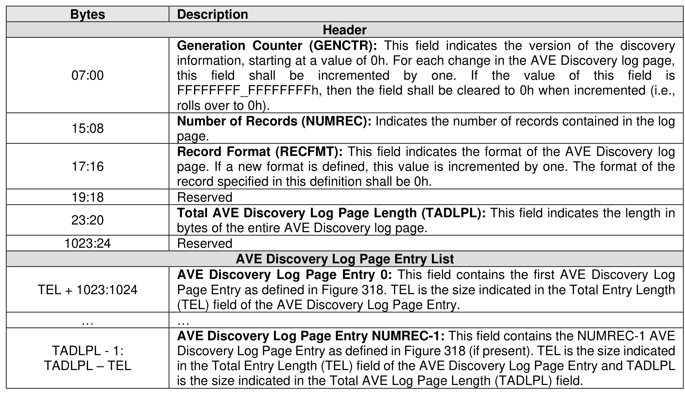
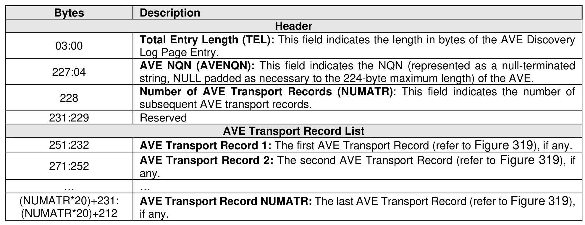

###### 5.2.12.3.5 AVE Discovery Log Page (Log Page Identifier 72h)

> **Section ID**: 5.2.12.3.5 | **Page**: 339-340

The format of the AVE Discovery Log Page is shown in Figure 317.
The format of the AVE Discovery Log Page Entry is shown in Figure 318.
The format of the AVE Transport Record is shown in Figure 319.

---
### 📊 Tables (3)

#### Table 1: Untitled Table

| | |
| :--- | :--- |
| 17:16 | page. If a new format is defined, this value is incremented by one. The format of the record specified in this definition shall be 0h. |
| 19:18 | Reserved |
| 23:20 | **Total AVE Discovery Log Page Length (TADLPL):** This field indicates the length in bytes of the entire AVE Discovery log page. |
| 1023:24 | Reserved |
| | **AVE Discovery Log Page Entry List** |
| | **AVE Discovery Log Page Entry 0:** This field contains the first AVE Discovery Log Page Entry as defined in Figure 318. TEL is the size indicated in the Total Entry Length (TEL) field of the AVE Discovery Log Page Entry. |
| | ... |
| | **AVE Discovery Log Page Entry NUMREC-1:** This field contains the NUMREC-1 AVE Discovery Log Page Entry as defined in Figure 318 (if present). TEL is the size indicated in the Total Entry Length (TEL) field of the AVE Discovery Log Page Entry and TADLPL is the size indicated in the Total AVE Log Page Length (TADLPL) field. |
| | |
| | |
| | |
| | |
| | |
| | |
| | |
| | |
| | |
| | |

#### Table 2: Untitled Table

(Continuation of Untitled Table - see first part)

#### Table 3: Untitled Table

(Continuation of Untitled Table - see first part)

