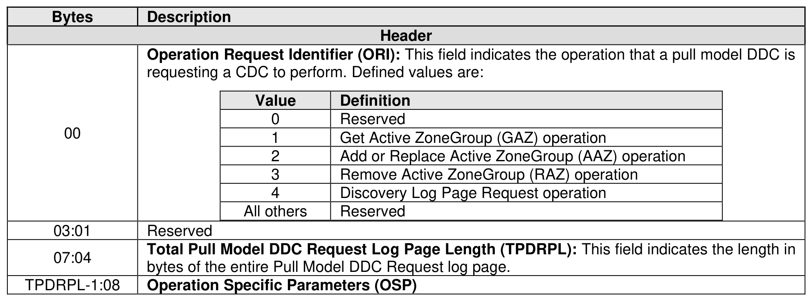

###### 5.2.12.3.6 Pull Model DDC Request Log Page (Log Page Identifier 73h)

> **Section ID**: 5.2.12.3.6 | **Page**: 340-341

The format of the Pull Model DDC Request log page is shown in Figure 320.

---
### 📊 Tables (1)

#### Table 1: Untitled Table

| Value | Definition |
|---|---|
| 0 | Reserved |
| 1 | Get Active ZoneGroup (GAZ) operation |
| 2 | Add or Replace Active ZoneGroup (AAZ) operation |
| 3 | Remove Active ZoneGroup (RAZ) operation |
| 4 | Discovery Log Page Request operation |
| All others | Reserved |

