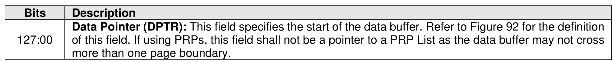
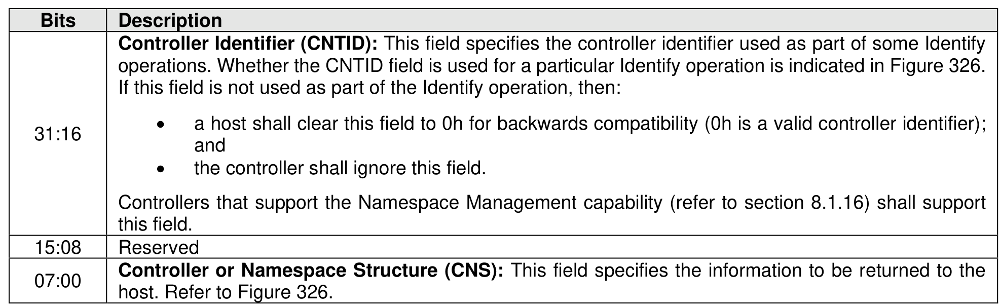
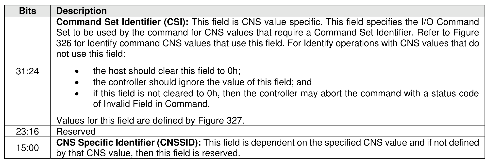
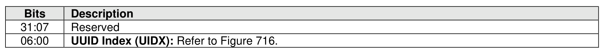
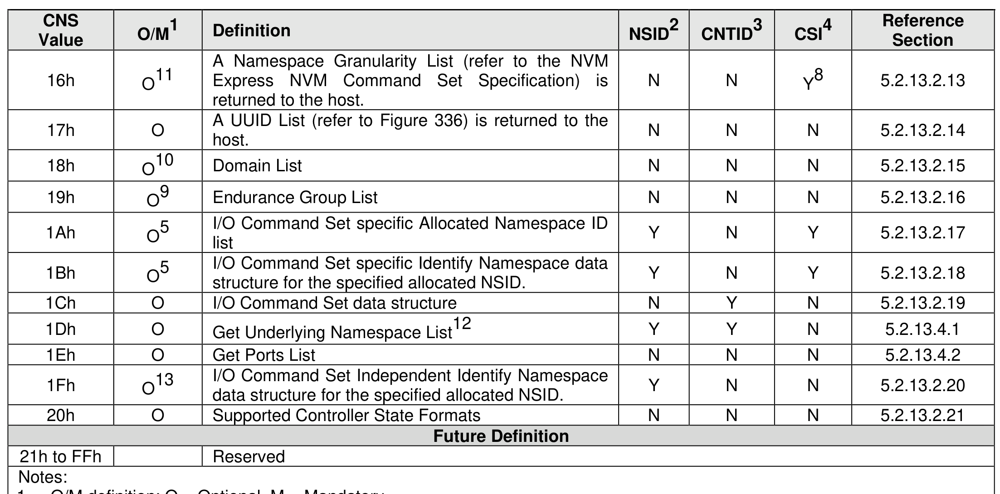
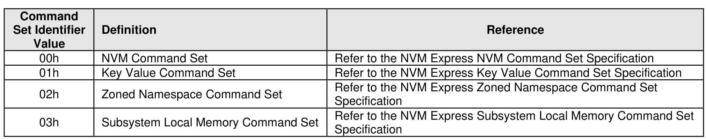
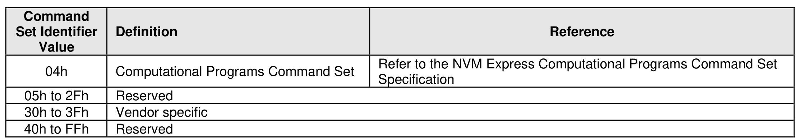

##### 5.2.13.1 Identify command overview

> **Section ID**: 5.2.13.1 | **Page**: 341-345

The Identify command returns a data buffer that describes information about the NVM subsystem, the
domain, the controller or the namespace(s). The data structure is 4,096 bytes in size.
The Identify command uses the Data Pointer, Command Dword 10, Command Dword 11, and Command
Dword 14 fields. All other command specific fields are reserved.
If the controller supports selection of a UUID by the Identify command (refer to section 8.1.30), then
Command Dword 14 is used to specify a UUID Index value (refer to Figure 325).
The data structure returned is based on the Controller or Namespace Structure (CNS) field as shown in
Figure 326. If there are fewer entries to return for the data structure indicated based on CNS value, then
the unused portion of the returned data is zero filled. If a controller does not support the specified CNS
value, then the controller shall abort the command with a status code of Invalid Field in Command.
When issuing the Identify command, if the specified namespace is not associated with an I/O Command
Set that supports the specified Identify CNS value (refer to Figure 326), then the controller shall abort the
command with a status code of Invalid I/O Command Set.
Note: The CNS field was specified as a one bit field in revision 1.0 and is a two bit field in revision 1.1. The
host should only issue CNS values defined in revision 1.0 to controllers compliant with revision 1.0. The
host should only issue CNS values defined in revision 1.1 to controllers compliant with revision 1.1. The
results of issuing other CNS values to controllers compliant with revision 1.0 or revision 1.1, respectively,
are indeterminate.
The Identify Controller data structure, Identify Namespace data structure, and the I/O Command Set
specific Identify Namespace data structure include several unique identifiers. The format and layout of these
unique identifiers is described in section 4.7.1.
Section 5.2.13.2 describes Identify data structures that are common to all transport models. Section
5.2.13.3 describes Identify data structures that are specific to the Memory-based transport model. Section
5.2.13.4 describes Identify data structures that are specific to the Message-based transport model.
1.
O/M definition: O = Optional, M = Mandatory.
2.
The NSID field is used: Y = Yes, N = No.
3.
The CDW10.CNTID field is used: Y = Yes, N = No.
4.
The CDW11.CSI field is used: Y = Yes, N = No.
5.
Mandatory for controllers that support the Namespace Management capability (refer to section 8.1.16).
6.
Mandatory for controllers that support Virtualization Enhancements (refer to section 8.2.6).
7.
Selection of a UUID may be supported (refer to section 8.1.30).
8.
This Identify data structure applies to namespaces that are associated with command sets that specify logical blocks (e.g.,
Command Set Identifier 0h or Command Set Identifier 2h).
9.
Mandatory for controllers that support Variable Capacity Management (refer to section 8.1.4.3).
10. Mandatory for controllers that support Capacity Management (refer to section 8.1.4) in an NVM subsystem that supports
multiple domains (refer to section 3.2.5).
11. Only applicable for the NVM Command Set and I/O Command Sets based on the NVM Command Set. Prohibited for all other
I/O Command Sets.
12. Support for this CNS value is prohibited in NVM subsystems that use a Memory-Based Transport Model (e.g., the PCIe
transport) for any controller.
13. For controllers compliant with NVM Express Base Specification, Revision 2.1 and later, mandatory if the Namespace
Management capability is supported.
The Command Set Identifier values are defined in Figure 327.

---
### 📊 Tables (8)

#### Table 1: Untitled Table

| Description |
| :--- |
| **Command Set Identifier (CSI):** This field is CNS value specific. This field specifies the I/O Command Set to be used by the command for CNS values that require a Command Set Identifier. Refer to Figure 327. |
| * the host should clear this field to 0h, |
| * the controller should ignore the value of this field; and |
| * if this field is not cleared to 0h, then the controller may abort the command with a status code of Invalid Field in Command. |
| Values for this field are defined by Figure 327. |
| Reserved |
| **CNS Specific Identifier (CNSSID):** This field is dependent on the specified CNS value and if not defined by that CNS value, then this field is reserved. |
| | | | | | | |
| :--- | :--- | :--- | :--- | :--- | :--- | :--- |
| 00h | M11 | Identify Namespace data structure for the specified NSID or the namespace capabilities for the NVM Command Set.7 | Y | N | N8 | NVM Express NVM Command Set Specification |
| 01h | M | Identify Controller data structure for the controller processing the command.7 | N | N | N | 5.2.13.2.1 |
| 02h | M | Active Namespace ID list. | Y | N | N | 5.2.13.2.2 |
| 03h | M | Namespace Identification Descriptor list for the specified NSID. | Y | N | N | 5.2.13.2.3 |
| 04h | O | An NVM Set List (refer to Figure 333) is returned to the host for up to 31 NVM Sets. The list contains entries for NVM Set identifiers greater than or equal to the value specified in the NVM Set Identifier (CDW11.NVMSETID) field. | N | N | N | 5.2.13.2.4 |
| 05h | M | I/O Command Set specific Identify Namespace data structure for the specified NSID for the I/O Command Set specified in the CSI field.7 | Y | N | Y | 5.2.13.2.5 |
| 06h | M | I/O Command Set specific Identify Controller data structure for the controller processing the command.7 | N | N | Y | 5.2.13.2.6 |
| 07h | M | Active Namespace ID list associated with the specified I/O Command Set. | Y | N | Y | 5.2.13.2.7 |
| 08h | M | I/O Command Set Independent Identify Namespace data structure. | Y | N | N | 5.2.13.2.8 |
| 09h | O | Identify Namespace data structure for the specified Format Index containing the namespace capabilities for the NVM Command Set.7 | N | N | Y | NVM Express NVM Command Set Specification |
| 0Ah | O | I/O Command Set specific Identify Namespace data structure for the specified Format Index containing the namespace capabilities for the I/O Command Set specified in the CSI field.7 | N | N | Y | I/O Command Set Specification |
| h to 0Fh | | Reserved | | | | |
| | | | | | | |
| | | | | | | |
| | | | | | | |
| |
| Value | | |
| :--- | :--- | :--- |
| 04h | Computational Programs Command Set | Refer to the NVM Express Computational Programs Command Set Specification |
| 5h to 2Fh | Reserved | |
| 0h to 3Fh | Vendor specific | |
| 0h to FFh | Reserved | |

#### Table 2: Untitled Table

(Continuation of Untitled Table - see first part)

#### Table 3: Untitled Table

(Continuation of Untitled Table - see first part)

#### Table 4: Untitled Table

(Continuation of Untitled Table - see first part)

#### Table 5: Untitled Table

(Continuation of Untitled Table - see first part)

#### Table 6: Untitled Table

(Continuation of Untitled Table - see first part)

#### Table 7: Untitled Table

(Continuation of Untitled Table - see first part)

#### Table 8: Untitled Table

(Continuation of Untitled Table - see first part)

