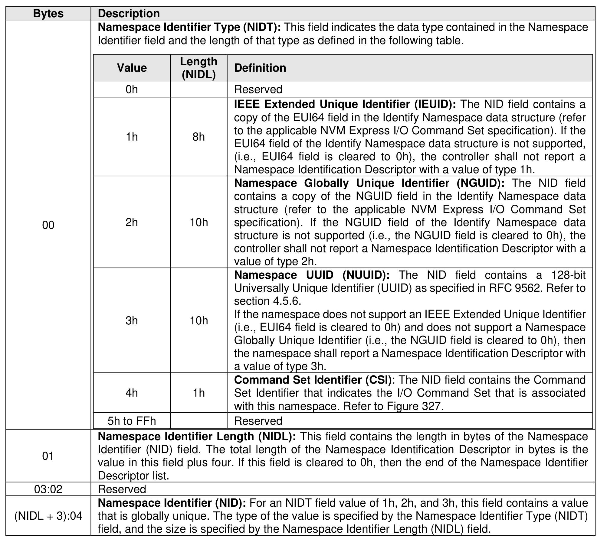

###### 5.2.13.2.3 Namespace Identification Descriptor list (CNS 03h)

> **Section ID**: 5.2.13.2.3 | **Page**: 381-382

A list of Namespace Identification Descriptor structures (refer to Figure 331) is returned to the host for the
specified namespace if the value in the Namespace Identifier (NSID) field is an active NSID. The controller
shall abort the command with a status code of Invalid Namespace or Format if the NSID field is set to
FFFFFFFEh or is set to FFFFFFFFh. Namespace Identification Descriptor structures consist of one or more
Namespace Identifiers (NID) of various types as indicated by the Namespace Identifier Type (NIDT) field
in each descriptor. Each NID is assigned to a namespace at namespace creation and remains fixed
throughout the life of that namespace. If the NSID field does not specify an active NSID, then refer to section
3.2.1.5 for the status code to return. Textual representations related to Boot of NIDs may be found in the
NVM Express Boot Specification.
The contents of the Namespace Identification Descriptor list is preserved across namespace and controller
operations (e.g., Controller Level Reset, namespace format, etc.).
The controller may return any number of variable length Namespace Identification Descriptor structures
that fit into the 4,096 byte Identify payload. All remaining bytes after the Namespace Identification Descriptor
structures should be cleared to 0h, and the host shall interpret a Namespace Identifier Descriptor Length
(NIDL) value of 0h as the end of the list. The host should ignore any Namespace Identification Descriptor
with a Namespace Identifier Type not supported by the host.
A controller shall not return multiple Namespace Identification Descriptors with the same Namespace
Identifier Type (NIDT). A controller shall return:
•
at least one Namespace Identification Descriptor identifying the namespace (i.e., NIDT field set to
1h, 2h, or 3h); and
•
A Namespace Identification Descriptor identifying the I/O Command Set (i.e., NIDT field set to 4h)
if the CAP.CSS.IOCSS bit is set to ‘1’.

---
### 📊 Tables (1)

#### Table 1: Untitled Table

| Value | Length (NIDL) | Definition |
| :--- | :--- | :--- |
| 0h | | Reserved |
| 1h | 8h | **IEEE Extended Unique Identifier (IEUID):** The NID field contains a copy of the EUI64 field in the Identify Namespace data structure (refer to the applicable NVM Express I/O Command Set specification). If the EUI64 field of the Identify Namespace data structure is not supported, (i.e., EUI64 field is cleared to 0h), the controller shall not report a Namespace Identification Descriptor with a value of type 1h. |
| 2h | 10h | **Namespace Globally Unique Identifier (NGUID):** The NID field contains a copy of the NGUID field in the Identify Namespace data structure (refer to the applicable NVM Express I/O Command Set specification). If the NGUID field of the Identify Namespace data structure is not supported (i.e., the NGUID field is cleared to 0h), the controller shall not report a Namespace Identification Descriptor with a value of type 2h. |
| 3h | 10h | **Namespace UUID (NUUID):** The NID field contains a 128-bit Universally Unique Identifier (UUID) as specified in RFC 9562. Refer to section 4.5.6. If the namespace does not support an IEEE Extended Unique Identifier (i.e., EUI64 field is cleared to 0h) and does not support a Namespace Globally Unique Identifier (i.e., the NGUID field is cleared to 0h), then the namespace shall report a Namespace Identification Descriptor with a value of type 3h. |
| 4h | 1h | **Command Set Identifier (CSI):** The NID field contains the Command Set Identifier that indicates the I/O Command Set that is associated with this namespace. Refer to Figure 327. |
| 5h to FFh | | Reserved |
| | | **Namespace Identifier Length (NIDL):** This field contains the length in bytes of the Namespace Identifier (NID) field. The total length of the Namespace Identification Descriptor in bytes is the value in this field plus four. If this field is cleared to 0h, then the end of the Namespace Identifier Descriptor list. |
| | | **Namespace Identifier (NID):** For an NIDT field value of 1h, 2h, and 3h, this field contains a value that is globally unique. The type of the value is specified by the Namespace Identifier Type (NIDT) field, and the size is specified by the Namespace Identifier Length (NIDL) field. |

