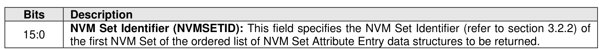
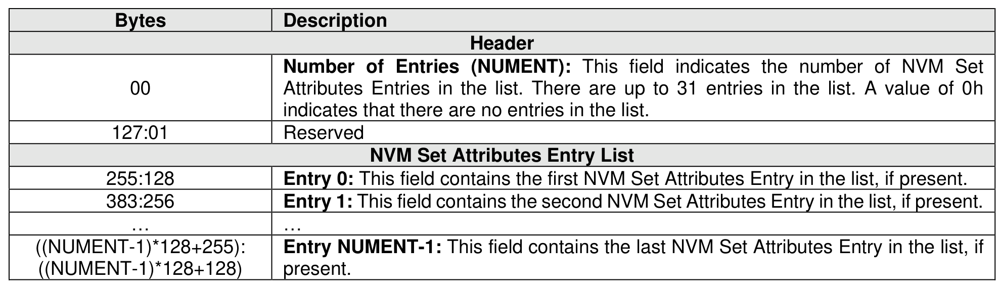
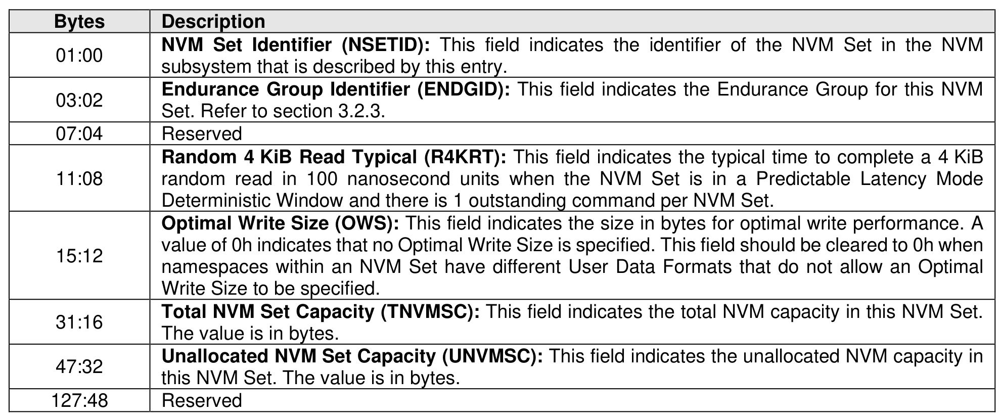

###### 5.2.13.2.4 NVM Set List (CNS 04h)

> **Section ID**: 5.2.13.2.4 | **Page**: 382-383

Figure 333 defines an NVM Set List. The data structure is an ordered list of NVM Set Attribute Entry data
structures, sorted by NVM Set Identifier, starting with the first NVM Set Identifier supported by the NVM
subsystem that is equal to or greater than the NVM Set Identifier specified by the CNS Specific Identifier
field as defined in Figure 332 and are accessible by the controller processing the command. The NVM Set
List describes the attributes for each NVM Set in the list based on the NVM Set Attributes Entry in Figure
333.
The NVM Set List shall not contain an entry cleared to 0h.

---
### 📊 Tables (3)

#### Table 1: Untitled Table

| | Description |
|---|---|
| 00 | NVM Set Identifier (NSETID): This field indicates the identifier of the NVM Set in the NVM subsystem that is described by this entry. |
| 08 | Random 4 KiB Read Typical (R4KRT): This field indicates the typical time to complete a 4 KiB random read in 100 nanosecond units when the NVM Set is in a Predictable Latency Mode Deterministic Window and there is 1 outstanding command per NVM Set. |
| 12 | Optimal Write Size (OWS): This field indicates the size in bytes for optimal write performance. A value of 0h indicates that no Optimal Write Size is specified. This field should be cleared to 0h when namespaces within an NVM Set have different User Data Formats that do not allow an Optimal Write Size to be specified. |
| 16 | Total NVM Set Capacity (TNVMSC): This field indicates the total NVM capacity in this NVM Set. The value is in bytes. |
| 32 | Unallocated NVM Set Capacity (UNVMSC): This field indicates the unallocated NVM capacity in this NVM Set. The value is in bytes. |
| 48 | Reserved |

#### Table 2: Untitled Table

(Continuation of Untitled Table - see first part)

#### Table 3: Untitled Table

(Continuation of Untitled Table - see first part)

