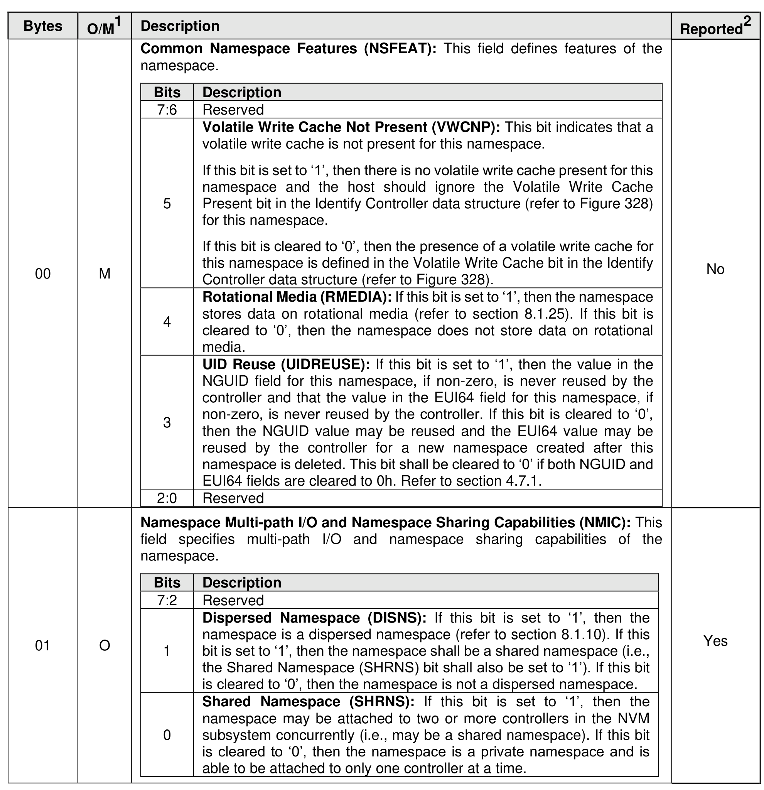
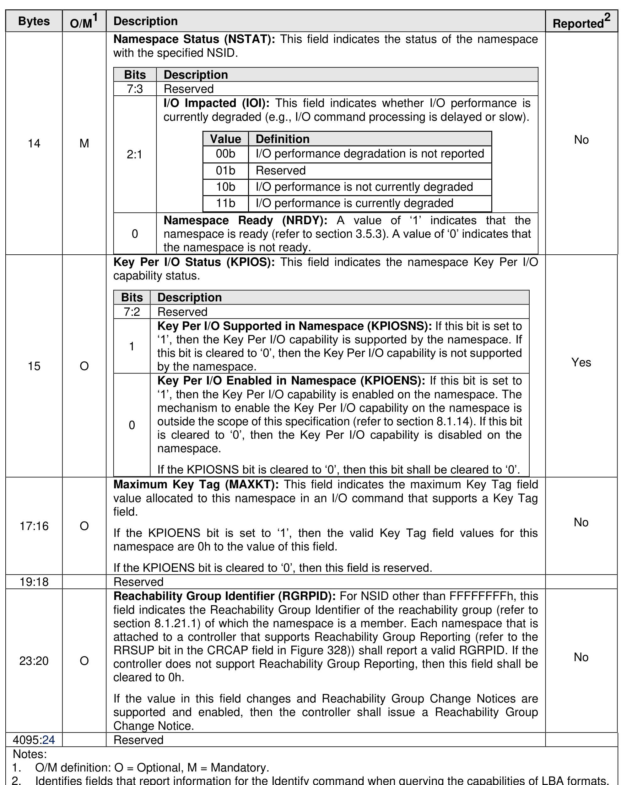

###### 5.2.13.2.8 I/O Command Set Independent Identify Namespace data structure (CNS 08h)

> **Section ID**: 5.2.13.2.8 | **Page**: 384-388

If the Namespace Identifier (NSID) field specifies an active NSID, then the I/O Command Set Independent
Identify Namespace data structure (refer to Figure 335) is returned to the host for that specified namespace.
If the value in the NSID field specifies an inactive NSID, then the controller returns a zero filled data
structure.
The Reported column in Figure 335 specifies fields in the I/O Command Set Independent Identify
Namespace data structure that define namespace capabilities used by a host to format or create a
namespace. If the NSID field is set to FFFFFFFFh, then the controller shall return an I/O Command Set
Independent Identify Namespace data structure that:
•
for fields in Figure 335 that indicate “Yes” in the Reported column, contain the same value for all
namespaces; and
•
for fields in Figure 335 that indicate “No” in the Reported column, contain a value cleared to 0h.
If the controller supports the Namespace Management capability (refer to section 8.1.16) and the NSID
field is set to FFFFFFFFh, then the controller shall return an I/O Command Set Independent Identify
Namespace data structure. If the controller does not support the Namespace Management capability and
the NSID field is set to FFFFFFFFh, then the controller may abort the command with a status code of Invalid
Namespace or Format.

---
### 📊 Tables (4)

#### Table 1: Untitled Table

| | | | |
| :--- | :--- | :--- | :--- |
| M | **Common Namespace Features (NSFEAT):** This field defines features of the namespace. | | No |
| | | **Bits** | **Description** |
| | | 7:6 | Reserved |
| | | | **Volatile Write Cache Not Present (VWCNP):** This bit indicates that a volatile write cache is not present for this namespace. |
| | | | If this bit is set to '1', then there is no volatile write cache present for this namespace and the host should ignore the Volatile Write Cache Present bit in the Identify Controller data structure (refer to Figure 328) for this namespace. |
| | | 5 | If this bit is cleared to '0', then the presence of a volatile write cache for this namespace is defined in the Volatile Write Cache bit in the Identify Controller data structure (refer to Figure 328). |
| | | | **Rotational Media (RMEDIA):** If this bit is set to '1', then the namespace stores data on rotational media (refer to section 8.1.25). If this bit is cleared to '0', then the namespace does not store data on rotational media. |
| | | 4 | |
| | | | **UID Reuse (UIDREUSE):** If this bit is set to '1', then the value in the NGUID field for this namespace, if non-zero, is never reused by the controller and that the value in the EUI64 field for this namespace, if non-zero, is never reused by the controller. If this bit is cleared to '0', then the NGUID value may be reused and the EUI64 value may be reused by the controller for a new namespace created after this namespace is deleted. This bit shall be cleared to '0' if both NGUID and EUI64 fields are cleared to 0h. Refer to section 4.7.1. |
| | | 3 | |
| | | 2:0 | Reserved |
| O | **Namespace Multi-path I/O and Namespace Sharing Capabilities (NMIC):** This field specifies multi-path I/O and namespace sharing capabilities of the namespace. | | Yes |
| | | **Bits** | **Description** |
| | | 7:2 | Reserved |
| | | | **Dispersed Namespace (DISNS):** If this bit is set to '1', then the namespace is a dispersed namespace (refer to section 8.1.10). If this bit is set to '1', then the namespace shall be a shared namespace (i.e., the Shared Namespace (SHRNS) bit shall also be set to '1'). If this bit is cleared to '0', then the namespace is not a dispersed namespace. |
| | | 1 | |
| | | | **Shared Namespace (SHRNS):** If this bit is set to '1', then the namespace may be attached to two or more controllers in the NVM subsystem concurrently (i.e., may be a shared namespace). If this bit is cleared to '0', then the namespace is a private namespace and is able to be attached to only one controller at a time. |
| | | 0 | |
| | Bits | Description |
|---|---|---|
| | | **Reservation Capabilities (RESCAP):** This field indicates the reservation capabilities of the namespace. A value of 0h in this field indicates that reservations are not supported by this namespace. Refer to section 8.1.24 for more details. |
| | | |
| | 7 | **Ignore Existing Key Support (IEKS):** If this bit is set to '1', then the Ignore Existing Key is used as defined in NVM Express Base Specification revision 1.3 or later. If this bit is cleared to '0', then the Ignore Existing Key is used as defined in NVM Express Base Specification revision 1.2.1 or earlier. This bit shall be set to '1' if the controller supports revision 1.3 or later as indicated in the Version property. |
| | 6 | **Exclusive Access – All Registrants Support (EAARS):** If this bit is set to '1', then the namespace supports the Exclusive Access – All Registrants reservation type. If this bit is cleared to '0', then the namespace does not support the Exclusive Access – All Registrants reservation type. |
| | 5 | **Write Exclusive – All Registrants Support (WEARS):** If this bit is set to '1', then the namespace supports the Write Exclusive – All Registrants reservation type. If this bit is cleared to '0', then the namespace does not support the Write Exclusive – All Registrants reservation type. |
| | 4 | **Exclusive Access – Registrants Only Support (EAROS):** If this bit is set to '1', then the namespace supports the Exclusive Access – Registrants Only reservation type. If this bit is cleared to '0', then the namespace does not support the Exclusive Access – Registrants Only reservation type. |
| | 3 | **Write Exclusive – Registrants Only Support (WEROS):** If this bit is set to '1', then the namespace supports the Write Exclusive – Registrants Only reservation type. If this bit is cleared to '0', then the namespace does not support the Write Exclusive – Registrants Only reservation type. |
| | 2 | **Exclusive Access Support (EAS):** If this bit is set to '1', then the namespace supports the Exclusive Access reservation type. If this bit is cleared to '0', then the namespace does not support the Exclusive Access reservation type. |
| | 1 | **Write Exclusive Support (WES):** If this bit is set to '1', then the namespace supports the Write Exclusive reservation type. If this bit is cleared to '0', then the namespace does not support the Write Exclusive reservation type. |
| | 0 | **Persist Through Power Loss Support (PTPLS):** If this bit is set to '1', then the namespace supports the Persist Through Power Loss capability. If this bit is cleared to '0', then the namespace does not support the Persist Through Power Loss capability. |
| | | | |
| :--- | :--- | :--- | :--- |
| | **Format Progress Indicator (FPI):** If a format operation is in progress, this field indicates the percentage of the namespace that remains to be formatted. | | |
| | | **Bits** | **Description** |
| | | 7 | **Format Progress Indicator Support (FPIS):** If this bit is set to '1', then the namespace supports the Format Progress Indicator defined by the RFNVM field. If this bit is cleared to '0', then the namespace does not support the Format Progress Indicator. |
| | | 6:0 | **Remaining Format NVM (RFNVM):** This field indicates the percentage of the Format NVM command that remains to be completed (e.g., a value of 25 indicates that 75% of the Format NVM command has been completed and 25% remains to be completed). If the FPIS bit is set to '1', then a value of 0h indicates that the namespace is formatted with the format specified by Identify Namespace data structures (refer to section 1.5.50) and there is no Format NVM command in progress. If the FPIS bit is cleared to '0', then this field shall be cleared to 0h. |
| | | | |
| | **ANA Group Identifier (ANAGRPID):** For NSID other than FFFFFFFFh, this field indicates the ANA Group Identifier of the ANA group (refer to section 8.1.1.2) of which the namespace is a member. Each namespace that is attached to a controller that supports Asymmetric Namespace Access Reporting (refer to the CMIC field) shall report a valid ANAGRPID. If the controller does not support Asymmetric Namespace Access Reporting, then this field shall be cleared to 0h. If the value in this field changes and Asymmetric Namespace Access Change Notices are supported and enabled, then the controller shall issue an Asymmetric Namespace Access Change Notice. | | |
| | **Namespace Attributes (NSATTR):** This field specifies attributes of the namespace. | | |
| | | **Bits** | **Description** |
| | | 7:1 | Reserved |
| | | 0 | **Currently Write Protected (CWP):** If this bit is set to '1', then the namespace is currently write protected due to any condition (e.g., namespace write protection set for the namespace, media errors) and all write access to the namespace shall fail. If this bit is cleared to '0', then the namespace is not currently write protected. |
| | | | |
| | **NVM Set Identifier (NVMSETID):** For NSID other than FFFFFFFFh, this field indicates the NVM Set with which this namespace is associated. If NVM Sets are not supported by the controller, then this field shall be cleared to 0h. For namespaces that do not contain formatted storage this field shall be cleared to 0h. | | |
| | **Endurance Group Identifier (ENDGID):** For NSID other than FFFFFFFFh, this field indicates the Endurance Group with which this namespace is associated. If Endurance Groups are not supported by the controller, then this field shall be cleared to 0h. For namespaces that do not contain formatted storage this field shall be cleared to 0h. | | |
| | | | |
| :--- | :--- | :--- | :--- |
| M | Namespace Status (NSTAT): This field indicates the status of the namespace with the specified NSID. | | No |
| | Bits | Description | |
| | 7:3 | Reserved | |
| | 2:1 | I/O Impacted (IOI): This field indicates whether I/O performance is currently degraded (e.g., I/O command processing is delayed or slow). | |
| | | | |
| | | Value | Definition |
| | | 00b | I/O performance degradation is not reported |
| | | 01b | Reserved |
| | | 10b | I/O performance is not currently degraded |
| | | 11b | I/O performance is currently degraded |
| | 0 | Namespace Ready (NRDY): A value of '1' indicates that the namespace is ready (refer to section 3.5.3). A value of '0' indicates that the namespace is not ready. | |
| O | Key Per I/O Status (KPIOS): This field indicates the namespace Key Per I/O capability status. | | Yes |
| | Bits | Description | |
| | 7:2 | Reserved | |
| | 1 | Key Per I/O Supported in Namespace (KPIOSNS): If this bit is set to '1', then the Key Per I/O capability is supported by the namespace. If this bit is cleared to '0', then the Key Per I/O capability is not supported by the namespace. | |
| | 0 | Key Per I/O Enabled in Namespace (KPIOENS): If this bit is set to '1', then the Key Per I/O capability is enabled on the namespace. The mechanism to enable the Key Per I/O capability on the namespace is outside the scope of this specification (refer to section 8.1.14). If this bit is cleared to '0', then the Key Per I/O capability is disabled on the namespace.   If the KPIOSNS bit is cleared to '0', then this bit shall be cleared to '0'. | |
| O | Maximum Key Tag (MAXKT): This field indicates the maximum Key Tag field value allocated to this namespace in an I/O command that supports a Key Tag field.   If the KPIOENS bit is set to '1', then the valid Key Tag field values for this namespace are 0h to the value of this field.   If the KPIOENS bit is cleared to '0', then this field is reserved. | | No |
| | | Reserved | |
| O | Reachability Group Identifier (RGRPID): For NSID other than FFFFFFFFh, this field indicates the Reachability Group Identifier of the reachability group (refer to section 8.1.21.1) of which the namespace is a member. Each namespace that is attached to a controller that supports Reachability Group Reporting (refer to the RRSUP bit in the CRCAP field in Figure 328)) shall report a valid RGRPID. If the controller does not support Reachability Group Reporting, then this field shall be cleared to 0h.   If the value in this field changes and Reachability Group Change Notices are supported and enabled, then the controller shall issue a Reachability Group Change Notice. | | No |
| | | Reserved | |
| | | | |
| | | | |
| | | | |
| | | | |
| | | | |
| | | |

#### Table 2: Untitled Table

(Continuation of Untitled Table - see first part)

#### Table 3: Untitled Table

(Continuation of Untitled Table - see first part)

#### Table 4: Untitled Table

(Continuation of Untitled Table - see first part)

