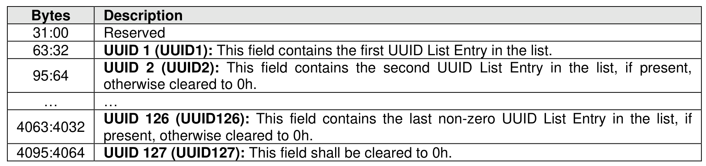
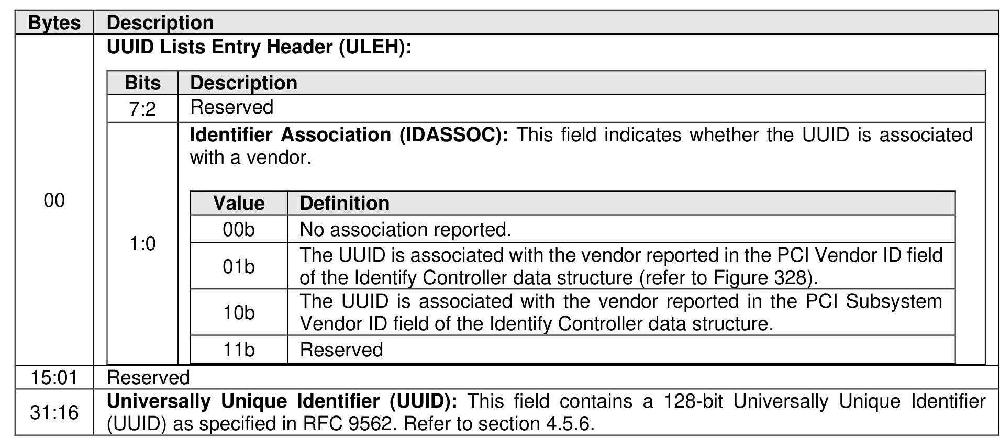

###### 5.2.13.2.14 UUID List (CNS 17h)

> **Section ID**: 5.2.13.2.14 | **Page**: 389-390

The format of the UUID List is defined in Figure 336. Each UUID List entry is either 0h, the NVMe Invalid
UUID, or a valid UUID. Valid UUIDs are those which are non-zero and are not the NVMe Invalid UUID (refer
to section 8.1.30).
If the UUID List bit is set to ‘1’ in the Controller Attributes (CTRATT) field in the Identify Controller data
structure (refer to Figure 328), then:
•
The UUID List shall contain at least one valid UUID (refer to section 8.1.30);
•
The UUID 1 field shall contain a non-zero value; and
•
A UUID field cleared to 0h indicates the end of the UUID List.
The list may be in any order.
The format of a UUID List Entry is defined in Figure 337.

---
### 📊 Tables (2)

#### Table 1: Untitled Table

| Value | Definition |
| :--- | :--- |
| 00b | No association reported. |
| 01b | The UUID is associated with the vendor reported in the PCI Vendor ID field of the Identify Controller data structure (refer to Figure 328). |
| 10b | The UUID is associated with the vendor reported in the PCI Subsystem Vendor ID field of the Identify Controller data structure. |
| 11b | Reserved |

#### Table 2: Untitled Table

(Continuation of Untitled Table - see first part)

