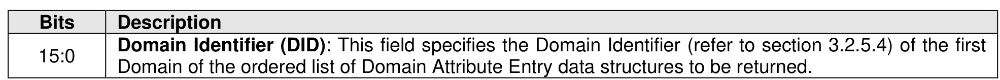
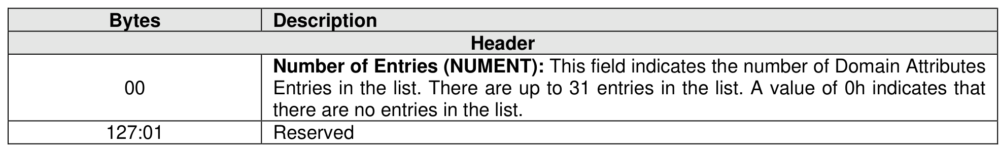
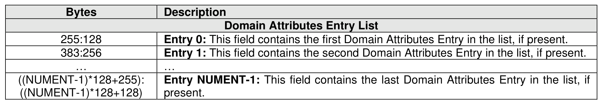
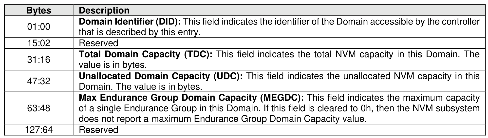

###### 5.2.13.2.15 Domain List (CNS 18h)

> **Section ID**: 5.2.13.2.15 | **Page**: 390-391

Figure 339 defines a Domain List. The data structure is an ordered list by Domain Identifier, starting with
the first Domain Identifier that is greater than or equal to the Domain Identifier specified by the CNS Specific
Identifier field as defined in Figure 338 and is accessible by the controller processing the command. The
Domain List describes the attributes for each Domain in the list based on the Domain Attributes Entry in
Figure 340.

---
### 📊 Tables (4)

#### Table 1: Untitled Table

| | Description |
|---|---|
| 16 | **Total Domain Capacity (TDC):** This field indicates the total NVM capacity in this Domain. The value is in bytes. |
| 32 | **Unallocated Domain Capacity (UDC):** This field indicates the unallocated NVM capacity in this Domain. The value is in bytes. |
| 48 | **Max Endurance Group Domain Capacity (MEGDC):** This field indicates the maximum capacity of a single Endurance Group in this Domain. If this field is cleared to 0h, then the NVM subsystem does not report a maximum Endurance Group Domain Capacity value. |
| 64 | Reserved |

#### Table 2: Untitled Table

(Continuation of Untitled Table - see first part)

#### Table 3: Untitled Table

(Continuation of Untitled Table - see first part)

#### Table 4: Untitled Table

(Continuation of Untitled Table - see first part)

