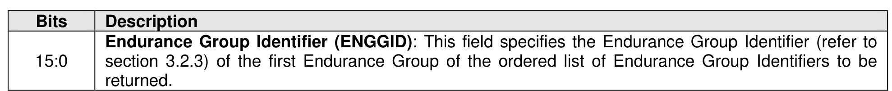
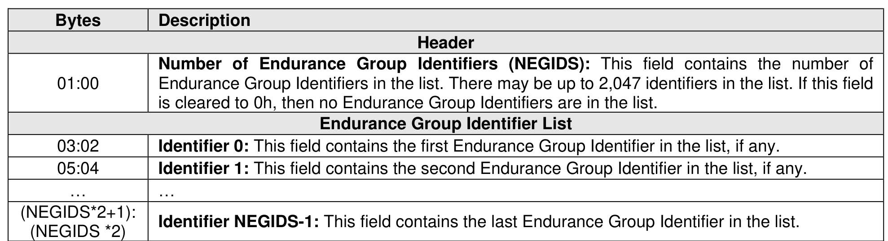

###### 5.2.13.2.16 Endurance Group List (19h)

> **Section ID**: 5.2.13.2.16 | **Page**: 391-391

An Endurance Group List (refer to Figure 342) of up to 2,047 Endurance Group Identifiers in increasing
order is returned containing an Endurance Group Identifier greater than or equal to the Endurance Group
Identifier specified by the CNS Specific Identifier field as defined in Figure 341. The list contains Endurance
Group Identifiers of Endurance Groups that are accessible by the controller processing the command. If
the value specified in the Endurance Group Identifier is greater than ENDGIDMAX, then the controller shall
complete the command with a status code of Successful Completion and return an Endurance Group List
containing no Endurance Group Identifiers.

---
### 📊 Tables (2)

#### Table 1: Untitled Table

| :00 | Endurance Group Identifiers in the list. There may be up to 2,047 identifiers in the list. If this field is cleared to 0h, then no Endurance Group Identifiers are in the list. |
|---|---|
| | **Endurance Group Identifier List** |
| :02 | **Identifier 0:** This field contains the first Endurance Group Identifier in the list, if any. |
| :04 | **Identifier 1:** This field contains the second Endurance Group Identifier in the list, if any. |
| ... | ... |

#### Table 2: Untitled Table

(Continuation of Untitled Table - see first part)

