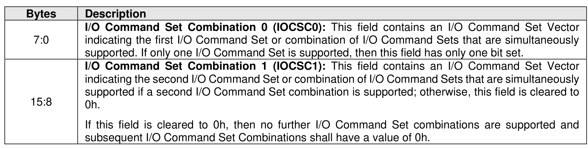
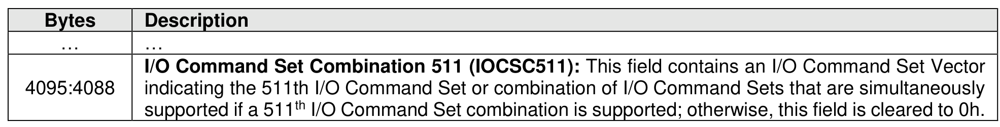
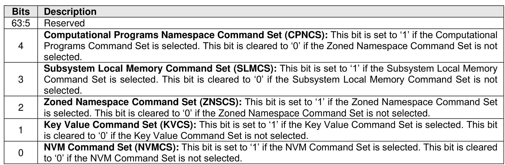

###### 5.2.13.2.19 Identify I/O Command Set data structure (CNS 1Ch)

> **Section ID**: 5.2.13.2.19 | **Page**: 392-393

The Identify I/O Command Set data structure (refer to Figure 343) is returned to the host for the controller
specified in the Controller ID (CNTID) field of the command if the CNTID field does not have a value of
FFFFh. If the CNTID field has a value of FFFFh, then the Identify I/O Command Set data structure is
returned to the host for the controller processing the command.
This CNS value shall be implemented if the CAP.CSS.IOCSS bit is set to ‘1’.
The Identify I/O Command Set data structure consists of an array of I/O Command Set Vectors (refer to
Figure 344) that describe the I/O Command Sets that the controller supports and the combination of
supported I/O Command Sets that may be simultaneously used. The I/O Command Set Profile Feature
value indicates the index of the I/O Command Set Combination that is currently selected (refer to section
5.2.26.1.17). I/O Command Set Combination 0 has an index value of 0h, I/O Command Set Combination 1
has an index value of 1h, and so on. Only I/O Command Sets that have a bit set to ‘1’ in the I/O Command
Set Vector of the I/O Command Set Combination selected by the I/O Command Set Profile Feature value
may be used. All other I/O Command Sets are treated as unsupported I/O Command Sets.

---
### 📊 Tables (3)

#### Table 1: Untitled Table

| Description |  |
| :--- | :--- |
| Subsystem Local Memory Command Set (SLMCS): This bit is set to '1' if the Subsystem Local Memory Command Set is selected. This bit is cleared to '0' if the Subsystem Local Memory Command Set is not selected. |  |
| Zoned Namespace Command Set (ZNSCS): This bit is set to '1' if the Zoned Namespace Command Set is selected. This bit is cleared to '0' if the Zoned Namespace Command Set is not selected. |  |
| Key Value Command Set (KVCS): This bit is set to '1' if the Key Value Command Set is selected. This bit is cleared to '0' if the Key Value Command Set is not selected. |  |
| NVM Command Set (NVMCS): This bit is set to '1' if the NVM Command Set is selected. This bit is cleared to '0' if the NVM Command Set is not selected. |  |

#### Table 2: Untitled Table

(Continuation of Untitled Table - see first part)

#### Table 3: Untitled Table

(Continuation of Untitled Table - see first part)

