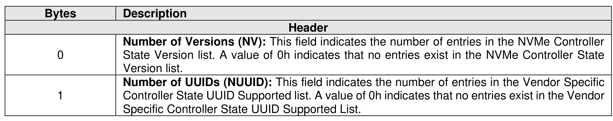

###### 5.2.13.2.21 Supported Controller State Formats (CNS 20h)

> **Section ID**: 5.2.13.2.21 | **Page**: 393-394

A Supported Controller State Formats data structure (refer to Figure 345) is returned to the host identifying
the supported NVMe Controller State data structures (refer to Figure 346) and a list of UUIDs that identifies
the vendor specific controller state information.
A host uses an index into each list to identify the format and information returned by a Migration Receive
command specifying the Get Controller State management operation (refer to section 5.2.16.1.1).
A host uses an index into each list to identify the format and information contained in a Migration Send
command specifying the Set Controller State management operation of the Migration Send command (refer
to section 5.2.17.1.3).

---
### 📊 Tables (2)

#### Table 1: Untitled Table

| | Description |
|:---|:---|
| 3:2 | **NVMe Controller State Data Structure Version 1**: This field contains a version of the NVMe Controller State data structure (refer to Version field in Figure 375) that is supported by this controller and is associated with index 1h of this list, if any. This field is the first entry of the NVMe Controller State Version list. |
| 5:4 | **NVMe Controller State Data Structure Version 2**: This field contains a version of the NVMe Controller State data structure that is supported by this controller and is associated with index 2h of this list, if any. This field is the second entry of the NVMe Controller State Version list. |
| +1:(NV*2) | **NVMe Controller State Data Structure Version NV**: This field contains a version of the NVMe Controller State data structure that is supported by this controller and is associated with index NV of this list, if any. This field is the last entry of the NVMe Controller State Version list. |
| | **Vendor Specific Controller State UUID Supported List** |
| (1)*2)+15: (+1)*2) | **Vendor Specific Controller State UUID 1**: This field contains a 128-bit Universally Unique Identifier (UUID), as specified in RFC 9562 (refer to section 4.5.6), that identifies the format of the Vendor Specific Data field the Controller State data structure (refer to Figure 374) that is supported by this controller and is associated with index 1h of this list, if any. This field is the first entry of the Vendor Specific Controller State UUID Supported list.  The value in this field and the associated format of the Vendor Specific Data field the Controller State data structure is out of scope for this specification. |
| (1)*2)+31 : (1)*2)+16 | **Vendor Specific Controller State UUID 2**: This field contains a 128-bit Universally Unique Identifier (UUID), as specified in RFC 9562, that identifies the format of the Vendor Specific Data field the Controller State data structure that is supported by this controller and is associated with index 2h of this list, if any. This field is the second entry of the Vendor Specific Controller State UUID Supported list.  The value in this field and the associated format of the Vendor Specific Data field the Controller State data structure is out of scope for this specification. |
| (DID)*16)+ (D-1)*2)-1 : (D-1)*16)+ (+1)*2) | **Vendor Specific Controller State UUID NUUID**: This field contains a 128-bit Universally Unique Identifier (UUID), as specified in RFC 9562, that identifies the format of the Vendor Specific Data field the Controller State data structure that is supported by this controller and is associated with index NUUID of this list, if any. This field is the last entry of the Vendor Specific Controller State UUID Supported list.  The value in this field and the associated format of the Vendor Specific Data field the Controller State data structure is out of scope for this specification. |
| | **Memory-Based Transport Identify Data Structures (PCIe)** |
| | This section describes Identify data structures that are specific to the Memory-based transport model. |
| | **3.3.1 Primary Controller Capabilities data structure (CNS 14h)** |
| | The Primary Controller Capabilities Structure (refer to Figure 346) is returned to the host for the primary controller specified. |
| | **Figure 346: Identify – Primary Controller Capabilities Structure** |
| | **Description** |
| | **Controller Identifier (CNTLID)**: This field indicates the Controller Identifier of the primary controller. |

#### Table 2: Untitled Table

(Continuation of Untitled Table - see first part)

