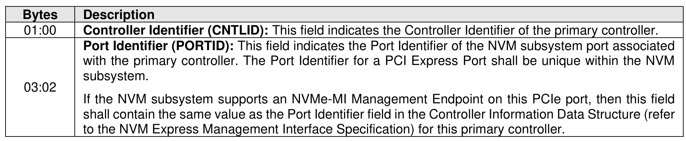
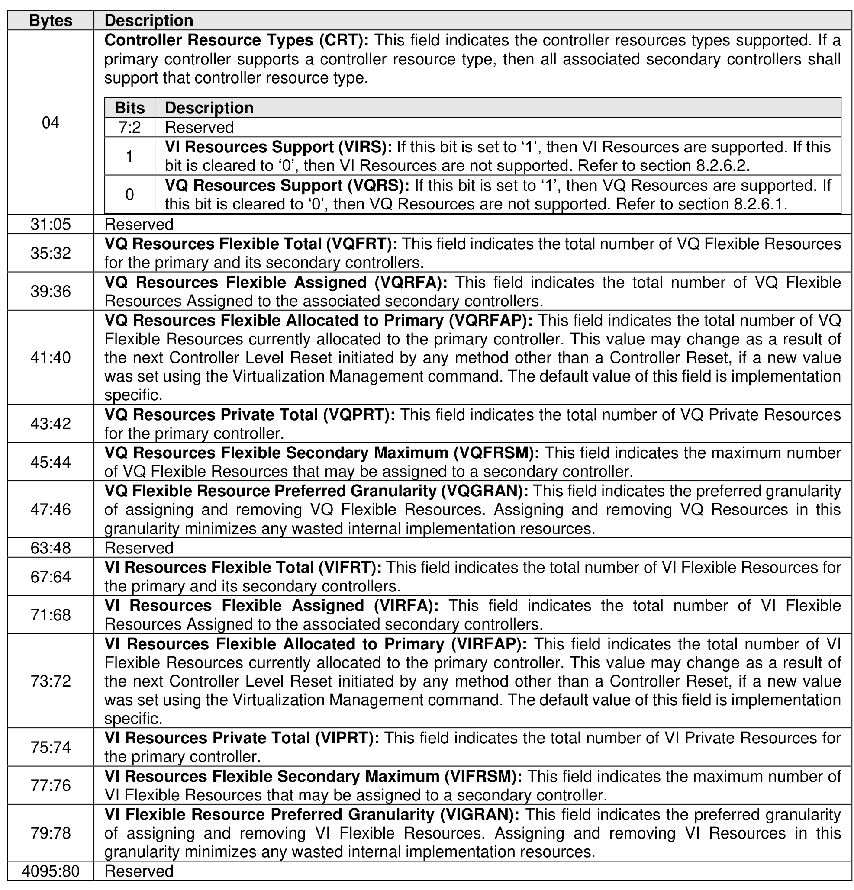

###### 5.2.13.3.1 Primary Controller Capabilities data structure (CNS 14h)

> **Section ID**: 5.2.13.3.1 | **Page**: 394-395

The Primary Controller Capabilities Structure (refer to Figure 346) is returned to the host for the primary
controller specified.

---
### 📊 Tables (2)

#### Table 1: Untitled Table

| Bits | Description |
| :--- | :--- |
| 7:2 | Reserved |
| 1 | VI Resources Support (VIRS): If this bit is set to '1', then VI Resources are supported. If this bit is cleared to '0', then VI Resources are not supported. Refer to section 8.2.6.2. |
| 0 | VQ Resources Support (VQRS): If this bit is set to '1', then VQ Resources are supported. If this bit is cleared to '0', then VQ Resources are not supported. Refer to section 8.2.6.1. |
| | Reserved |
| | VQ Resources Flexible Total (VQFRT): This field indicates the total number of VQ Flexible Resources for the primary and its secondary controllers. |
| | VQ Resources Flexible Assigned (VQRFA): This field indicates the total number of VQ Flexible Resources Assigned to the associated secondary controllers. |
| | VQ Resources Flexible Allocated to Primary (VQRFAP): This field indicates the total number of VQ Flexible Resources currently allocated to the primary controller. This value may change as a result of the next Controller Level Reset initiated by any method other than a Controller Reset, if a new value was set using the Virtualization Management command. The default value of this field is implementation specific. |
| | VQ Resources Private Total (VQPRT): This field indicates the total number of VQ Private Resources for the primary controller. |
| | VQ Resources Flexible Secondary Maximum (VQFRSM): This field indicates the maximum number of VQ Flexible Resources that may be assigned to a secondary controller. |
| | VQ Flexible Resource Preferred Granularity (VQGRAN): This field indicates the preferred granularity of assigning and removing VQ Flexible Resources. Assigning and removing VQ Resources in this granularity minimizes any wasted internal implementation resources. |
| | Reserved |
| | VI Resources Flexible Total (VIFRT): This field indicates the total number of VI Flexible Resources for the primary and its secondary controllers. |
| | VI Resources Flexible Assigned (VIRFA): This field indicates the total number of VI Flexible Resources Assigned to the associated secondary controllers. |
| | VI Resources Flexible Allocated to Primary (VIRFAP): This field indicates the total number of VI Flexible Resources currently allocated to the primary controller. This value may change as a result of the next Controller Level Reset initiated by any method other than a Controller Reset, if a new value was set using the Virtualization Management command. The default value of this field is implementation specific. |
| | VI Resources Private Total (VIPRT): This field indicates the total number of VI Private Resources for the primary controller. |
| | VI Resources Flexible Secondary Maximum (VIFRSM): This field indicates the maximum number of VI Flexible Resources that may be assigned to a secondary controller. |
| | VI Flexible Resource Preferred Granularity (VIGRAN): This field indicates the preferred granularity of assigning and removing VI Flexible Resources. Assigning and removing VI Resources in this granularity minimizes any wasted internal implementation resources. |
| 0 | Reserved |

#### Table 2: Untitled Table

(Continuation of Untitled Table - see first part)

