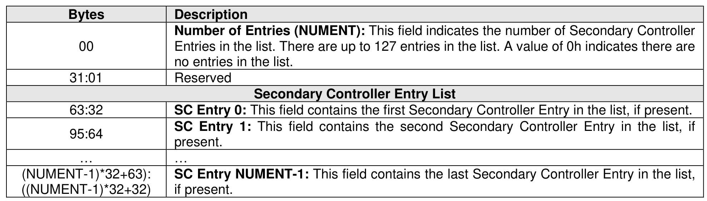
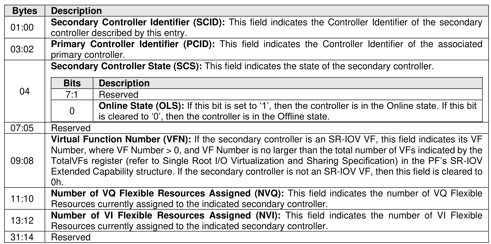

###### 5.2.13.3.2 Secondary Controller list (CNS 15h)

> **Section ID**: 5.2.13.3.2 | **Page**: 395-396

A Secondary Controller List (refer to Figure 347) is returned to the host for up to 127 secondary controllers
associated with the primary controller processing this command. The list contains entries for controller
identifiers greater than or equal to the value specified in the Controller Identifier (CDW10.CNTID) field.
All secondary controllers are represented, including those that are in an Offline state due to SR-IOV
configuration settings (e.g., VF Enable is cleared to ‘0’ or NumVFs specifies a value that does not enable
the associated secondary controller).

---
### 📊 Tables (2)

#### Table 1: Untitled Table

| Description |  |
| :--- | :--- |
| **Secondary Controller Identifier (SCID):** This field indicates the Controller Identifier of the secondary controller described by this entry. |  |
| **Bits** | **Description** |
| 7:1 | Reserved |
| 0 | **Online State (OLS):** If this bit is set to '1', then the controller is in the Online state. If this bit is cleared to '0', then the controller is in the Offline state. |
| Reserved |  |
| **Virtual Function Number (VFN):** If the secondary controller is an SR-IOV VF, this field indicates its VF Number, where VF Number > 0, and VF Number is no larger than the total number of VFs indicated by the TotalVFs register (refer to Single Root I/O Virtualization and Sharing Specification) in the PF's SR-IOV Extended Capability structure. If the secondary controller is not an SR-IOV VF, then this field is cleared to 0h. |  |
| **Number of VQ Flexible Resources Assigned (NVQ):** This field indicates the number of VQ Flexible Resources currently assigned to the indicated secondary controller. |  |
| **Number of VI Flexible Resources Assigned (NVI):** This field indicates the number of VI Flexible Resources currently assigned to the indicated secondary controller. |  |
| Reserved |  |

#### Table 2: Untitled Table

(Continuation of Untitled Table - see first part)

