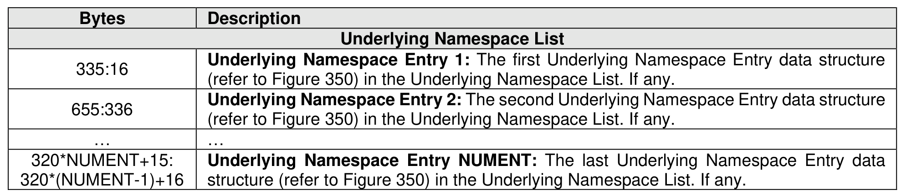
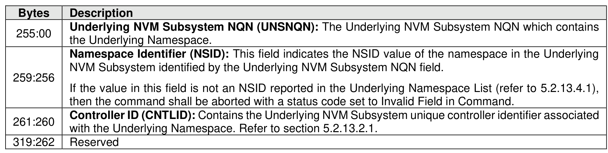

###### 5.2.13.4.1 Get Underlying Namespace List (CNS 1Dh)

> **Section ID**: 5.2.13.4.1 | **Page**: 396-397

An Underlying Namespace List data structure (refer to Figure 349) is returned containing a list of all
Underlying Namespaces spanning all NVM subsystems that are accessible through either a virtual function
or a physical function.

---
### 📊 Tables (3)

#### Table 1: Untitled Table

| | Description |
|---|---|
| | **Underlving NVM Subsystem NQN (UNSNQN):** The Underlving NVM Subsystem NQN which contains |
| | If the value in this field is not an NSID reported in the Underlying Namespace List (refer to 5.2.13.4.1), then the command shall be aborted with a status code set to Invalid Field in Command. |
| | **Controller ID (CNTLID):** Contains the Underlying NVM Subsystem unique controller identifier associated with the Underlying Namespace. Refer to section 5.2.13.2.1. |
| | Reserved |

#### Table 2: Untitled Table

(Continuation of Untitled Table - see first part)

#### Table 3: Untitled Table

(Continuation of Untitled Table - see first part)

