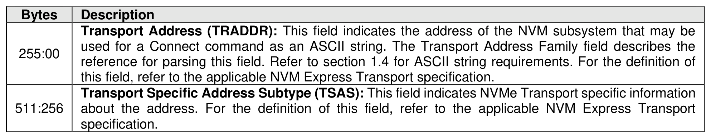
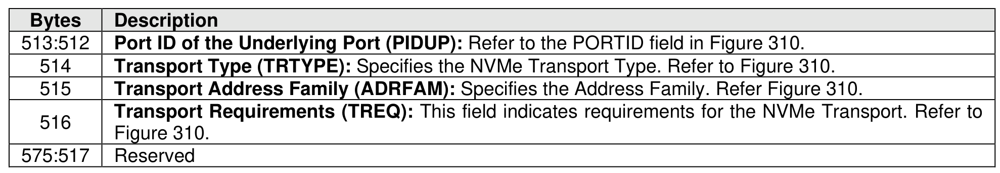

###### 5.2.13.4.2 Get Ports List (CNS 1Eh)

> **Section ID**: 5.2.13.4.2 | **Page**: 397-398

A Ports List data structure (refer to Figure 351) is returned containing a list of Underlying Ports that may be
used to export NVMe over Fabrics NVM subsystems.

---
### 📊 Tables (3)

#### Table 1: Untitled Table

| Description |
| :--- |
| **Transport Address (TRADDR)**: This field indicates the address of the NVM subsystem that may be used for a Connect command as an ASCII string. The Transport Address Family field describes the reference for parsing this field. Refer to section 1.4 for ASCII string requirements. For the definition of this field, refer to the applicable NVM Express Transport specification. |
| **Transport Specific Address Subtype (TSAS)**: This field indicates NVMe Transport specific information about the address. For the definition of this field, refer to the applicable NVM Express Transport specification. |
| **Transport Type (TRTYPE)**: Specifies the NVMe Transport Type. Refer to Figure 310. |
| **Transport Address Family (ADRFAM)**: Specifies the Address Family. Refer Figure 310. |
| **Transport Requirements (TREQ)**: This field indicates requirements for the NVMe Transport. Refer to Figure 310. |
| Reserved |

#### Table 2: Untitled Table

(Continuation of Untitled Table - see first part)

#### Table 3: Untitled Table

(Continuation of Untitled Table - see first part)

