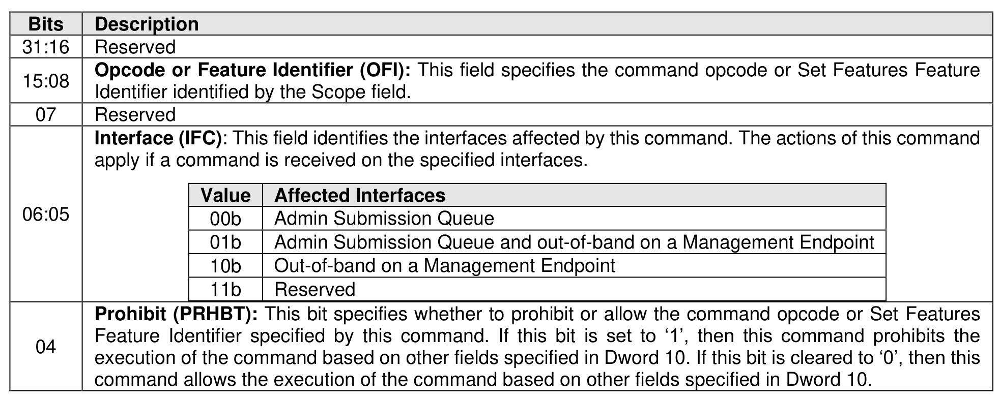
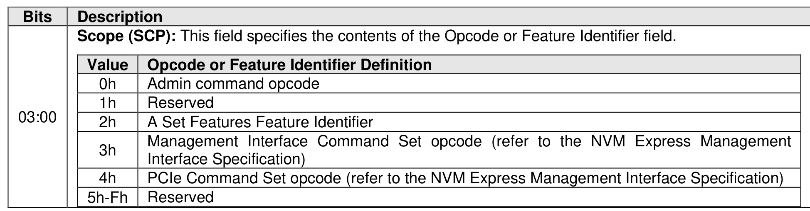
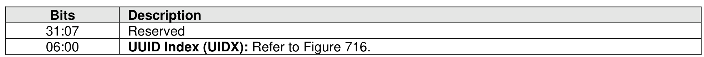

#### 5.2.15 Lockdown command

> **Section ID**: 5.2.15 | **Page**: 398-399

The Lockdown command is used to control the Command and Feature Lockdown capability (refer to section
8.1.5) which configures the prohibition or allowance of execution of the specified command or Set Features
command targeting a specific Feature Identifier.
After a successful completion of a Lockdown command prohibiting a command or Feature Identifier, all
controllers, if applicable, and all management endpoints, if applicable, in the NVM subsystem behave as
described in section 8.1.5.
The Lockdown command uses Command Dword 10 (refer to Figure 353) and Command Dword 14 (refer
to Figure 354). All other command specific fields are reserved.
If the controller supports selection of a UUID:
a) by the Lockdown command; and
b) by the Set Features command (refer to section 5.2.26 and section 8.1.30) and for the vendor
specific Feature Identifier specified by the Opcode or Feature Identifier field, if the Scope field is
set to 2h,
then Command Dword 14 (refer to Figure 354) is used to specify a UUID Index value.
If the controller does not support selection of a UUID:
a) by the Lockdown command;
b) by the Set Features command; or
c) for the vendor specific feature identifier specified by the Opcode or Feature Identifier field, if the
Scope field is set to 2h,
then Command Dword 14 does not specify a UUID Index value. If the Scope field is not set to 2h, then
UUID Index field is ignored.
If a controller processes a Lockdown command that specifies a command opcode or Feature Identifier that
is:
•
not indicated as being able to be prohibited from execution (refer to Figure 271), then that command
shall be aborted with a status code of Prohibition of Command Execution Not Supported; or
•
indicated as being able to be prohibited from execution (refer to Figure 271) but that command
opcode or Feature Identifier is not supported on one of the interfaces specified in the Interface field
(e.g., an Admin Submission Queue, a Management Endpoint) of that Lockdown command, then:
o
that command should be aborted with a status code of Prohibition of Command Execution
Not Supported; and
o
that command may be aborted with a status code of Invalid Field in Command.
If a controller processes this command with the Interface field set to 01b or 10b and the NVM subsystem
does not contain a Management Endpoint, then the command shall be aborted with a status code of Invalid
Field in Command.
If a controller processes this command with the Interface field set to 00b or 01b and the Scope field is set
to 4h, then the command shall be aborted with a status code of Invalid Field in Command.
It is not an error to attempt to prohibit a command or Feature Identifier that is already prohibited from
execution or allow a command or Feature Identifier that is already allowed to be executed.

---
### 📊 Tables (3)

#### Table 1: Untitled Table

| Value | Opcode or Feature Identifier Definition |
|---|---|
| 0h | Admin command opcode |
| 1h | Reserved |
| 2h | A Set Features Feature Identifier |
| 3h | Management Interface Command Set opcode (refer to the NVM Express Management Interface Specification) |
| 4h | PCIe Command Set opcode (refer to the NVM Express Management Interface Specification) |
| 5h-Fh | Reserved |

#### Table 2: Untitled Table

(Continuation of Untitled Table - see first part)

#### Table 3: Untitled Table

(Continuation of Untitled Table - see first part)

