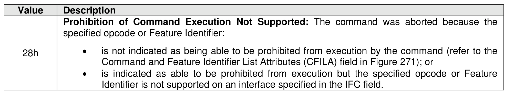

##### 5.2.15.1 Command Completion

> **Section ID**: 5.2.15.1 | **Page**: 400-400

Upon completion of the Lockdown command, the controller posts a completion queue entry to the Admin
Completion Queue.
Lockdown command specific status values are defined in Figure 355.

---
### 📊 Tables (1)

#### Table 1: Untitled Table

| | • is not indicated as being able to be prohibited from execution by the command (refer to the Command and Feature Identifier List Attributes (CFILA) field in Figure 271); or   • is indicated as able to be prohibited from execution but the specified opcode or Feature Identifier is not supported on an interface specified in the IFC field. |
|---|---|
| Migration Receive command | |
| Migration Receive command is used to obtain information from the controller processing the command   host may use to manage a migratable controller (refer to section 8.1.13).   Migration Receive command uses the Data Pointer field, Command Dword 10 field, Command Dword |

