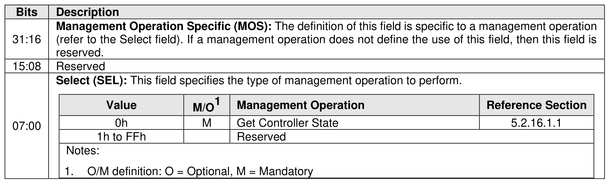
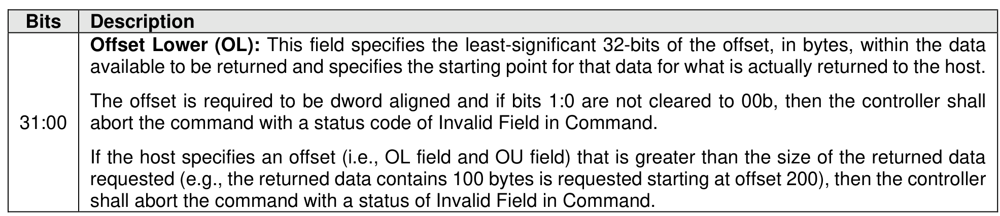
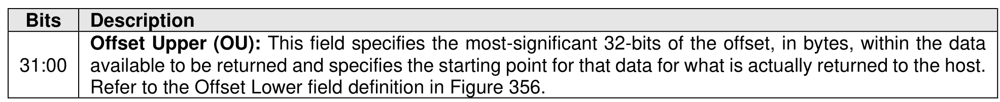
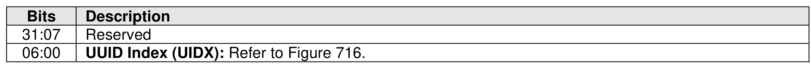
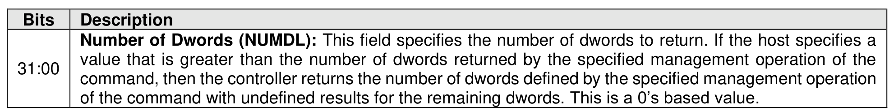

#### 5.2.16 Migration Receive command

> **Section ID**: 5.2.16 | **Page**: 400-401

The Migration Receive command is used to obtain information from the controller processing the command
that the host may use to manage a migratable controller (refer to section 8.1.13).
The Migration Receive command uses the Data Pointer field, Command Dword 10 field, Command Dword
12 field, Command Dword 13 field, Command Dword 14 field, and Command Dword 15 field. The use of
the Command Dword 11 field is specific to the management operation specified by the Select field. All other
command specific fields are reserved.
The Select field defined in Figure 356 specifies the management operation to be performed. Refer to section
5.2.16.1for a description of each management operation.
If the controller supports selection of a UUID by the Migration Receive command (refer to Figure 214 and
section 8.1.30), then Command Dword 14 is used to specify a UUID Index value (refer to Figure 359).

---
### 📊 Tables (5)

#### Table 1: Untitled Table

| | 1h to FFh | Reserved |
|---|---|---|
| Notes: | | |
| 1. O/M definition: O = Optional, M = Mandatory | | |
| Figure 357: Migration Receive – Command Dword 12 | | |
| Description | | |
| Offset Lower (OL): This field specifies the least-significant 32-bits of the offset, in bytes, within the data available to be returned and specifies the starting point for that data for what is actually returned to the host. The offset is required to be dword aligned and if bits 1:0 are not cleared to 00b, then the controller shall abort the command with a status code of Invalid Field in Command. If the host specifies an offset (i.e., OL field and OU field) that is greater than the size of the returned data requested (e.g., the returned data contains 100 bytes is requested starting at offset 200), then the controller shall abort the command with a status of Invalid Field in Command. | | |
| 376 | | |
| available to be returned and specifies the starting point for that data for what is actually returned to the host. Refer to the Offset Lower field definition in Figure 356. | | |
| controller supports selection of a UUID by the Migration Receive command (refer to Figure 214 and 3.1.30), then Command Dword 14 is used to specify a UUID Index value (refer to Figure 359). | | |
| Figure 360: Migration Receive – Command Dword 15 | | |
| Description | | |
| Number of Dwords (NUMDL): This field specifies the number of dwords to return. If the host specifies a value that is greater than the number of dwords returned by the specified management operation of the Migration Receive Management Operations | | |
| 5.1.1 Get Controller State (Management Operation 0h) | | |
| Controller State management operation of the Migration Receive command allows the host to from the controller processing the command state data for the controller specified in the Controller field in the Management Operation Specific field (refer to Figure 361). The data returned in the | | |
| 374. | | |

#### Table 2: Untitled Table

(Continuation of Untitled Table - see first part)

#### Table 3: Untitled Table

(Continuation of Untitled Table - see first part)

#### Table 4: Untitled Table

(Continuation of Untitled Table - see first part)

#### Table 5: Untitled Table

(Continuation of Untitled Table - see first part)

