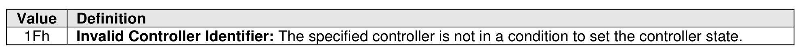

###### 5.2.16.1.2 Command Completion

> **Section ID**: 5.2.16.1.2 | **Page**: 403-403

The Upon completion of the Migration Receive command, the controller posts a completion queue entry to
the Admin Completion Queue indicating the status for the command. Section 5.2.16.1 describes completion
details for each management operation.
Migration Receive command specific status values (i.e., SCT field set to 1h) are shown in Figure 364.

---
### 📊 Tables (1)

#### Table 1: Untitled Table

| Operation Send command uses the Command Dword 10 and Command Dword 14. The use of the inter field, Command Dword 11 field, Command Dword 12 field, Command Dword 13 field, and Dword 15 field is specific to the management operation specified by the Select field. All other |

