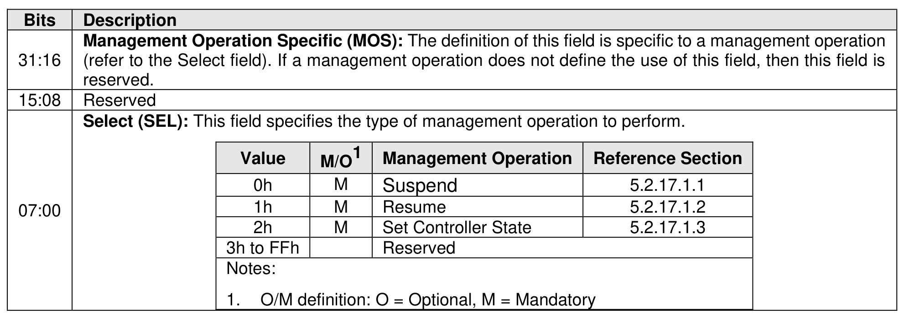
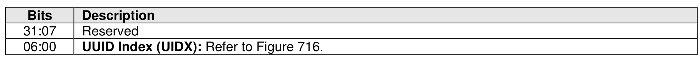

#### 5.2.17 Migration Send command

> **Section ID**: 5.2.17 | **Page**: 403-403

The Migration Send command is used to manage the migration of a controller (refer to section 8.1.13).
The Migration Send command uses the Command Dword 10 and Command Dword 14. The use of the
Data Pointer field, Command Dword 11 field, Command Dword 12 field, Command Dword 13 field, and
Command Dword 15 field is specific to the management operation specified by the Select field. All other
command specific fields are reserved.
The Select field defined in Figure 365 specifies the management operation to be performed. Refer to section
5.2.17.1 for a description of each management operation.
If the controller supports selection of a UUID by the Migration Send command (refer to Figure 214 and
section 8.1.30), then Command Dword 14 is used to specify a UUID Index value (refer to Figure 366).

---
### 📊 Tables (2)

#### Table 1: Untitled Table

| | | | |
| :--- | :--- | :--- | :--- |
| 2h | M | Set Controller State | 5.2.17.1.3 |
| 3h to FFh | | Reserved | |
| Notes: | | | |
| 1. O/M definition: O = Optional, M = Mandatory | | | |
| | | | |
| Controller supports selection of a UUID by the Migration Send command (refer to Figure 214 and 3.1.30), then Command Dword 14 is used to specify a UUID Index value (refer to Figure 366). | | | |
| **Figure 366: Migration Send – Command Dword 14** | | | |
| | **Description** | | |
| | Reserved | | |
| | **UUID Index (UIDX):** Refer to Figure 716. | | |

#### Table 2: Untitled Table

(Continuation of Untitled Table - see first part)

