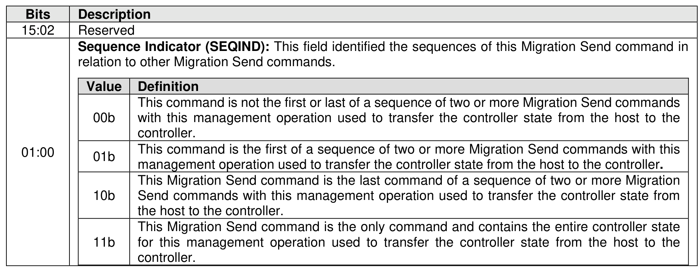
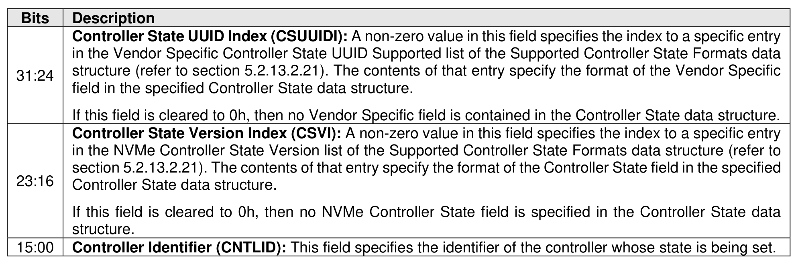
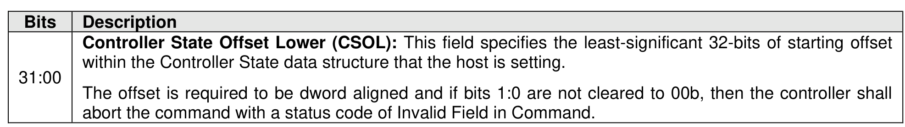
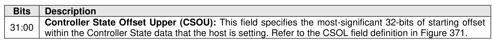
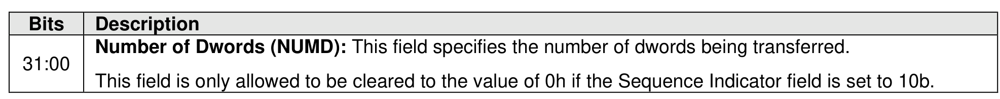
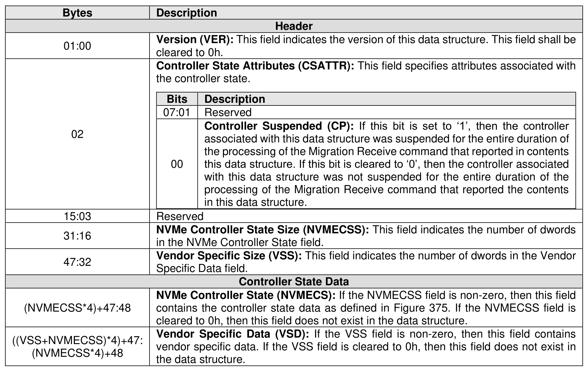
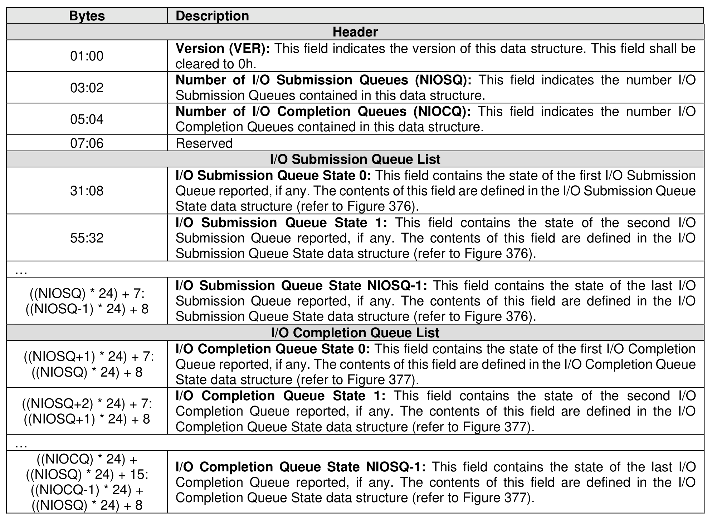
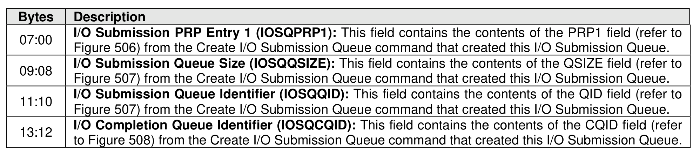
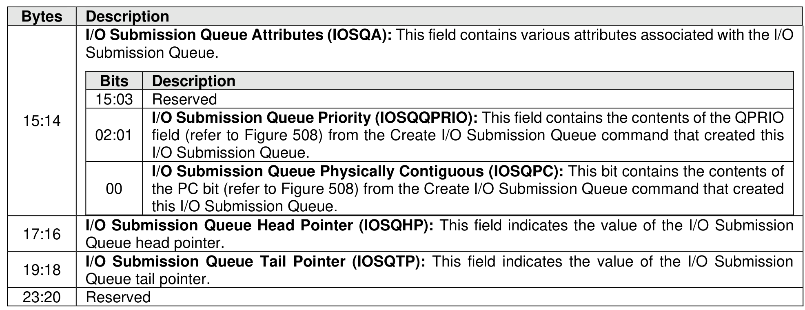
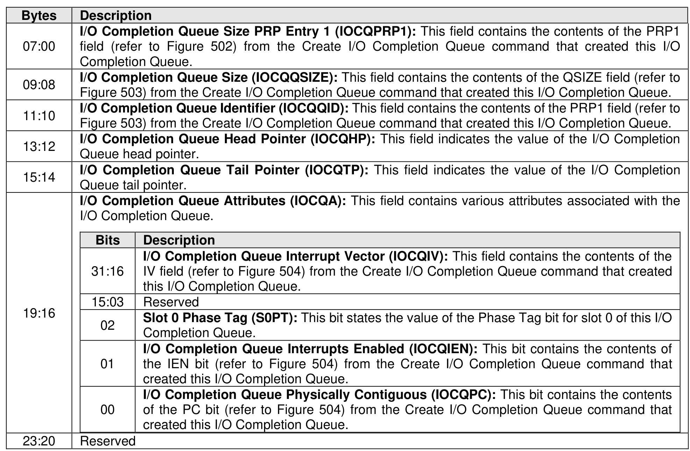

###### 5.2.17.1.3 Set Controller State (Management Operation 2h)

> **Section ID**: 5.2.17.1.3 | **Page**: 405-411

The Set Controller State management operation of the Migration Send command allows the host to set the
state of the controller specified by the Controller Identifier (CNTLID) field in Command Dword 11 (refer to
Figure 370).
The data buffer contains the Controller State data structure specified in Figure 374 which specifies the state
to be set in the specified controller.
To set the controller state of the specified controller, the specified controller is required to be in one or more
of these conditions:
•
Suspended (refer to section 5.2.17.1.1);
•
enabled (i.e., CC.EN bit is set to ‘1’); or
•
offline, if that specified controller is a secondary controller.
If the specified controller is not in one of these conditions, then the controller processing the command shall
abort the command with a status code of Invalid Controller Identifier.
The host may submit one or more Migration Send commands to transfer the controller state. If more than
one Migration Send command is submitted to transfer the controller state, then:
•
The host first submits a Migration Send command with:
o
the Select field set to Set Controller State (i.e., 2h);
o
the Sequence Indicator (SEQIND) field (refer to Figure 369) set to 01b; and
o
the Controller Identifier field set to the controller whose state is being set,
to specify to the controller that the command is the first of a sequence of Migration Send commands
of controller state data being transferred.
•
The host may submit Migration Send commands with:
o
the Select field set to Set Controller State (i.e., 2h);
o
the SEQIND field cleared to 00b; and
o
the Controller Identifier field set to the controller whose state is being set,
to specify to the controller that the command is not the last of the sequence of Migration Send
commands of controller state data being transferred, if any.
•
The host is required to wait for the completion queue entries to be posted for the previous submitted
Migration Send commands in the sequence of Migration Send commands.
•
Finally, the host submits the last Migration Send command with:
o
the Select field set to Set Controller State (i.e., 2h);
o
the SEQIND field set to 10b; and
o
the Controller Identifier field set to the controller whose state is being set,
to specify to the controller that this is the last command of the sequence of Migration Send
commands of the controller state data being transferred. This last Migration Send command may
or may not have the Number of Dwords (NUMD) field cleared to 0h.
If a sequence of Migration Send commands of the controller state data being transferred and the controller
processes a Migration Send command with:
•
the Select field set to Set Controller State (i.e., 2h);
•
the Sequence Indicator (SEQIND) field (refer to Figure 369) set to 01b; and
•
the Controller Identifier field set to the controller whose state is being set,
then, the command is specifying a new sequence of Migration Send commands of the controller state data
is being transferred and the previous sequence of Migration Send commands of the controller state data is
discarded.
If a sequence of Migration Send commands of the controller state data is not being transferred to the
specified controller and the controller processes a Migration Send command with the Sequence Indicator
(SEQIND) field (refer to Figure 369) not set to 01b, clearer to 0b; the controller shall abort that command
with a status code of Command Sequence Error.
If a single Migration Send command is submitted to transfer the entire controller state, then the host submits
a Migration Send command with the SEQIND field set to 11b.
If the host specifies an offset (i.e., the CSLO field and the CSUO field) that is greater than the size of the
Controller State data, then the controller shall abort the command with a status code of Invalid Field in
Command.
If the CSVI field (refer to Figure 370) specifies a non-zero index that is not defined by the Supported
Controller State Formats data structure (refer to Figure 345), then the controller shall abort the command
with a status code of Invalid Field in Command.
If the CSVI field (refer to Figure 370) is cleared to 0h and the NVMe Controller State Size field is non-zero
then the controller shall abort the command with a status code of Invalid Field in Command.
If the CSUUIDI field (refer to Figure 370) specifies a non-zero index that is not defined by the Supported
Controller State Formats data structure, then the controller shall abort the command with a status code of
Invalid Field in Command.
If the NVMe Controller State field exists (i.e., the NVMECSS field is non-zero) and any I/O Submission
Queue or I/O Completion Queue exists in the controller specified by the Controller Identifier (CNTLID) field,
then the controller shall abort the command with a status code of Invalid Field in Command.
Figure 375 defines the NVMe Controller State data structure that identifies the state of the all the I/O
Submission Queues and I/O Completion Queues for a controller. Any controller state defined by this
specification that is not included in the NVMe Controller State data structure is either included in the Vendor
Specific Data field in the Controller State data structure (refer to Figure 374) or is obtained in a vendor
specific manner.
The I/O Submission Queue list shall be listed in ascending order by I/O Submission Queue Identifier.
The I/O Completion Queue list shall be listed in ascending order by I/O Completion Queue Identifier.
If the CSVI field (refer to Figure 370) is cleared to 0h and the NVMe Controller State Size field (refer to
Figure 374) is not cleared to 0h, then the controller shall abort the command with a status code of Invalid
Field in Command.
If the CSUUIDI field (refer to Figure 370) is cleared to 0h and the Vendor Specific Size field (refer to Figure
374) is not cleared to 0h, then the controller shall abort the command with a status code of Invalid Field in
Command.
If the CSVI field (refer to Figure 370) is cleared to 0h and the CSUUIDI field (refer to Figure 370) is cleared
to 0h, then the controller shall abort the command with a status code of Invalid Field in Command.
If the Migration Send command for this management operation specifies the SEQIND field set to 10b and
that command completes successfully, then the controller state shall be verified and committed to the
specified controller which includes:
•
Creating any I/O Submission Queues and I/O Completion Queues specified by the NVMe
Controller State field; and
•
setting the queue state for each I/O Submission Queues and I/O Completion Queues specified by
the NVMe Controller State field.
If any Migration Send command for this management operation is not successful, then the host should
attempt to re-transfer the entire controller state data so that any existing controller state is overwritten with
the desired controller state.

---
### 📊 Tables (10)

#### Table 1: Untitled Table

| Value | Definition |
| :--- | :--- |
| 00b | This command is not the first or last of a sequence of two or more Migration Send commands with this management operation used to transfer the controller state from the host to the controller. |
| 01b | This command is the first of a sequence of two or more Migration Send commands with this management operation used to transfer the controller state from the host to the controller. |
| 10b | This Migration Send command is the last command of a sequence of two or more Migration Send commands with this management operation used to transfer the controller state from the host to the controller. |
| 11b | This Migration Send command is the only command and contains the entire controller state for this management operation used to transfer the controller state from the host to the controller. |
| 01:00 | Version (VER): This field indicates the version of this data structure. This field shall be cleared to 0h. |
|---|---|
| 03:02 | Number of I/O Submission Queues (NIOSQ): This field indicates the number I/O Submission Queues contained in this data structure. |
| 05:04 | Number of I/O Completion Queues (NIOCQ): This field indicates the number I/O Completion Queues contained in this data structure. |
| 07:06 | Reserved |
| | **I/O Submission Queue List** |
| 31:08 | I/O Submission Queue State 0: This field contains the state of the first I/O Submission Queue reported, if any. The contents of this field are defined in the I/O Submission Queue State data structure (refer to Figure 376). |
| 55:32 | I/O Submission Queue State 1: This field contains the state of the second I/O Submission Queue reported, if any. The contents of this field are defined in the I/O Submission Queue State data structure (refer to Figure 376). |
| (NIO*SQ) * 24) + 7: (NIO*SQ-1) * 24) + 8 | I/O Submission Queue State NIOSQ-1: This field contains the state of the last I/O Submission Queue reported, if any. The contents of this field are defined in the I/O Submission Queue State data structure (refer to Figure 376). |
| | **I/O Completion Queue List** |
| (NIO*SQ+1) * 24) + 7: (NIO*SQ) * 24) + 8 | I/O Completion Queue State 0: This field contains the state of the first I/O Completion Queue reported, if any. The contents of this field are defined in the I/O Completion Queue State data structure (refer to Figure 377). |
| (NIO*SQ+2) * 24) + 7: (NIO*SQ+1) * 24) + 8 | I/O Completion Queue State 1: This field contains the state of the second I/O Completion Queue reported, if any. The contents of this field are defined in the I/O Completion Queue State data structure (refer to Figure 377). |
| (NIO*DCQ) * 24) + (NIO*SQ) * 24) + 15: (NIO*DCQ-1) * 24) + (NIO*SQ) * 24) + 8 | I/O Completion Queue State NIOCQ-1: This field contains the state of the last I/O Completion Queue reported, if any. The contents of this field are defined in the I/O Completion Queue State data structure (refer to Figure 377). |
| | Submission Queue list shall be listed in ascending order by I/O Submission Queue Identifier. |
| | Completion Queue list shall be listed in ascending order by I/O Completion Queue Identifier. |
| | **Figure 376: I/O Submission Queue State Data Structure** |
| | **Description** |
| | I/O Submission PRP Entry 1 (IOSQPRP1): This field contains the contents of the PRP1 field (refer to Figure 506) from the Create I/O Submission Queue command that created this I/O Submission Queue. |
| | I/O Submission Queue Size (IOSQQSIZE): This field contains the contents of the QSIZE field (refer to Figure 507) from the Create I/O Submission Queue command that created this I/O Submission Queue. |
| | **Submission Queue.** |
| | **Bits** | **Description** |
| | 15:03 | Reserved |
| | 02:01 | I/O Submission Queue Priority (IOSQQPRIO): This field contains the contents of the QPRIO field (refer to Figure 508) from the Create I/O Submission Queue command that created this I/O Submission Queue. |
| | 00 | I/O Submission Queue Physically Contiguous (IOSQPC): This bit contains the contents of the PC bit (refer to Figure 508) from the Create I/O Submission Queue command that created this I/O Submission Queue. |
| | I/O Submission Queue Head Pointer (IOSQHP): This field indicates the value of the I/O Submission Queue head pointer. |
| | I/O Submission Queue Tail Pointer (IOSQTP): This field indicates the value of the I/O Submission Queue tail pointer. |
| | Reserved |
| | **Figure 377: I/O Completion Queue State Data Structure** |
| | **Description** |
| | I/O Completion Queue Size PRP Entry 1 (IOCQPRP1): This field contains the contents of the PRP1 field (refer to Figure 502) from the Create I/O Completion Queue command that created this I/O Completion Queue. |
| Bits | Description |
| :--- | :--- |
| 31:16 | I/O Completion Queue Interrupt Vector (IOCQIV): This field contains the contents of the IV field (refer to Figure 504) from the Create I/O Completion Queue command that created this I/O Completion Queue. |
| 15:03 | Reserved |
| 02 | Slot 0 Phase Tag (S0PT): This bit states the value of the Phase Tag bit for slot 0 of this I/O Completion Queue. |
| 01 | I/O Completion Queue Interrupts Enabled (IOCQIEN): This bit contains the contents of the IEN bit (refer to Figure 504) from the Create I/O Completion Queue command that created this I/O Completion Queue. |
| 00 | I/O Completion Queue Physically Contiguous (IOCQPC): This bit contains the contents of the PC bit (refer to Figure 504) from the Create I/O Completion Queue command that created this I/O Completion Queue. |
| | Reserved |

#### Table 2: Untitled Table

(Continuation of Untitled Table - see first part)

#### Table 3: Untitled Table

(Continuation of Untitled Table - see first part)

#### Table 4: Untitled Table

(Continuation of Untitled Table - see first part)

#### Table 5: Untitled Table

(Continuation of Untitled Table - see first part)

#### Table 6: Untitled Table

(Continuation of Untitled Table - see first part)

#### Table 7: Untitled Table

(Continuation of Untitled Table - see first part)

#### Table 8: Untitled Table

(Continuation of Untitled Table - see first part)

#### Table 9: Untitled Table

(Continuation of Untitled Table - see first part)

#### Table 10: Untitled Table

(Continuation of Untitled Table - see first part)

