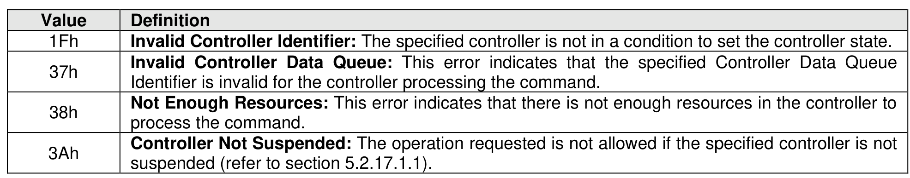

##### 5.2.17.2 Command Completion

> **Section ID**: 5.2.17.2 | **Page**: 411-411

Upon completion of the Migration Send command, the controller posts a completion queue entry to the
Admin Completion Queue indicating the status for the command. Section 5.2.17.1 describes completion
details for each management operation.
Migration Send command specific status values (i.e., SCT field set to 1h) are shown in Figure 378.

---
### 📊 Tables (1)

#### Table 1: Untitled Table

| | |
| :--- | :--- |
| NVMe-MI Receive command | the NVM Express Management Interface Specification for details on the NVMe-MI Receive command. |
| NVMe-MI Send command | the NVM Express Management Interface Specification for details on the NVMe-MI Send command. |
| Namespace Attachment command | |

