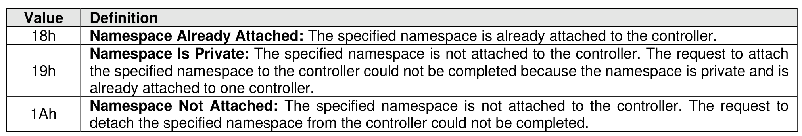
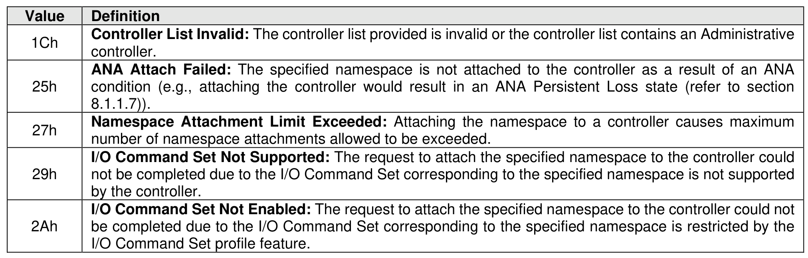

##### 5.2.20.1 Command Completion

> **Section ID**: 5.2.20.1 | **Page**: 412-413

When the command is completed, the controller posts a completion queue entry to the Admin Completion
Queue indicating the status for the command.
Command specific status values associated with the Namespace Attachment command are defined in
Figure 381. For failures, the byte offset of the first failing entry is reported in the Command Specific
Information field of the Error Information Log Entry. The controller does not process further entries in the
Controller List after an error is encountered.

---
### 📊 Tables (2)

#### Table 1: Untitled Table

| | controller. |
|---|---|
| | **ANA Attach Failed**: The specified namespace is not attached to the controller as a result of an ANA condition (e.g., attaching the controller would result in an ANA Persistent Loss state (refer to section 8.1.1.7)). |
| | **Namespace Attachment Limit Exceeded**: Attaching the namespace to a controller causes maximum number of namespace attachments allowed to be exceeded. |
| | **I/O Command Set Not Supported**: The request to attach the specified namespace to the controller could not be completed due to the I/O Command Set corresponding to the specified namespace is not supported by the controller. |
| | **I/O Command Set Not Enabled**: The request to attach the specified namespace to the controller could not be completed due to the I/O Command Set corresponding to the specified namespace is restricted by the I/O Command Set profile feature. |

#### Table 2: Untitled Table

(Continuation of Untitled Table - see first part)

