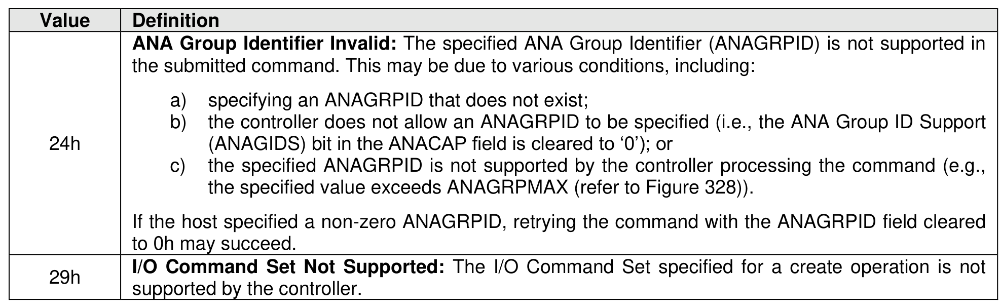
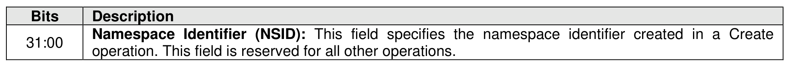

##### 5.2.21.1 Command Completion

> **Section ID**: 5.2.21.1 | **Page**: 414-415

When the command is completed, the controller posts a completion queue entry to the Admin Completion
Queue indicating the status for the command.
Namespace Management command specific status values (i.e., SCT field set to 1h) are shown in Figure
386.
Dword 0 of the completion queue entry contains the Namespace Identifier created. The definition of Dword
0 of the completion queue entry is in Figure 387.

---
### 📊 Tables (3)

#### Table 1: Untitled Table

| Namespace Identifier Unavailable: The number of namespaces supported has been exceeded. |  |
|---|---|
| Thin Provisioning Not Supported: Thin provisioning is not supported by the controller. |  |
| 390 |  |
| the submitted command. This may be due to various conditions, including: |  |
| a) specifying an ANAGRPID that does not exist; |  |
| b) the controller does not allow an ANAGRPID to be specified (i.e., the ANA Group ID Support (ANAGIDS) bit in the ANACAP field is cleared to '0'); or |  |
| c) the specified ANAGRPID is not supported by the controller processing the command (e.g., the specified value exceeds ANAGRPMAX (refer to Figure 328)). |  |
| If the host specified a non-zero ANAGRPID, retrying the command with the ANAGRPID field cleared to 0h may succeed. |  |
| I/O Command Set Not Supported: The I/O Command Set specified for a create operation is not supported by the controller. |  |
| of the completion queue entry contains the Namespace Identifier created. The definition of Dword completion queue entry is in Figure 387. |  |
| Figure 387: Namespace Management – Completion Queue Entry Dword 0 |  |
| from a previously failed NVM subsystem sanitize operation. The NVM subsystem sanitize operation |  |
| at may be supported are Block Erase, Crypto Erase, and Overwrite. |  |
| subsystem sanitize operation consists of: |  |
| sanitize processing (refer to section 8.1.26), which may include: |  |

#### Table 2: Untitled Table

(Continuation of Untitled Table - see first part)

#### Table 3: Untitled Table

(Continuation of Untitled Table - see first part)

